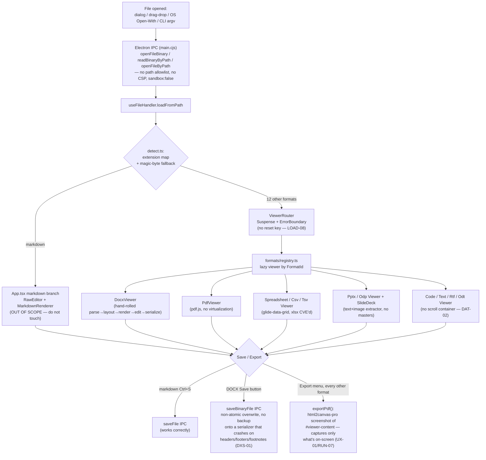

# Atlas Phase 3 — Improvement Plan

**Repo**: `C:\Users\Youssef\Documents\Projects\md-reader`
**Inputs**: whole-codebase verification audit (294 findings, 13 subsystem passes, 0 refuted) + architect/product/risk strategy memos + a critic review pass (Section 11) that added 5 independently-verified findings and corrected 2 factual errors, bringing the total to 299.
**Owner's constraint (hard, non-negotiable)**: the Markdown feature is perfect. This plan must not change Markdown's behavior, and every phase that touches shared shell code must ship with guardrails (characterization tests, shared-code change rules) that prove Markdown stays identical. See Section 7.

---

## 1. Executive Summary

**Current state, in plain terms.** Atlas is a 13-format Electron document viewer/editor that grew out of a markdown-only reader. The markdown path itself is mature and, by the owner's own judgment, functionally perfect. Everything built around it since — the app shell, the Electron IPC layer, and 12 non-markdown viewers headlined by a hand-rolled DOCX engine — was assembled across two prior phases and now carries 299 independently-verified findings across 13 subsystems (294 from the original audit, plus 5 added during this plan's critic-review pass — see Section 11), with health scores clustering at 2–4 out of 10. There is no git repository and no CI. The project's own planning documents already assert a "PHASE 1 — COMPLETE, 151/151 tests, lint 0" state that is provably false today (6 lint errors, 3 test failures, 7 test suites that fail to even load).

**The 5 biggest problems:**

1. **Trust-destroying data loss on routine actions.** Opening a new file (Ctrl+O, a Recent-files click, drag-drop, an OS "Open With", a second Explorer double-click) silently discards unsaved edits in *both* markdown and DOCX with zero confirmation — this was independently reproduced live in a running Electron instance (RUN-01). Inserting an image into an open DOCX silently discards every other edit made since the file was loaded (DXE-01). DOCX Save overwrites the user's only copy in place with no backup (DXS-12/RUN-10).
2. **A hand-rolled DOCX engine whose parser is genuinely well-built but whose render pipeline never consults the data the parser produces, and whose serializer corrupts or crashes on save for the majority of real documents.** Named styles, list numbering, image position, paragraph alignment, and space-before/after are all either parsed correctly and then ignored by the paginator, or parsed into opaque unusable blobs (headers/footers/footnotes). Saving *any* document containing a header, footer, footnote, or endnote throws outright (DXS-01); every table loses its schema-required `tblGrid` on save (DXS-02).
3. **Broken advertised functionality and app-chrome collisions.** Drag-and-drop — the Welcome screen's own headlined feature — is completely non-functional on the shipped Electron version, for every format (SHELL-01/ELEC-01/LOAD-02/RUN-04). While editing a DOCX, Ctrl+B/Ctrl+E/Ctrl+S/Ctrl+P all misbehave (toggle the sidebar, open the export menu, silently no-op, or double-fire) because six independent, uncoordinated `window`-level keyboard listeners fight for the same keys, and DocxViewer's own element-level handler on its contentEditable div never stops those keys from bubbling up to them. "Export to PDF" silently produces incomplete output — a screenshot (via `html2canvas-pro`) of whatever happens to be on screen — for every non-markdown, non-PDF format.
4. **An unhardened trust boundary in an app whose entire job is opening untrusted files.** No IPC path allowlist (any renderer script can read or overwrite arbitrary files on disk), no Content-Security-Policy, the Electron sandbox is explicitly disabled, and the app ships a frozen, CVE'd `xlsx` dependency plus a `pdfjs-dist` version in a known arbitrary-JS-execution range. The same non-atomic, backup-less `fs.writeFileSync` overwrite pattern flagged as CRITICAL for DOCX saves (DXS-12) is confirmed present, unaddressed, in the adjacent `save-file` handler markdown itself saves through (ELEC-24 — see Section 11).
5. **No safety net.** No git, no CI, a one-line fixable test-infrastructure bug (`?url` font imports) currently leaves the riskiest code in the app — the DOCX layout/pagination/render pipeline — with 0% working regression coverage, and the one feature the owner calls "perfect" has zero characterization tests protecting it from the shared-shell fixes this very plan requires.

**The thesis of this plan.** Fix the floor before adding weight. Sequence the safety net first — git, CI, and critically a Markdown characterization suite that lets every subsequent shared-shell change be verified as behavior-preserving for Markdown — then stop the bleeding (data loss, security, crashes) before any further feature work, then correct the shell architecture with one reusable document-session capability contract instead of a dozen point patches, then run per-format quality waves in parallel now that the floor is solid, and only then invest in performance, accessibility, and a signed release. The plan explicitly freezes new DOCX editing surface (structural table editing, header/footer live editing, track-changes UI beyond accept/reject wiring) until the already-correct-but-unwired style cascade and the crashing serializer are fixed — all three source strategy memos converge independently on this same conclusion: building more on the current broken wiring only compounds the eventual rework.

---

## 2. How Atlas Works Today

**Architecture map.** A file reaches Atlas through one of four entry points — the native Open dialog, an OS "Open With"/double-click (via `main.cjs`'s argv/second-instance handling), drag-and-drop, or a Recent-files click — all funneling into `useFileHandler.loadFromPath`. That function classifies the path via `src/formats/detect.ts` (an extension map, falling back to magic-byte sniffing for unrecognized extensions) into a discriminated `LoadedFile` (`text` or `binary`), reading the bytes through one of Electron's unauthenticated file-read IPC channels. `App.tsx` then branches: markdown goes to a dedicated, untouched `RawEditor`/`MarkdownRenderer` pipeline; every other format goes through `ViewerRouter` (Suspense + error boundary) to a lazily-loaded viewer from `formats/registry.ts`, wrapped in a `ViewerProvider` that publishes nav items/stats to the shared Sidebar/StatusBar. Six independent `window`-level keydown listeners (`useUniversalShortcuts`, `useFontSize`, `useSearch`, `ThemeMenu`, `ExportMenu`, `ShortcutsModal` — the last three Escape-only) compete for the same keys with no coordination; DocxViewer's own combo-key handling (Ctrl+B/E/S/P etc.) is a *separate, element-level* `onKeyDown` prop on its contentEditable div (`DocxViewer.tsx:1321`), not a seventh window listener, but it never stops propagation, so its keystrokes also reach the six listeners above (see Section 11 for the correction to the original draft's miscount). Saving is per-format and inconsistent: markdown routes through `saveFile`/`saveFileAs` (IPC `save-file`, a direct non-atomic `fs.writeFileSync` with no backup — ELEC-24), DOCX routes through its own `saveBinaryFile` call (IPC `save-binary-file`, the identical non-atomic overwrite pattern), and no other format has any save path at all. Export is uniform and wrong: every format except markdown and native PDF funnels into one `html2canvas-pro` screenshot of `#viewer-content`, sliced into an A4 PDF — a strategy fundamentally incompatible with virtualized grids, paginated `content-visibility` DOCX pages, and thumbnail-rail slide decks.



**Per-subsystem summaries:**

- **App shell & chrome (`SHELL`, health 3/10).** `App.tsx` owns top-level chrome plus a half-migrated state model: a legacy markdown-only `isDirty`/`localMarkdown` shim coexists with the newer `ViewerContext`/`ViewerRouter` generalization used by every other format. Cross-cutting concerns (theme, font size, recent files, autosave, shortcuts, drag-and-drop, close-guard) are each an independent hook with its own `window`-level listener and its own `localStorage` key, with no coordination layer and no state flowing back from non-markdown viewers into App's dirty/save model at all.
- **Electron main/preload/IPC (`ELEC`, health 3/10).** A single main process takes a single-instance lock, heuristically extracts a file path from argv, and creates one `BrowserWindow` (`contextIsolation:true`, `sandbox:false`) loading Vite's dev server or `dist/index.html`. IPC is a flat set of `ipcMain.handle`/`on` calls — dialogs, direct-path reads/writes, spellcheck, an image picker, a theme signal — with no sender/path validation anywhere.
- **File loading, detection & routing (`LOAD`, health 4/10).** A well-tested, well-typed extension/magic-byte detection pipeline (`detect.ts`) feeds a discriminated `LoadedFile` union into `ViewerRouter`, which memoizes one lazy component per `file.path` inside a `Suspense`+error-boundary pair. Markdown never enters this pipeline at all — it is architecturally firewalled from everything else in this subsystem.
- **DOCX parser, model & fonts (`DXP`, health 4/10).** Turns a `.docx` ZIP into an immutable `Document` model via hand-rolled XML parsers (`fast-xml-parser`-based) covering run/paragraph/table/section direct formatting, numbering definitions, and theme colors/fonts thoroughly and correctly. A separate, correct style-cascade algorithm (`cascade.ts`) exists but is not the code path the shipped renderer uses. A hand-rolled TTF parser plus canvas-based glyph measurement engine reflects serious, iteratively-hardened engineering.
- **DOCX layout, pagination & render (`DXL`, health 3/10).** A well-engineered `itemize → breakLines → paginate → PageView` pipeline (canvas-measured glyph widths, CJK grapheme-cluster breaking, widow/orphan control, table row-splitting across pages) paints almost everything wrong for real documents: alignment/indentation have zero effect on line position, space-before/after is never applied, named styles never cascade into the live view, list markers never render, images render as a placeholder glyph, and computed justification is dead code.
- **DOCX editor & DocxViewer integration (`DXE`, health 2/10).** A from-scratch rich-text engine (typed Command objects, an inverse-based undo/redo History, DOM↔model position mapping) makes basic single-paragraph, single-run editing work, but fails for anything beyond that: cross-paragraph/cross-run selections can't be deleted or formatted, any paragraph with a hyperlink is effectively uneditable, lists/tables are wired-but-throwing stubs, Ctrl+S does nothing, and image insertion silently destroys prior edits.
- **DOCX serializer & round-trip fidelity (`DXS`, health 2/10).** A sound byte-passthrough architecture (unhandled parts survive untouched) is undermined by the single worst finding in the whole audit: saving any document with a header, footer, footnote, or endnote throws and the save fails outright, and every table loses its required `tblGrid` element on save regardless.
- **PDF viewer (`PDF`, health 3/10).** Correct high-DPI canvas sizing and careful pdf.js resource cleanup, but no page virtualization at all (a real memory-exhaustion risk on large documents), no text layer (no select/copy/search), no annotation layer (dead links), no print, no forms.
- **PPTX & ODP slide viewers (`SLD`, health 3/10).** A bare text-and-image extractor rather than a slide renderer: slide masters/layouts are never read, run-level formatting and bullets are discarded, tables flatten into an unordered stack of text, group transforms are never composed, and export produces a one-slide PDF instead of the deck.
- **Spreadsheet, CSV, text, code, RTF & ODT viewers (`DAT`, health 3/10).** Sound shared architecture (format detection, lazy heavy libs, an error boundary) undercut by a CRITICAL CSS defect making Code/RTF/ODT unusable past one screen, a frozen CVE'd `xlsx` dependency, non-functional grid copy, and cells that look editable but silently discard input.
- **Export pipeline, theming & accessibility (`UX`, health 3/10).** A well-engineered CSS-variable theme system and canvas-grid theme bridge sit alongside an export pipeline that is fundamentally broken for every non-markdown format, a Ctrl+P double-fire bug that can corrupt DOCX print/export output, and inconsistently-applied accessibility (an entire ~20-button DOCX toolbar with no `aria-label`s, one core text color failing contrast in 4 of 5 themes).
- **Tests, tooling, dependencies & hygiene (`QA`, health 3/10).** No git, no CI, both lint and tests currently red, the riskiest engine (DOCX layout/render) at 0% real coverage due to a one-line-fixable Vitest asset-resolution bug, TypeScript strict mode entirely off, and two directly-used production dependencies with known unpatched CVEs.
- **Live runtime QA (`RUN`, health 3/10).** Every format loads and renders correctly with zero console errors on the happy path in a real, driven Electron instance — but every finding above was independently reproduced live the moment the app was probed past that path, several with concrete DOM before/after proof.

---

## 3. Health Scorecard

| Subsystem | Score /10 | Headline | # CRITICAL | # HIGH |
|---|---|---|---|---|
| App Shell & Chrome (SHELL) | 3 | Drag-and-drop dead; unsaved edits vanish silently; zero shell test coverage | 2 | 6 |
| Electron Main/Preload/IPC (ELEC) | 3 | Unrestricted file-read/write IPC; no CSP; sandbox disabled | 3 | 4 |
| File Loading & Routing (LOAD) | 4 | Well-tested detection undermined by data-loss-on-open and a viewer-crash that bricks the router | 2 | 7 |
| DOCX Parser & Fonts (DXP) | 4 | Thorough parser whose output (styles, numbering, footnotes) the renderer never consumes | 5 | 5 |
| DOCX Layout & Render (DXL) | 3 | Well-engineered pipeline painting almost everything wrong: no alignment, spacing, markers, or images | 3 | 10 |
| DOCX Editor (DXE) | 2 | Image insert destroys prior edits; cross-paragraph edits fail; Ctrl+S doesn't save; 0% of editor tests run | 6 | 13 |
| DOCX Serializer (DXS) | 2 | Saving any doc with a header/footer/footnote crashes; every table loses its schema-required grid | 8 | 4 |
| PDF Viewer (PDF) | 3 | No virtualization (memory risk); no text layer, search, print, or annotations | 1 | 8 |
| PPTX/ODP Viewers (SLD) | 3 | Bare text-and-image extractor: no masters/layouts, no tables, export drops the deck | 1 | 9 |
| Spreadsheet/CSV/Text/Code/RTF/ODT (DAT) | 3 | Code/RTF/ODT unusable past one screen; frozen CVE'd xlsx dependency; copy/edit are fake | 2 | 6 |
| Export/Theming/A11y (UX) | 3 | Export silently incomplete everywhere non-markdown; Ctrl+P double-fires; ~20 unlabeled controls | 3 | 6 |
| Tooling/Tests/Deps (QA) | 3 | No git, no CI, both currently red; riskiest engine has 0% real coverage; strict mode off | 0 | 8 |
| Live Runtime QA (RUN) | 3 | Every finding above reproduced live; happy path works, anything past it breaks | 3 | 6 |
| **Total** | — | — | **39** | **92** |

*Totals reflect the original audit's 38 CRITICAL / 92 HIGH plus one new CRITICAL (ELEC-24) identified and confirmed during this plan's critic-review pass — see Section 11. Four additional MEDIUM findings from that same pass (DXP-20, DXP-21, ELEC-25, ELEC-26) don't change this table's columns but are folded into the relevant Phase 1/3 tasks below and listed in Section 11.*

---

## 4. Root-Cause Themes

Ten cross-cutting causes explain the large majority of the 294 findings. Fixing the cause once, rather than patching each symptom, is the organizing principle behind Phases 1–2 of the roadmap.

1. **No single owner of dirty/save/export lifecycle state.** SHELL-02, SHELL-03, SHELL-04, SHELL-05, SHELL-09, SHELL-10, SHELL-12, SHELL-15, ELEC-06, DXE-01, DXE-07, DXE-09, DXE-16, DXE-17, DXE-18, LOAD-01, DAT-06, RUN-01, RUN-03, RUN-10, DXS-12, ELEC-24.
2. **Duplicated, unsynced hook instances derived from one `localStorage` source.** SHELL-06, LOAD-16, RUN-16.
3. **Extension/format knowledge hand-duplicated across 3–4 disagreeing files.** ELEC-05, ELEC-15, LOAD-03, LOAD-12, LOAD-22, DAT-14.
4. **Uncoordinated global keydown listeners with no precedence or `stopPropagation`.** SHELL-08, SHELL-09, SHELL-19, RUN-02, RUN-03, PDF-03, UX-03, UX-24, DXE-07.
5. **One unmigrated Electron API — `File.path` removal.** SHELL-01, SHELL-24, ELEC-01, LOAD-02, RUN-04.
6. **IPC trusts renderer-supplied paths/content with no allowlist; no CSP or sandbox.** ELEC-02, ELEC-03, ELEC-04, ELEC-12, DXS-12, RUN-10.
7. **One generic DOM-screenshot exporter applied to incompatible rendering strategies.** SHELL-13, UX-01, UX-02, UX-11, UX-12, RUN-07, SLD-01.
8. **Parser produces correct data the layout/render/serializer layer never consumes.** DXP-01, DXP-02, DXP-07, DXP-09, DXP-19, DXL-01, DXL-02, DXL-03, DXL-04, DXL-05, DXL-06, DXL-07, DXL-08, DXL-09, DXL-10, DXL-11, DXL-12, DXS-02, DXS-05, DXS-08, DXS-09, DXS-10.
9. **No safety net — no git/CI, and test-infrastructure bugs mask the real coverage gap.** QA-01, QA-03, QA-04, QA-05, QA-06, QA-07, QA-08, QA-09, QA-10, QA-11, QA-18, QA-22, QA-23, DXP-10, DXE-28, SHELL-27, DAT-16.
10. **Untrusted-input handling underbuilt — no size caps, non-atomic writes, vulnerable/frozen dependencies.** ELEC-08, DXP-15, DAT-01, DAT-07, DAT-13, DAT-20, QA-12, QA-13, DXS-12, DXP-20, ELEC-24, ELEC-25.

---

## 5. Key Decisions

Nine decisions synthesized from the architect, product, and risk strategy memos. Where the memos disagreed, the disagreement is resolved explicitly below rather than papered over.

**D1 — Document-session capability model.**
*Options:* (a) keep per-format ad hoc state (current); (b) a shared session-capability contract added to `ViewerContext` (`setDirty`/`save`/`getExportableContent`), rolled out to markdown + DOCX first and generalized later.
*Recommendation:* (b). *Rationale:* all three memos independently converge on this — it collapses ~12 separate dirty/save/close-guard point-fixes (SHELL-02/03/04/05/09/10/12/15, DXE-01/07/09/16/17/18, LOAD-01, ELEC-06, RUN-01/03/10) into one seam, and gives every future editable format the same contract for free. It is additive to markdown's existing `isDirty`/`saveFile` logic, not a replacement — markdown's own code path is untouched (see Section 7).

**D2 — Scope of the hand-rolled DOCX engine.**
*Options:* (1) keep expanding features on the current core; (2) freeze new capabilities and spend a dedicated phase hardening the existing parse→layout→render→serialize pipeline; (3) replace the layout/render/serializer core with a mature or embedded engine.
*Recommendation:* (2). *Rationale:* unanimous across all three memos. The parser, cascade algorithm, and font-metrics engine are already well-built and mostly correct — the defect is that `paginate.ts` never calls `cascade.ts`, and the serializer has specific, fixable OPC-validity gaps, not that the design is wrong. A rewrite (3) discards validated, hard-won reverse-engineering work; continuing to add features (1) onto an unwired cascade and a serializer that crashes on headers/footers compounds the eventual rework. Revisit (3) only if fidelity gaps persist after a full hardening pass.

**D3 — Export architecture, and how to sequence getting there.** *(Resolves the one genuine disagreement between the memos.)*
*Options:* (a) keep the generic screenshot exporter and just disable/relabel it for incompatible formats; (b) build format-aware exporters immediately (DOCX's own print path, spreadsheets from parsed data, slides per-slide); (c) do nothing.
The architect memo recommends jumping straight to full per-format rebuild. The product memo recommends a staged hybrid: relabel/disable immediately (cheap, stops active deception today), then invest incrementally starting with the cheapest real wins.
*Recommendation:* the product memo's staged hybrid. *Rationale:* the full per-format rebuild (architect's end-state, which this plan also adopts as the Phase 3 target) is genuinely the right architecture, but it is an L-effort task dependent on DOCX's serializer being hardened first (don't export from an engine still known to corrupt on save) and on the spreadsheet/slide waves landing. Shipping the cheap relabel/disable step in Phase 1 (Task P1.13) closes the "confidently-wrong backup" risk within days instead of waiting for the full Phase 3 rebuild (Task P3.X1) to land. The traceability matrix maps the underlying findings to P3.X1 (the real fix); P1.13 is a mitigation, not a closure.

**D4 — IPC trust boundary.**
*Options:* keep the flat, unrestricted `ipcMain.handle` surface vs. establish a main-process-owned path allowlist (only paths the app itself vouches for via dialog/argv/drag-drop) plus CSP and sandbox.
*Recommendation:* the allowlist, landed in Phase 1 before any new IPC-exposed writes are added (table editing, header/footer editing). *Rationale:* several renderers already inject raw/sanitized HTML (markdown's `rehypeRaw`, ODT via DOMPurify); a single future content-injection bug anywhere becomes arbitrary file read/write today. Every future IPC addition should be built on this boundary, not layered under it.

**D5 — Shortcut ownership.**
*Options:* keep six independent, uncoordinated `window.addEventListener('keydown')` sites (`useUniversalShortcuts`, `useFontSize`, `useSearch`, `ThemeMenu`, `ExportMenu`, `ShortcutsModal`) plus DocxViewer's separate element-level `onKeyDown` handler, vs. one dispatcher with explicit precedence (focused input/contentEditable → active viewer → shell-global).
*Recommendation:* the dispatcher (Task P2.1). *Rationale:* cheaper in the long run than the per-viewer `stopPropagation()` patches applied one collision at a time — every new viewer today risks reproducing SHELL-08/09/UX-03. (The plan's earlier draft undercounted this as "six sites including DOCX's own handler" — DocxViewer's handler is element-level, not window-level, and two of the six window-level sites, `ExportMenu` and `ShortcutsModal`, were previously omitted from the narrative though already correctly captured in SHELL-19's finding. Corrected in Section 11.)

**D6 — Security/dependency remediation posture and sequencing.**
*Options:* (a) full hardening pass (CSP, sandbox on, IPC validation, xlsx replacement, Electron major bump) before any feature work; (b) cheap high-leverage fixes now (CSP, IPC validation, xlsx CDN swap, pdfjs-dist bump, production menu — all S/M effort) folded into Phase 1, with the Electron major-version bump tracked as its own separate epic starting in Phase 4.
*Recommendation:* (b). *Rationale:* unanimous across all three memos — a 9-major Electron jump risks native-module/packaging breakage orthogonal to the data-loss/security fixes in flight, and would block small, high-certainty wins behind a large, low-certainty migration. `xlsx`'s replacement is a drop-in CDN swap (npm has no patched release to move to), so it belongs in Phase 1 alongside the other cheap wins, not bundled with the Electron epic.

**D7 — Verification gate before further feature work.**
*Options:* continue with no git/CI vs. establish both as a hard Phase 0 prerequisite.
*Recommendation:* establish first. *Rationale:* the single cheapest, highest-leverage change available, and every other recommendation's "did this actually work" claim is otherwise unfalsifiable — the project's own plan docs already demonstrate the failure mode (QA-18: "151/151 tests" claimed while the suite is provably red).

**D8 — Coverage/strictness ramp.**
*Options:* (a) jump to an 80% coverage floor and `tsc strict` immediately; (b) ratchet gradually from the measured ~57%/no-strict baseline, per directory, starting with the highest blast-radius code.
*Recommendation:* (b), starting with `src/docx/parser` and `src/docx/layout`. *Rationale:* an immediate hard gate blocks all work today and invites gaming; ratchet as each subsystem's tests land in Phase 3, formalized as Phase 4 tasks.

**D9 — How to honor "the markdown feature is perfect" while still fixing shared shell code.** *(The owner's central constraint — resolved explicitly, not just asserted.)*
*Options:* (a) treat "don't change markdown" as "don't touch `App.tsx`/hooks at all," refusing every shared-shell fix that happens to sit near markdown's code path; (b) treat "perfect" as an *observed, testable state* — capture it as a characterization suite, then allow shared-shell fixes that provably don't move that suite's output.
*Recommendation:* (b). *Rationale:* (a) is unworkable — SHELL-03/04, LOAD-01, and DXE-09 (the plan's own #1 problem, data loss on file-switch) are shell-level bugs that affect markdown *and* every other format simultaneously; refusing to touch `App.tsx` at all would mean shipping this plan without fixing the plan's own top priority. The characterization suite (Task P0.4, gating every phase from P0 onward) is the mechanism that makes (b) safe and auditable — see Section 7 for the full guardrail design.

---

## 6. Roadmap

Phases run in dependency order: **P0 (safety net) → P1 (stop the bleeding) → P2 (shell architecture) → P3 (per-format quality waves, parallel) → P4 (performance/a11y/polish) → P5 (release)**. Every task lists the finding IDs it addresses, files/modules touched, its approach, testable acceptance criteria, effort (S/M/L/XL), and dependencies. Every task that touches shell/hook code shared with markdown carries the guardrail from Section 7 as an implicit acceptance criterion, called out explicitly where most relevant.

**On calendar time (critic-review addition, Section 11).** Deliberately, no task below carries a calendar-time estimate or an assumed velocity (tasks/week) — with ~130 tasks and unknown solo-developer/AI-agent-assisted throughput, any number offered here would be a guess dressed up as a plan. Effort (S/M/L/XL) sizes *relative* work, not duration. The recommended practice: track actual wall-clock time for Phase 0 (the smallest, most homogeneous phase) as it completes, then extrapolate a rough per-effort-point velocity from it before committing to a date for Phase 1 onward — re-calibrating after Phase 1 as well, since Phase 0's tasks (git/CI/tooling) are not representative of Phase 3's fidelity-engineering work.

### Phase 0 — Safety Net & Green Build

Nothing below is verifiable or reversible without version control and a real green baseline. This phase blocks everything else.

**P0.1 — Initialize git + baseline commit**
Findings: QA-22. Files: repo root. Approach: `git init`; verify the existing `.gitignore` covers `node_modules`/`dist`/`release`; commit the current working tree as the Phase-3 starting baseline. Acceptance: `git log` shows one baseline commit; `git status` is clean. Effort: S. Depends: none.

**P0.2 — Minimal CI pipeline + get lint to a true green baseline**
Findings: QA-23, QA-11. Files: `.github/workflows/ci.yml` (new), `eslint.config.js`. Approach: add a workflow running `npm ci && npm run lint && tsc -b && npm test && npm run build` on every push/PR; fix the 6 current ESLint errors + 2 warnings per the tool's own guidance (unused `_word`/`_` params, stale `eslint-disable` comments, the `react-hooks/set-state-in-effect` violation in DocxViewer's file-change effect). Acceptance: CI workflow runs and is visible on the next push; `npx eslint .` exits 0. Effort: M. Depends: P0.1.

**P0.3 — Fix Vitest font-asset resolution (unblocks 7+ DOCX test suites)**
Findings: QA-01, DXP-10, DXE-28. Files: `src/docx/fonts/families.ts`, `src/docx/fonts/assets/*.ttf` (new location). Approach: move the bundled TTFs from `public/fonts/` to `src/docx/fonts/assets/` and change `families.ts`'s imports from root-absolute `/fonts/*.ttf?url` specifiers to relative `./assets/*.ttf?url` specifiers, which Vite's normal hashed-asset pipeline handles identically across build, dev, and Vitest's transform (unlike the public-dir passthrough). Re-run `DocxViewer.editor.test.tsx` and confirm DXE-28's missing-mock issue is resolved as a side effect (the module now loads for real, no mock needed). Acceptance: `npx vitest run` shows 0 suites failing to load; the 7 previously-blocked DOCX layout/render/editor suites execute (pass/fail is irrelevant at this stage — *running* is the bar). Effort: S. Depends: none.

**P0.4 — Markdown characterization suite (the load-bearing guardrail for this entire plan)**
Findings: QA-07. Files: new `src/components/__tests__/MarkdownRenderer.characterization.test.tsx`, `src/hooks/__tests__/useToc.test.ts`, `src/utils/__tests__/export.markdown.test.ts`, new `src/__tests__/App.dirtyState.characterization.test.tsx`. Approach: snapshot-test `MarkdownRenderer` against a fixed fixture set (headings, GFM tables, task lists, code fences, inline/block KaTeX math, a Mermaid diagram, nested lists, hyperlinks) to freeze today's exact rendered HTML; unit-test `useToc`'s heading-extraction against the same fixtures; snapshot markdown→HTML/PDF/DOCX/MD export output from `export.ts` against the same fixtures. **Critic-review correction (Section 11):** the original draft's Section 7.4 table claimed this task also snapshots `App.tsx`'s `isDirty` state-transition behavior — it did not; that gap is fixed here by adding a dedicated `App.dirtyState.characterization.test.tsx` (RTL, using the existing `ViewerProvider`-harness pattern) that drives markdown's own `isDirty` through edit → save → open-new-file → format-switch and snapshots the exact transition sequence, since this state machine is the literal foundation P1.1 and P2.10 both modify. As a cheap partial mitigation for the characterization suite's DOM-snapshot blind spot to CSS/visual regressions (also flagged in Section 11), additionally snapshot `getComputedStyle()` for a handful of key markdown containers (`.markdown-body`, heading levels, code blocks) on each theme — this catches a shared CSS-variable rename/typo cheaply; it is not a substitute for real pixel-diff visual regression testing, which remains out of scope for this plan (see Section 8, DEFER-8). See Section 7 for the full guardrail design this suite enables. Acceptance: suite passes against current `main`; CI runs it on every PR; any PR that changes its snapshots without an explicit, reviewed "markdown behavior change approved" note is blocked; the new `isDirty` transition snapshot exists and passes. Effort: M. Depends: P0.2 (CI to enforce it).

**P0.5 — DOCX round-trip fidelity corpus + harness**
Findings: QA-09, DXS-17. Files: new `tests/fixtures/docx-corpus/*.docx` (10–20 real files: plain doc, header+footer+page-numbers, footnote, tracked changes, comments-with-hyperlink, styled/banded table, inline+anchored images), new `tests/fixtures/docx-corpus/reference-screenshots/*.png`, new `tests/docx-roundtrip.test.ts`. Approach: build the fixture corpus by asking the owner for representative real documents, **time-boxed to 3 business days** — if the owner cannot supply them in that window, fall back immediately to publicly-available OOXML/ODF conformance-suite documents (e.g. the OOXML SDK sample files, Apache POI's test fixtures) plus synthetically-constructed fixtures covering the same feature matrix, so this task (and everything downstream of it — P1.3/P1.5/P1.7, D1/D7/D11/D19/D20/D27, Gate 3-D) is never indefinitely blocked on owner availability (**critic-review fix, Section 11** — the original draft left this open-ended); a genuine load → edit → save → re-load round-trip test asserting no exception, a valid zip/XML, and no unexpected structural diff on parts Atlas claims to preserve untouched. **Also produce, for each corpus file, a reference rendering from a real Word/LibreOffice install** (owner-provided screenshots where available, or generated via scriptable `soffice --headless --convert-to png` as a pragmatic proxy when real Word isn't scriptable) — these become the reference images Gate 3-D's exit criterion compares against; **critic-review fix (Section 11)** — the original draft's Gate 3-D cited "a real-Word-rendered reference screenshot" without any task ever assigned to produce one. Acceptance: harness runs against all corpus files (failures are allowed and expected at this stage — non-running is not); a reference screenshot exists for every corpus file; becomes the required regression gate for every DOCX serializer task in Phase 1/3. Effort: M. Depends: P0.3 (tests must load).

**P0.6 — Hygiene: dead comment-extraction precedence bug**
Findings: DXP-05, QA-02, DXE-10. Files: `src/docx/editor/comments.ts:83-89`. Approach: fix `extractCommentText`'s `Array.isArray` precedence bug (`structuredBody.length > 0 ? structuredBody : legacyBlocks`) so the 3 currently-failing tests pass and the raw-XML comment fallback (currently unreachable, masking real signal) is either correctly reachable or deleted if genuinely dead. Acceptance: the 3 previously-failing `comments.test.ts` cases pass. Effort: S. Depends: P0.3.

**Gate P0 — exit criteria:** CI is green (0 lint errors, `tsc -b` clean, 0 test suites failing to *load*); the Markdown characterization suite exists, passes, and is wired into CI; the DOCX round-trip corpus/harness exists and runs (failures allowed, non-running is not). **No Phase 1 task may begin until this gate is met.**

---

### Phase 1 — Stop the Bleeding: Data Loss, Security, Crashes

Every task here fixes a defect that destroys user data, corrupts a file, or opens a real security hole — sequenced before any shell-architecture or per-format polish work. Constraint carried from Phase 0: every task touching `App.tsx`, `useFileHandler.ts`, or any shared hook must run the P0.4 characterization suite unchanged before merging.

**P1.1 — Document-session capability contract (dirty/save/export ownership)**
Findings: SHELL-03, SHELL-04, SHELL-10, DXE-07, DXE-09, LOAD-01, RUN-01, RUN-03. Files: `src/viewers/shared/viewerContextValue.ts`, `ViewerContext.tsx`, `useViewerContext.ts`, `App.tsx`, `DocxViewer.tsx`. Approach: extend `ViewerContext` with `setDirty(boolean)`, `save(): Promise<boolean>`, and `getExportableContent()`, alongside the existing `setNavItems`/`setStats`. DocxViewer calls `setDirty` whenever `documentModel` diverges from the last-saved snapshot and registers its own `save` implementation; App.tsx combines the new signal with its existing markdown `isDirty` for the Toolbar/StatusBar dot, for SHELL-04's open-file guard (below), and routes global Ctrl+S to the active viewer's registered `save()` when non-markdown (closing DXE-07/SHELL-10/RUN-03 in one stroke). Before `openFile`/`openFileFromPath`/`handleOpenRecent` and the `file-opened-path` IPC handler proceed, check the combined dirty signal and show a confirm/discard dialog if true (closing SHELL-04/LOAD-01/RUN-01, and DXE-09 via the same combined signal on file-switch). This is additive only — markdown's own `saveFile`/`isDirty` implementation is unchanged; run P0.4 before merging. Acceptance: (1) type into markdown, open a different file → confirm dialog appears, cancel preserves the edit; (2) edit a DOCX, switch files → same dialog; (3) Ctrl+S while editing a DOCX calls DocxViewer's `handleSave`; (4) P0.4 characterization suite unchanged. Effort: M. Depends: P0.4.

**P1.2 — IPC trust boundary: path allowlist + CSP + sandbox + production menu**
Findings: ELEC-02, ELEC-03, ELEC-04, ELEC-12, ELEC-25. Files: `electron/main.cjs`, `electron/preload.cjs`. Approach: track "paths this window may read/write" as main-process state, populated only from `dialog.showOpenDialog` results, argv/second-instance paths, and (once P1.4 lands) `webUtils.getPathForFile` results; reject `file:readBinaryByPath`/`save-file`/`save-binary-file` requests outside that set, with a size cap and an `event.senderFrame === mainWindow.webContents.mainFrame` check; add a strict CSP via `session.webRequest.onHeadersReceived`; set `sandbox:true` and verify (preload only uses `contextBridge`/`ipcRenderer`, both sandbox-compatible); build a minimal production `Menu.buildFromTemplate` omitting Reload/Force-Reload/Toggle-DevTools, gated to `isDev`. Normalize allowlist path comparisons so a legacy-MAX_PATH-exceeding path (Windows' 260-character limit) or a UNC network path (`\\server\share\file.docx`) is compared consistently rather than falsely rejected by a naive string/drive-letter check (ELEC-25, added per Section 11's critic review); the app manifest's `longPathAware` opt-in is a separate, cheap addition worth making alongside this task if the build tooling supports it. Acceptance: a script attempting `readBinaryByPath('C:\\Windows\\System32\\...')` from the renderer console is rejected; `curl -I` against the loaded page shows the CSP header; packaged build has no DevTools/Reload menu item; existing legitimate open/save flows (dialog, recent files, drag-drop-once-fixed) still work end-to-end, including a smoke test against a UNC path and a long path. Effort: M. Depends: none (parallel with P1.1).

**P1.3 — DOCX save-crash fix: finish the header/footer/footnote/endnote parser**
Findings: DXP-03, DXP-04, DXS-01. Files: `src/docx/parser/headers.ts`, `footers.ts`, `footnotes.ts`, `endnotes.ts`. Approach: port `comments.ts`'s proven technique (wrap extracted `w:p` nodes in a synthetic `<w:document><w:body>` wrapper and run them through the real `parseDocument()`) into all four modules, replacing the "Option B" opaque-`UnknownNode` stub; this makes `Header`/`Footer`/`Footnote`/`Endnote.blocks` real `Paragraph[]` that the existing `buildParagraphBlockNodes` writer path can already serialize without throwing. Acceptance: saving a `.docx` containing a header, footer, footnote, and endnote (from the P0.5 corpus) no longer throws; the P0.5 round-trip harness passes for these fixtures. Effort: M. Depends: P0.5.

**P1.4 — Drag-and-drop fix (Electron 32+ removed `File.path`)**
Findings: SHELL-01, SHELL-24, ELEC-01, LOAD-02, RUN-04. Files: `electron/preload.cjs`, `electron/main.cjs` (via `webUtils`), `src/electron.d.ts`, `App.tsx:128-142`. Approach: `const { webUtils } = require('electron')` in preload; expose `getPathForFile: (file) => webUtils.getPathForFile(file)` via `contextBridge`; update `ElectronAPI` type; replace `handleDrop`'s `'path' in droppedFile` check with a call to the new bridge; fix the `dragleave` target-identity false-negative (SHELL-24) with an enter/leave counter while touching this code. Acceptance: dragging any of the 13 non-markdown fixture files (plus a markdown file) onto the running app opens it; the drop overlay never sticks/flickers when dragging over nested children. Effort: M. Depends: P1.2 (register the resolved path into the new IPC allowlist).

**P1.5 — Fix `w:tblGrid` loss (parse → layout consumption → serialize)**
Findings: DXP-19, DXS-02. Files: `src/docx/model/document.ts`, `src/docx/parser/document.ts:530-558`, `src/docx/layout/layoutTable.ts:37-39,161-178`, `src/docx/serializer/documentWriter.ts:524-609`. Approach: add `tblGrid: ReadonlyArray<Twip>` to the `Table` model; parse `w:gridCol` children in `parseTable` instead of skipping them; remove `layoutTable.ts`'s dead `TableWithGrid` type-cast workaround so `resolveFixedColumnWidths` receives real data; emit `w:tblGrid` as the first child after `w:tblPr` in the serializer. Acceptance: a round-trip test (added to P0.5's corpus) asserts `<w:tblGrid>` survives a save with the same column count/widths as the input; a `w:tblLayout="fixed"` table's declared column widths are honored in the live view instead of content-based autofit. Effort: M. Depends: P0.5.

**P1.6 — Fix DOCX image-insert stale-document bug**
Findings: DXE-01. Files: `src/viewers/DocxViewer.tsx:711-751`, `src/docx/editor/insertImage.ts:70-139`. Approach: `insertImageIntoBundle` currently operates on the stale `bundle` prop instead of the live `documentModel` state; call it with `{...bundle, document: documentModel}` (or thread the image-only mutation through the same `commitState`-driven document) so inserting an image no longer reverts every edit made since file-load. Acceptance: type text, insert an image, confirm the typed text is still present in the document model and survives a subsequent save. Effort: M. Depends: P1.1 (shares the same `documentModel`/`commitState` surface).

**P1.7 — DOCX serializer OPC-validity pass**
Findings: DXS-03, DXS-04, DXS-06, DXS-07. Files: `src/docx/serializer/documentWriter.ts:411-470`, `src/docx/editor/insertImage.ts`, `src/docx/editor/commentMutations.ts`, `src/docx/serializer/relsWriter.ts`, `src/docx/serializer/contentTypesWriter.ts`. Approach: (a) extend `Drawing` to capture `wp:anchor`'s position/wrap children so anchored images emit the schema-required `wp:simplePos`/`wp:positionH`/`wp:positionV`/wrap-choice elements, or fall back to raw `UnknownNode` preservation when unmodeled; (b) when `parseDrawing` finds no `a:blip` (charts/SmartArt/other graphicFrame content), preserve the whole `wp:inline`/`wp:anchor` subtree as `UnknownNode` instead of emitting a lossy, schema-invalid partial `Drawing`; (c) call the already-implemented, already-tested `addRelationship`/`addOverride` helpers (currently dead code per DXS-18) from `commentMutations.ts` when the first comment is added to a comment-less document, and `ensureMediaContentType` from `insertImageIntoBundle` when the first image is inserted into an image-less document. Acceptance: saving a doc with an anchored/wrapped image produces schema-valid `wp:anchor` XML; adding the first comment or image to a previously comment-/image-free document produces an OPC-valid package (relationship + content-type entries present) — verified by round-tripping through the P0.5 harness and, where feasible, opening the output in a real Word/LibreOffice install. Effort: M. Depends: P0.5.

**P1.8 — Atomic save + backup for every binary save path**
Findings: DXS-12, RUN-10, ELEC-25, ELEC-26. Files: `electron/main.cjs:291-316` (`save-binary-file` handler). Approach: write to a temp file in the same directory, `fsync`, then atomically rename over the target (the standard safe-write pattern); keep one rolling `.bak` of the previous version. This is a main-process-only change protecting against every other lossy-save bug in DXS/DXE while those land incrementally. Verify the temp-file-then-rename pattern against a `\\?\`-long-path-prefixed path and a UNC network share (`\\server\share\...`) — a cross-volume rename can fail with `EXDEV` on some network filesystems, so fall back to a direct (non-atomic, but still backed-up) write with a clear warning if the atomic rename throws `EXDEV` (ELEC-25, added per Section 11's critic review — no prior task addressed Windows long-path/UNC handling). Wrap the write in a try/catch that recognizes `EBUSY`/`EPERM` (the errors Windows raises when another process, most plausibly Microsoft Word holding its own lock on the same `.docx`, has the target file open) and surface a specific "This file appears to be open in another program — close it there first and try again" message instead of a generic failure (ELEC-26, added per Section 11 — a best-effort mitigation; proactively detecting Word's `~$file.docx` lock sibling is not attempted, as it is unreliable and out of scope). Acceptance: kill the Electron process mid-save (simulated) — the original file is unmodified, not corrupted; a successful save produces both the new file and a `.bak` of the prior version; a simulated `EXDEV` falls back to a direct write instead of failing outright; a simulated `EBUSY` surfaces the specific lock message. Effort: S. Depends: none (can land immediately, independent of P1.5/P1.7).

**P1.14 — Atomic write for the markdown/text `save-file` IPC handler (critic-review addition, Section 11)**
Findings: ELEC-24. Files: `electron/main.cjs:264-289` (`save-file` handler). Approach: the audit's own reasoning for P1.8 — treating the write-side fix as "a byte-for-byte-identical atomic rewrite, a pure reliability improvement, not a behavior change" — applies identically here: `save-file` (used by markdown, the app's flagship "perfect" feature, and every other text-class format) calls the exact same unguarded `fs.writeFileSync(targetPath, req.content, 'utf-8')` with no atomicity or backup that P1.8 fixes for `save-binary-file`. Apply the identical temp-file-then-`fsync`-then-rename-plus-rolling-`.bak` pattern (extract a shared `atomicWriteFile(path, data)` helper used by both handlers rather than duplicating the logic). This is purely a main-process write-mechanism change — it does not alter `saveFile`'s request/response shape, so it requires no renderer changes and, per the P0.4/Section 7 guardrail, is expected to leave every markdown characterization snapshot unchanged. Acceptance: kill the process mid-save on a markdown file — the original file is unmodified; a successful save produces a `.bak`; the P0.4 characterization suite is unchanged. Effort: S. Depends: P1.8 (reuse its helper).

**P1.15 — Basic crash/error logging, pulled forward from Phase 5 (critic-review change, Section 11)**
Findings: ELEC-13 (moved here from P5.2 — see Section 11's rationale). Files: `electron/main.cjs`. Approach: add `process.on('uncaughtException', ...)` / `process.on('unhandledRejection', ...)` handlers in the main process, plus `render-process-gone`/`unresponsive` listeners on `mainWindow.webContents`, all writing a timestamped line to a persistent log file under `app.getPath('logs')` (rotate/truncate above a small size cap); show a minimal recovery screen on renderer crash instead of a blank window. This was originally scheduled in Phase 5 (P5.2) alongside window-state persistence — moved forward because Phases 1–4 are exactly the period of heaviest shared-shell surgery (the riskiest window for regressions), and until now the plan shipped that entire period with no structured error/crash diagnostic beyond console output and manual testing. Acceptance: an intentionally-thrown error in a test build appears in the log file with a timestamp and stack trace; a simulated renderer crash shows the recovery screen instead of a blank window. Effort: S. Depends: P0.1 (git, so the change is itself tracked from day one).

**P1.9 — Security dependency remediation: `xlsx` + `pdfjs-dist`**
Findings: DAT-01, QA-12. Files: `package.json`, `src/viewers/SpreadsheetViewer.tsx`, `src/viewers/PdfViewer.tsx`. Approach: replace the npm `xlsx@0.18.5` (frozen since 0.18.5, unpatched CVEs, no newer npm release exists) with SheetJS's own CDN-distributed current build pinned to an exact version (drop-in API-compatible); bump `pdfjs-dist` to ≥6.2.108 (outside the arbitrary-JS-execution vulnerable range) and re-verify `PdfViewer.tsx`'s worker wiring (PDF-15) still resolves under the packaged `file://` build. Acceptance: `npm audit` shows 0 critical/high advisories for these two directly-exercised packages; the existing DOCX/XLSX/PDF fixture set still opens and renders correctly after the swap. Effort: L. Depends: none (isolated workstream, land alongside other P1 tasks).

**P1.16 — Remaining runtime advisories: `dompurify` + `mermaid` (added at final review)**
Findings: none in the register (surfaced by re-running `npm audit` on 2026-09-13 during final review). Evidence: `dompurify` is in the vulnerable range `<=3.4.12` (10 moderate advisories, several XSS bypasses; used by `OdtViewer.tsx:23` to sanitize untrusted ODT HTML); `mermaid@11.15.x` is in `<11.16.1` (moderate: prototype pollution, CSS injection, DoS; used by `Mermaid.tsx:22` for markdown diagrams). Both have non-major fixes available. Files: `package.json`. Approach: bump `dompurify` to the latest 3.x first (ODT only, no markdown impact) and re-run the ODT fixture; bump `mermaid` to ≥11.16.1 as a **separate** PR under Section 7's dependency rule — P0.4's Mermaid snapshots must stay byte-identical, plus a manual check of the sample document's diagrams. Acceptance: `npm audit` no longer lists `dompurify` or `mermaid`; P0.4 characterization suite unchanged. Effort: S. Depends: P0.4.

**P1.10 — Code/RTF/ODT scroll-container fix**
Findings: DAT-02, UX-04. Files: new `src/viewers/__styles__/viewer-code.css`, `viewer-rtf.css`, `viewer-odt.css`, `viewer-unknown.css`. Approach: `.content--viewer .preview-panel { overflow:hidden }` (specificity `(0,2,0)`) beats the generic `.preview-panel { overflow-y:auto }` rule; add dedicated stylesheets for `.code-viewer`/`.rtf-viewer`/`.odt-viewer`/`.unknown-viewer` with `overflow:auto` plus reasonable padding/line-height, mirroring the already-working `.docx-viewer` pattern. Trivial effort, CRITICAL impact — included in Phase 1 as a quick win even though it isn't strictly data-loss/security/crash. Acceptance: open a source file, RTF, or ODT document taller than one screen — content past the fold is reachable via scroll, mouse wheel, and Page Down. Effort: S. Depends: none.

**P1.11 — Non-UTF-8 text encoding detection**
Findings: LOAD-05, DAT-03, RUN-05. Files: `electron/main.cjs:63-71` (`readMarkdownFile`, renamed per P4.11 to `readTextFile`), `src/hooks/useFileHandler.ts:96`. Approach: sniff a leading UTF-8/UTF-16 LE/BE BOM and select the matching decoder; when no BOM is present and the buffer fails strict UTF-8 validation, fall back to a Windows-1252/Latin-1 decode instead of emitting U+FFFD replacement characters. Scope this to `format !== 'markdown'` (or verify byte-for-byte identical output for markdown's existing UTF-8 fixtures) so markdown's own text-decoding behavior is provably unchanged. Acceptance: a UTF-16 LE `.txt` and a Windows-1252 `.csv` (both reproduced live in RUN-05 with screenshots) render correctly instead of showing replacement-character mojibake; the P0.4 markdown characterization suite is unchanged. Effort: M. Depends: P0.4.

**P1.12 — Spreadsheet/CSV grid honesty: fix copy, stop faking editability**
Findings: DAT-05, DAT-06. Files: `src/viewers/SpreadsheetViewer.tsx:132,226-241`, `src/viewers/CsvViewer.tsx:124,212-227`. Approach: pass `getCellsForSelection={true}` to both `DataEditor` instances so Ctrl+C actually copies a selection; set `allowOverlay:false` on both grids so cells no longer open an edit overlay that silently discards whatever is typed into it (spreadsheet editing is out of scope for this plan — see Section 8). Acceptance: selecting a range and pressing Ctrl+C populates the clipboard; double-clicking a cell no longer opens a phantom edit box. Effort: S. Depends: none.

**P1.13 — Export honesty: relabel/disable misleading exports (interim mitigation)**
Findings: (mitigates, does not close — see D3) SHELL-13, UX-01, UX-02, RUN-07, SLD-01. Files: `src/components/ExportMenu.tsx`, `App.tsx:236-239`. Approach: for spreadsheet/CSV/TSV/PPTX/ODP formats, immediately relabel the single "Export to PDF" item to make its limitation explicit (e.g. "Export visible view to PDF (partial)") or disable it outright with a tooltip explaining the gap, until the real per-format export (Task P3.X1) lands. This is a cheap, S-effort stopgap per Decision D3 — it stops the "confidently-wrong backup" risk immediately; it does not implement real per-format export. Acceptance: exporting a large spreadsheet or a multi-slide deck no longer silently produces an incomplete file with no warning — the user sees the limitation before exporting. Effort: S. Depends: none.

**Gate P1 — exit criteria:** no scenario in the P0.5 corpus, or a manual test script, produces silent data loss, a crash on save, or an unrecoverable overwrite; every fix ships with a corpus/characterization regression test; the IPC surface has a working IPC allowlist; `npm audit` shows 0 critical/high advisories for directly-exercised runtime libraries **other than `electron` itself** (its fix requires a major upgrade, tracked separately as P4.5 per Decision D6) and no remaining `dompurify`/`mermaid` advisories (P1.16); drag-and-drop works for all 13 non-markdown formats plus markdown; the P0.4 markdown characterization suite is unchanged by every task above. **No Phase 2 task may begin until this gate is met.**

---

### Phase 2 — Shell Architecture Correctness

With the capability contract (P1.1) and IPC boundary (P1.2) in place, this phase fixes the remaining shell/chrome defects that either build directly on those seams or are independent hygiene the safety net now lets the team trust. Every task here again carries the P0.4 characterization-suite gate.

**P2.1 — Centralized shortcut dispatcher**
Findings: SHELL-08, SHELL-09, SHELL-19, RUN-02, UX-03, UX-24. Files: new `src/hooks/useShortcutManager.ts` (context + one top-level listener), `useUniversalShortcuts.ts`, `DocxViewer.tsx`, `ThemeMenu.tsx`, `useFontSize.ts`, `useSearch.ts`, `ShortcutsModal.tsx`, `ExportMenu.tsx`. Approach: replace all six independent `window.addEventListener('keydown', ...)` sites — `useUniversalShortcuts`, `useFontSize`, `useSearch`, `ThemeMenu`, `ExportMenu`, and `ShortcutsModal` (the `ExportMenu.tsx`/`ShortcutsModal.tsx` Escape-close listeners were omitted from the plan's original narrative though already captured in SHELL-19's finding — corrected per Section 11) — with one shared dispatcher evaluated by a single top-level listener with explicit precedence: focused input/`contentEditable` first, then the active viewer's own registered handlers, then shell-global. DocxViewer's own combo set (Ctrl+B/I/U/E/L/R/J/P/S/etc.) is element-level (an `onKeyDown` prop on its contentEditable div, not a `window` listener) — register it with the dispatcher too so it participates in the same precedence order instead of relying on ad hoc `stopPropagation()` calls, closing SHELL-08/09 (sidebar/export-menu collisions) and UX-03 (Ctrl+P double-fire) structurally rather than with point patches; add the previously-undocumented Ctrl+P entry to `ShortcutsModal` (UX-24). Acceptance: Ctrl+B/Ctrl+E/Ctrl+P while editing a DOCX no longer trigger any shell-global action; a Playwright script exercising every documented shortcut against DocxViewer shows no double-fire; **a markdown-specific shortcut regression test (RTL, simulating keydown events against the rendered app — not the full e2e suite) verifying Ctrl+1/2/3 view-mode switching and `RawEditor`'s Ctrl+B/I still behave identically gates this task's own merge**, rather than being deferred two phases to P4.6's e2e spec as the original draft's Section 7.4 table implied (critic-review fix, Section 11 — P4.6 still adds the fuller e2e coverage later, but a regression here is now caught at the point of the risky change, not after all of Phase 3 has built on top of it); the P0.4 characterization suite (including its new `isDirty`-transition snapshot) is unchanged. Effort: L. Depends: P0.4.

**P2.2 — Extension/format single source of truth**
Findings: ELEC-05, ELEC-15, LOAD-03, LOAD-12. Files: new `src/formats/extensionManifest.ts` (canonical table), `electron/main.cjs`, `electron-builder.yml`, `src/formats/detect.ts`. Approach: define one extension→format manifest; have `detect.ts`'s `EXTENSION_MAP`, `main.cjs`'s `KNOWN_EXTENSIONS`/dialog filter, and `electron-builder.yml`'s `fileAssociations` all derive from it (a small build-time generator script for the YAML block and the CJS array). Add the currently-missing `.mdown`, `.ini`, `.docm` (and OOXML template siblings) entries as part of the consolidation. Acceptance: double-clicking a `.mdown` or `.ini` file (both already Windows-registered) opens correctly instead of showing a blank Welcome screen; no extension appears in only one of the three lists going forward (enforced by a new detect.ts test asserting manifest completeness). Effort: M. Depends: none.

**P2.3 — Surface loading/error state app-wide**
Findings: SHELL-07, LOAD-06, RUN-17. Files: `App.tsx:69-76`. Approach: destructure the already-implemented, already-unit-tested `loading`/`error` fields from `useFileHandler()` (currently dropped) and render a dismissible toast/banner on `error`, plus a loading indicator (Toolbar spinner or thin progress bar) while `loading` is true. Acceptance: opening a deleted/locked/corrupted file, or clicking a stale Recent entry, shows a visible error message instead of nothing happening. Effort: S. Depends: none.

**P2.4 — Recent-files single source of truth**
Findings: SHELL-06, LOAD-16, RUN-16. Files: `App.tsx:66`, `useFileHandler.ts:57`, `useRecentFiles.ts`. Approach: lift the single `useRecentFiles()` call into `App.tsx` and pass its `addRecent` function into `useFileHandler` as a parameter, removing `useFileHandler`'s independent internal instance. Acceptance: removing a file from Recent, then opening a different Recent file, does not resurrect the removed entry (add the dedicated `useRecentFiles.test.ts` from QA-27 as the regression test). Effort: S. Depends: none.

**P2.5 — Main-process close confirmation**
Findings: SHELL-02, ELEC-06. Files: `electron/main.cjs` (new `close` handler), `App.tsx` (push dirty state via IPC). Approach: have the renderer push its combined dirty state (from P1.1) to main via a lightweight IPC call whenever it changes; add `mainWindow.on('close', (e) => { if (dirty) { e.preventDefault(); dialog.showMessageBoxSync(...) } })`, since Electron does not surface a visible prompt for a renderer-only `beforeunload` handler. Acceptance: editing a document and clicking the window's close button (X, Alt+F4) shows a native Save/Discard/Cancel prompt instead of silently closing. Effort: M. Depends: P1.1.

**P2.6 — Autosave read-back, draft recovery, and correct gating**
Findings: SHELL-11, SHELL-12, LOAD-20. Files: `useAutosave.ts`, `App.tsx:152`. Approach: call `loadDraft()` on mount; if a draft exists and is newer than any currently-loaded file, prompt to restore it into `localMarkdown`/`isDirty`; call `clearDraft()` after a successful save; gate the `useAutosave` call on `isMarkdownDocument` so a stale markdown draft is never paired with an unrelated binary file's name. Purely additive to markdown's autosave — run P0.4 before merging. Acceptance: edit markdown, force-quit the app, relaunch — a "Restore unsaved draft?" prompt appears; switching to a non-markdown file no longer keeps writing markdown drafts under the new file's name. Effort: M. Depends: P0.4.

**P2.7 — Format-gated chrome: font-size, Save button, search visibility**
Findings: SHELL-14, SHELL-15, UX-07. Files: `Toolbar.tsx:98-161`. Approach: wrap the font-size button group and the global Save button in the same `isMarkdown` conditional already used correctly for the view-mode toggle and `canSearch`, hiding both (rather than rendering them disabled-but-clickable-looking) for every non-markdown format. Acceptance: opening a PDF/DOCX/spreadsheet no longer shows a font-size control that silently does nothing, nor a second, always-disabled Save button next to DocxViewer's own working one. Effort: S. Depends: none.

**P2.8 — Missing shell affordances: close-file action + dynamic window title**
Findings: SHELL-16, SHELL-18. Files: `App.tsx`, `Toolbar.tsx`, `electron/main.cjs` (optional `setTitle` IPC). Approach: wire `useFileHandler.clear()` (already implemented, never called) to a "Close file" toolbar action + Ctrl+W shortcut (via the P2.1 dispatcher), gated by the P1.1 unsaved-changes guard; set `document.title` reactively to `${dirty?'● ':''}${fileName ?? 'Atlas'} — Atlas`. Acceptance: Ctrl+W (with no unsaved changes) returns to the Welcome screen; the taskbar/Alt-Tab title reflects the open file and its dirty state. Effort: S. Depends: P1.1, P2.1.

**P2.9 — ViewerErrorBoundary reset + lazy-loader retry + format-key fix**
Findings: LOAD-08, LOAD-09, LOAD-19, RUN-09. Files: `ViewerRouter.tsx:12-29`, `ViewerErrorBoundary.tsx:31-34`. Approach: add `key={file.path}` to `<ViewerErrorBoundary>` so a crash on one file no longer bricks the "Viewer crashed" screen for every subsequently-opened valid file (confirmed live in RUN-09); add `file.format` to the `useMemo` dependency array alongside `file.path` (LOAD-19); replace the bare `lazy()` wrapper with a retry-capable loader keyed on a bumpable counter incremented from a newly-wired `onReset` prop, so "Try again" can actually recover from a transient chunk-load failure (LOAD-09) instead of replaying a dead cached promise. Acceptance: a regression test renders a crashing viewer, then rerenders with a different valid file, and asserts the crash UI clears; a simulated one-time chunk-load failure recovers on "Try again". Effort: M. Depends: none.

**P2.10 — Concurrent-load race + stale-dirty-leak fix**
Findings: SHELL-05, LOAD-07. Files: `App.tsx:86-100`, `useFileHandler.ts:63-124`. Approach: key the markdown dirty-reset guard off `file.path` identity instead of derived markdown-string equality (fixing SHELL-05's stale-dirty-dot leak onto a freshly-opened binary file); add a monotonically increasing request id (or `AbortController`) to `loadFromPath` so a slower, earlier-requested file load can no longer silently overwrite a faster, newer one. Acceptance: Load Sample → open a PDF — no stale dirty dot on the PDF; opening file A then quickly file B always ends on file B regardless of which network/disk read finishes first. Effort: M. Depends: none.

**P2.11 — Legacy/extensionless file honest handling**
Findings: LOAD-10, LOAD-11, LOAD-18. Files: `src/formats/detect.ts`, `src/viewers/UnknownViewer.tsx`. Approach: apply a cheap text-sniff heuristic (no NUL bytes, valid UTF-8/ASCII) in the unknown-extension branch so extensionless plain-text files (README, LICENSE, Dockerfile, `.gitignore`) render as text instead of "unknown"; add an OLE/CFB magic-byte check (`D0 CF 11 E0 A1 B1 1A E1`) so legacy `.doc`/`.xls`/`.ppt` get a specific, honest "legacy format, not supported — re-save as .docx/.xlsx/.pptx" message; rebuild `UnknownViewer` as a real empty-state UI (icon, explanation, actionable options) for whatever remains genuinely unrecognized. Acceptance: opening a README with no extension shows readable text; opening a `.doc` file shows the specific legacy-format message, not a bare "unknown" label. Effort: M. Depends: none.

**P2.12 — Browser-mode (non-Electron) guard**
Findings: SHELL-20, LOAD-17, ELEC-19, QA-26. Files: `useFileHandler.ts:73,82,91,134`. Approach: replace the `window.electronAPI!` non-null assertions in `loadFromPath`/`openDialog` with the same `if (!window.electronAPI) return`-style guard already used correctly in the hook's own mount-time effect, routing the "not running inside Atlas" case through the P2.3 error state; add the QA-26 test asserting graceful failure when `electronAPI` is undefined. Acceptance: running `npm run dev` in a plain browser tab and clicking "Open File" shows a clear error instead of an unhandled `TypeError`. Effort: M. Depends: P2.3.

**P2.13 — `App.tsx` + Electron IPC test coverage**
Findings: SHELL-27, QA-05. Files: new `src/__tests__/App.test.tsx`, new `electron/__tests__/main.test.js`. Approach: RTL integration tests covering open-file-while-dirty confirmation (P1.1), dirty reset on format switch (P2.10), recent-file add/remove round-trip (P2.4), and loading/error rendering (P2.3), using the existing `ViewerProvider`-harness pattern from `StatusBar.test.tsx`/`Sidebar.test.tsx`; a lightweight mocked-`ipcMain`/`dialog`/`fs` test suite asserting each IPC handler's argument validation and error paths (extract handler bodies to be testable without a real Electron runtime if needed). This is the formal test-writing task that satisfies Phase 2's exit gate below. Acceptance: both new suites pass in CI; they specifically assert the *corrected* behavior from P1.1/P2.3/P2.4/P2.10, not the pre-fix bugs. Effort: L. Depends: P1.1, P2.3, P2.4, P2.10.

**P2.14 — Magic-byte verification on the fast path**
Findings: LOAD-04. Files: `useFileHandler.ts:63-112`. Approach: always fetch the buffer (already required for binary-class formats) and run it through `detectFormat` even on the recognized-extension fast path, falling back to a user-visible "this file doesn't look like a valid X — open anyway?" prompt (via P2.3's error state) when extension and magic genuinely disagree for a binary-class format, instead of blindly trusting the extension. Acceptance: a `.docx`-renamed corrupted/mismatched file surfaces a warning instead of being routed straight into a parser that may throw an unfriendly error. Effort: M. Depends: P2.3.

**Gate P2 — exit criteria:** `App.tsx`/electron IPC integration tests (P2.13) pass in CI and specifically assert the corrected shell behavior; Ctrl+B/Ctrl+E/Ctrl+P collisions are eliminated, verified by an e2e shortcut-collision test; every extension registered by the installer opens correctly; the P0.4 markdown characterization suite is unchanged by every task in this phase. **Phase 3's format waves may start once this gate is met — they proceed in parallel with each other.**

---

### Phase 3 — Per-Format Quality Waves (Parallel)

Five independent waves — DOCX (D), PDF (P), Slides (S), Data/Text (T), Export/UX (X) — touch disjoint viewer code and so are architecturally *parallelizable* once Phase 2's gate is met. **Critic-review clarification (Section 11):** "parallel" here means cross-wave concurrency, not that a single solo developer executes all five simultaneously — a human context-switches, and even AI-agent-assisted concurrency has real limits. The realistic model is: (a) separate agent sessions may run concurrently on genuinely disjoint files across *different* waves (e.g. a PDF-wave session alongside a DOCX-wave session) with low conflict risk; (b) *within* the DOCX wave specifically, `src/docx/layout/paginate.ts` is a shared hotspot touched by D1, D2, D3, D9, D10, D23, and D24 — do not run more than one agent session against it at a time; the existing dependency chain (D2/D3/D4/D9/D10 all depend on D1; D23/D24 depend on D1) already forces D1 to merge first, but D2–D10 among themselves still contend for the same file and should be worked sequentially or with deliberate small, fast-merging PRs (per Section 7.3's "single small reviewable PR" rule) rather than left as several long-lived branches against the same file. Within the DOCX wave, tasks are still sequenced (style cascade before everything that depends on it) per Decision D2's freeze.

#### Wave 3-D — DOCX Hardening (scope-cut, not rewrite; new editing surface frozen per Decision D2)

**D1 — Wire the style cascade into layout**
Findings: DXP-01, DXP-02, DXL-01. Files: `src/docx/layout/paginate.ts:683-984`, `src/docx/parser/cascade.ts`. Approach: thread `document.styles`/`document.numbering` through `PaginatorInput`; replace `paginate.ts`'s local `mergeParaProps`/`mergeRunProps` with calls into the already-correct `resolveParaProps(paragraph.props, paragraph.props?.pStyle, document.styles, document.defaults)`/`resolveRunProps(run.props, run.props?.rStyle, ...)` from `cascade.ts` (fixing DXP-02's wrong-style-id bug in the same pass); cache resolved results per styleId+direct-props hash to avoid re-walking the `basedOn` chain per run on every keystroke (feeds D23's perf work). Acceptance: a document using Heading 1/Title/Emphasis/Hyperlink named styles renders with correct size/weight/color/spacing instead of plain Normal-style text, verified against the P0.5 corpus. Effort: L. Depends: P0.5.

**D2 — Paragraph alignment, indentation, and space-before/after**
Findings: DXL-02, DXL-05. Files: `src/docx/layout/paginate.ts:575-600`, `breakLines.ts:319-329,403-419`. Approach: compute `leftPt = column.leftPt + leftIndentPt + alignmentOffsetPt` in `placeLine` (0 for left, `availableWidth - line.width` for right, half that for center); thread `jc`/`ind` through `LayoutUnit`/`PageLineRef`; add `spacing.before`/`after` handling between paragraphs (the larger of adjacent values, respecting `contextualSpacing`, suppressed at page/column top). Acceptance: centered/right-aligned/indented paragraphs render at the correct horizontal position; Word's default paragraph spacing is visible between paragraphs. Effort: M. Depends: D1.

**D3 — List numbering markers**
Findings: DXP-07, DXL-04. Files: `src/docx/layout/paginate.ts`, new marker-generation module reusing `numbering.ts`'s already-correct parsing. Approach: implement counter state per `numId`+`ilvl` (reset on `lvlRestart`/`startOverride`/section boundaries) inside the layout pipeline; generate the correct marker text for each paragraph's actual list position; reserve line-box width for it in `itemize.ts`/`breakLines.ts` so it participates in line measurement and hanging-indent alignment. Acceptance: bulleted and numbered lists render with correct markers, correctly incrementing across the document. Effort: L. Depends: D1, D2.

**D4 — Image/drawing rendering (inline + anchored position, crop/rotation model)**
Findings: DXL-03, DXP-09. Files: `src/docx/layout/itemize.ts:73-84`, `types.ts:8-17`, `render/PageView.tsx:268-309`, `src/docx/model/document.ts:122-130`. Approach: add a real `drawing` `LineItem` variant carrying `relationshipId`/`extent`/`layout`; have `itemize.ts` emit it instead of the placeholder glyph; size it in `breakLines.ts` like a fixed inline object; render via `useMediaResolver().resolve(relationshipId)` in `PageView.tsx`; parse `wp:positionH`/`wp:positionV`/wrap mode from `wp:anchor` and give the renderer a float-positioned path for `layout==='anchor'`. **Also parse and store crop rectangle (`a:srcRect`), rotation (`rot`), and flip (`flipH`/`flipV`) from the `pic:spPr`/`a:xfrm` subtree onto the `Drawing` model**, and apply crop/rotation/flip when rendering in `PageView.tsx` (critic-review fix, Section 11: the original draft's D19 claimed picture crop/rotation was "folded into D4's Drawing model extension," but D4's own approach text never actually added those fields — this addition makes that dependency true rather than aspirational). Note: P1.7 already hardened the *serializer* side for anchored images (schema validity on save); this task is the *render* side (visibility in the live view), and D19 is the *round-trip* side (crop/rotation surviving a save) that now genuinely depends on the model fields added here. Acceptance: an inline image is visible in the document flow; a floating/wrapped image is positioned and wrapped approximately correctly instead of appearing as a placeholder glyph or inline; a cropped or rotated image visibly reflects that cropping/rotation in the live view. Effort: L. Depends: D1.

**D5 — Justification rendering**
Findings: DXL-11. Files: `src/docx/layout/breakLines.ts:139-155`, `render/PageView.tsx:245-334`. Approach: `line.isJustified`/`justificationStretch` are already correctly computed and simply never read; render each stretchable-space item at `item.width + line.justificationStretch` when set, and set the line container's width to `lineLimit`. Depends on D2's per-line width/offset fix being in place. Acceptance: a "Justify" paragraph shows a flush right edge, not a ragged one. Effort: S. Depends: D2.

**D6 — Hyperlink rendering**
Findings: DXL-12. Files: `src/docx/layout/paginate.ts:856-878`, `render/PageView.tsx`. Approach: add a `collectHyperlinkRunsByParagraph` walk (mirroring the existing revision-tracking pattern) that records each run's enclosing hyperlink target; wrap the relevant spans in `<a href>` resolved via the document's relationship map in `renderLine`. Acceptance: a hyperlink in a document is visually distinct and clickable in the viewer. Effort: M. Depends: D1.

**D7 — Table style cascade (render + serialize)**
Findings: DXP-06, DXL-08, DXS-05. Files: `src/docx/model/styles.ts:393-402`, `parser/styles.ts:303-318`, `serializer/stylesWriter.ts:441-456`, `layout/layoutTable.ts:47-85,493-507`. Approach: add a `conditionalFormats` map to the table-style model; parse each `w:tblStylePr` (keyed by `w:type`) in `parser/styles.ts` and re-emit it in `stylesWriter.ts` (closing DXS-05's "loses all table formatting on save" data-loss); add `resolveTableStyle`/`resolveCellStyle` to `cascade.ts` walking the `basedOn` chain + conditional blocks gated by `tblLook`; consume the resolved result in `layoutTable.ts` instead of raw `table.props`/`cell.props`. Acceptance: a table using a built-in banded/colored Word table style renders with header shading and row banding; saving such a table through Atlas no longer strips that formatting (verified via P0.5 corpus). Effort: L. Depends: D1, P0.5.

**D8 — Parser gap-filling: `mc:AlternateContent`, `w:sdt`, VML, `w:sym`**
Findings: DXP-08. Files: `src/docx/parser/document.ts:150-153,217-246,257-288`. Approach: unwrap `w:sdt` transparently to its `w:sdtContent` children (recovers most real-world content controls/auto-generated TOCs with no new model type); add `w:sym`→synthetic text-node handling; for `mc:AlternateContent`, prefer `mc:Fallback` (or the first `mc:Choice`) and parse its contents recursively instead of treating the whole wrapper as unknown. Acceptance: a document using Word 2010+ shapes wrapped in `mc:AlternateContent`, or a `w:sdt` content control, shows its content instead of nothing. Effort: M. Depends: none.

**D9 — Section break handling: continuous / nextColumn**
Findings: DXL-07. Files: `src/docx/layout/paginate.ts:172-249,424-452`. Approach: branch on `sectionLayout.sectionType`: for `continuous`, keep flowing into the current page (recomputing content width/columns from the new section's geometry for units placed after the break) instead of calling `createActivePage`; for `nextColumn`, advance the column index on the existing page instead of opening a new page. Acceptance: a document using a continuous section break (e.g. to switch column count mid-page) no longer gets an unwanted extra page break at that boundary. Effort: M. Depends: D1.

**D10 — Manual page/column breaks**
Findings: DXL-06. Files: `src/docx/layout/itemize.ts:63-70`, `breakLines.ts:56-70`, `types.ts:31-35`, `paginate.ts`. Approach: add `endsWithPageBreak`/`endsWithColumnBreak` to `LineBox` (set from the last item's already-correctly-tagged `breakKind`); split a paragraph's lines into separate placement chunks in `paginate.ts` wherever such a line occurs, forcing a new page/column between chunks the same way `pageBreakBefore` already does. Acceptance: pressing Ctrl+Enter in the source document (a manual page break) actually starts a new page in the viewer instead of rendering as an ordinary line break. Effort: M. Depends: D1.

**D11 — Footnote/endnote/header/footer layout + render**
Findings: DXL-09. Files: `src/docx/layout/pageTypes.ts:113-130`, `paginate.ts`, `render/PageView.tsx`. Approach: extend `PaginatorInput` with a footnote/endnote content map (itemized/broken the same way header/footer lines already are); track which footnote/endnote ids are referenced per page during placement; reserve bottom-of-page space for their rendered text (mirroring how header/footer height already reduces `contentHeightPt`); add a `footnoteLines` field to `Page` for `PageView` to render. Depends on P1.3's parsing work (headers/footers/footnotes are now real `Paragraph[]`, not opaque blobs) and D1 (style cascade for the footnote text itself). This is the largest single task in the DOCX wave — **critic-review note (Section 11):** rather than exploding it into new top-level task IDs (which would force renumbering every dependent and re-checking the traceability matrix), track it internally against these sub-milestones, each independently mergeable and testable against the P0.5 corpus: (1) header/footer height reservation + render, generalized from the existing pattern to confirm it still holds; (2) footnote reference-to-content mapping and per-page "which footnotes are referenced" tracking; (3) bottom-of-page space reservation and footnote text layout; (4) endnote layout (end-of-document, not per-page — a materially different placement rule from footnotes); (5) footnote/endnote numbering-reset rules (per-page vs. continuous vs. per-section). Acceptance: a footnote/endnote reference in the body shows the corresponding text at the bottom of the page/end of the document, not just a superscript marker with nothing behind it; each of the 5 sub-milestones above has its own passing test against the P0.5 corpus. Effort: XL. Depends: P1.3, D1.

**D12 — Editor: cross-paragraph, cross-run, and hyperlink-paragraph editing**
Findings: DXE-03, DXE-04, DXE-05. Files: `src/docx/editor/commands.ts:419-573,902-932`, `Input.ts:433-435`. Approach: extend the run-collection logic (`getEditableRuns`/`requireEditableRuns`) to flatten hyperlink children the same way DocxViewer's own read-only helper already does, routing the wrapper back through on write (closing DXE-03); implement general cross-paragraph delete (splice content before the anchor / after the focus, drop fully-enclosed paragraphs, merge remaining halves) and generalize `applyRunFormat` to iterate paragraphs in range (DXE-04); generalize `applyDeleteWithinParagraph` to slice every run intersected by `[startOffset, endOffset)` using the same offset-walking approach `buildFormattedRuns` already uses (DXE-05). At minimum, ensure `event.preventDefault()` is always called on command failure so the native DOM never silently diverges from the model when an edge case remains. Acceptance: selecting text that spans two paragraphs, or spans a bold/plain run boundary within one paragraph, or sits inside a hyperlink, can be deleted/retyped/formatted correctly. Effort: L. Depends: D1 (shares model-traversal helpers being touched by cascade work).

**D13 — Editor: undo/redo position restore, atomic multi-command transactions, single-step paste/replace-all**
Findings: DXE-02, DXE-16, DXE-17. Files: `src/docx/editor/History.ts`, `Input.ts:451-462`, `DocxViewer.tsx:619-637`, `htmlPaste.ts`, `Find.ts:304-320`. Approach: have each inverse command (or a parallel structure) carry the position/range to restore; return it from `History.undo`/`redo` so `Input.ts` can move the selection there (DXE-16); make `applyEditorCommands` build the full working document + inverse list first, only pushing to history after the *entire* batch succeeds and `commitState` has run — never for a rolled-back partial batch (DXE-02); introduce a composite/grouped Command so a whole paste or Replace-All undoes in one step (DXE-17). Acceptance: undoing an edit moves the cursor to where that edit was; a Replace-All across 20 matches that partially fails leaves the document and undo stack consistent; a 3-paragraph paste undoes in one Ctrl+Z. Effort: M. Depends: none.

**D14 — Editor: image insert fixes (history, cursor position, aspect ratio)**
Findings: DXE-18. Files: `src/docx/editor/insertImage.ts:17-19,99-139,227`, `DocxViewer.tsx:711-751`. Approach: route image insertion through the Command/History pipeline (or push a matching inverse command removing the run) so Ctrl+Z undoes an inserted image; insert at the actual cursor `charOffset` within the paragraph's children instead of always appending at the end; decode the source image's natural width/height (an offscreen `Image` load) to compute a correct default size/aspect ratio instead of a hardcoded 200×150pt box. Acceptance: Ctrl+Z after inserting a picture removes it; inserting mid-sentence places the image at the cursor; a portrait photo is not forced into a 4:3 box. Effort: M. Depends: P1.6 (builds on the stale-document fix).

**D15 — Editor: spellcheck fix**
Findings: DXE-08. Files: `src/docx/editor/useSpellCheck.ts:54-67`, `DocxViewer.tsx:1002-1011`. Approach: build and apply a real delete-range + insert-text editor command through `applyEditorCommand`/`commitState` when a spell-check suggestion is accepted, instead of routing only through Electron's native `replaceMisspelling` bridge (which mutates the DOM, not the AST, so the fix is lost on save). Acceptance: accepting a spelling correction, then saving and reopening the file, shows the corrected word. Effort: M. Depends: D12 (shares the run-mutation helpers).

**D16 — Editor: comments persistence (resolved state)**
Findings: DXE-26, DXS-11. Files: `src/docx/model/document.ts:367-375`, new `parser/commentsExtended.ts`/`serializer/commentsExtendedWriter.ts`, `DocxViewer.tsx:1064-1098`. Approach: add a `resolved?: boolean` field to the `Comment` model; parse/write `word/commentsExtended.xml` (keyed by `paraId` once available, or a fallback keyed on comment id); make `handleResolveComment` mutate `documentModel.comments` instead of purely local React state. Acceptance: resolving a comment, saving, closing, and reopening the file (or opening in Word) shows it still resolved. Effort: M. Depends: none.

**D17 — Editor: Track Changes accept/reject wiring**
Findings: DXE-11. Files: `src/docx/editor/toolbarAdapter.ts:260-265`, `commandTypes.ts:83-139`. Approach: the backend logic (`acceptRevision`/`rejectRevision`/accept-all/reject-all) is already implemented and tested; wire `toolbarToCommand`'s `accept-change`/`reject-change` cases (currently mapped to `null`) to build a command from `resolveRevisionTarget`'s existing selection/cursor resolution; drive `ToolbarState.trackChanges` from the document's real track-changes setting instead of a hardcoded value. Acceptance: the Review tab's Accept/Reject buttons actually resolve a tracked insertion/deletion at the cursor. Effort: M. Depends: none.

**D18 — Editor: disable/relabel unimplemented toolbar commands (interim, per Decision D2's freeze)**
Findings: DXE-06 (interim only — full implementation deferred, see Section 8), DXE-12. Files: `src/docx/editor/toolbarAdapter.ts:208-273`, `Toolbar.tsx`. Approach: visually disable (not just silently no-op) every toolbar control currently mapped to `null`/throwing "not yet implemented" — bulleted/numbered lists, indent/outdent, table insertion, hyperlink/header/footer insertion, all Layout-tab controls, spell-check toggle — with a "not yet supported" tooltip, so the polished ribbon UI stops implying functionality that doesn't exist. This directly implements the product memo's Decision A interim state ("hide unimplemented controls until real"); full list/table/header-footer editing is intentionally out of scope for this plan (see Section 8). Acceptance: every disabled control shows a clear affordance explaining why; no toolbar button silently no-ops. Effort: L. Depends: none.

**D19 — Serializer fidelity pass 2**
Findings: DXS-08, DXS-09, DXS-10, DXS-13, DXS-14, DXS-15, DXS-16, DXS-18. Files: `src/docx/serializer/partWriterSupport.ts:61-75`, `commentsWriter.ts:18-29`, `documentWriter.ts:1123-1150,195-295`, `stylesWriter.ts:41-52`, `parser/document.ts:1393-1398`, new `docPropsWriter.ts`. Approach: declare the full standard DrawingML/relationship namespace set (`wp`/`a`/`pic`/`r`/`w15`) in `serializeWordPart` and the comments root builder (DXS-08); capture `w14:paraId`/`w14:textId`/`w:rsid*` as optional passthrough fields on `Paragraph`/`Run`, re-emitting them and generating fresh values only for genuinely new nodes (DXS-10); capture the source document root's actual namespace/`mc:Ignorable` attributes and union with Atlas's required baseline instead of a fixed hardcoded set (DXS-15); capture `w:latentStyles` as an opaque passthrough fragment (DXS-14); regenerate `dcterms:modified`/`cp:lastModifiedBy` in `docProps/core.xml` on every save (DXS-13); where feasible, capture unknown XML nodes as raw source substrings rather than parse-then-rebuild, to preserve ancestor-inherited namespaces (DXS-16); wire the already-tested `addRelationship`/`ensureMediaContentType`/`addOverride` helpers everywhere they're still uncalled (DXS-18, cross-check against P1.7's work). Approach for picture crop/rotation/effects (DXS-09) is folded into D4's `Drawing` model extension. Acceptance: a header containing an image or hyperlink serializes with valid namespaces; `w14:paraId` survives a save (checked against real Word-authored fixtures in the P0.5 corpus); `docProps/core.xml`'s modified-date updates after an Atlas save. Effort: L. Depends: D4, P0.5.

**D20 — Post-serialization validation pass**
Findings: DXS-19. Files: `src/docx/index.ts:172-251`. Approach: add a cheap post-save sanity check — re-parse the freshly generated `document.xml` (and any part just written) with the same XML parser, verify well-formedness plus a small set of known-critical invariants (every `w:tbl` has a `w:tblGrid`; every relationship-referenced part exists and has a content-type entry); surface a clear warning to the user if it fails rather than silently reporting success. Acceptance: an intentionally-broken test build (e.g. reverting P1.5's `tblGrid` fix) is caught by this check in CI before it would ever reach a user. Effort: M. Depends: P1.5, P1.7.

**D21 — Zip-bomb / entry-size limits on unzip + XML parser hardening**
Findings: DXP-15, DXP-20. Files: `src/docx/parser/unzip.ts:44-78`, `src/docx/parser/document.ts`, `styles.ts`, `numbering.ts`, `headers.ts`, `footers.ts`, `footnotes.ts`, `endnotes.ts`, `comments.ts`, `relationships.ts`, `contentTypes.ts`, `theme.ts` (all `fast-xml-parser` call sites). Approach: check each entry's `_data.uncompressedSize` (JSZip exposes this) against a per-entry and running-total budget before calling `.async()`; abort with a clear `DocxParseError` when exceeded; process entries sequentially or in small batches rather than one unconditional `Promise.all`. **Also add a cheap defense-in-depth guard around every `fast-xml-parser` `XMLParser.parse()` call site** (DXP-20, added per Section 11's critic review): D21's zip-level size cap catches a small-compressed/huge-uncompressed zip bomb, but not a modest-uncompressed-size XML part that is pathologically deep or wide (thousands of nested elements) — cap parsed-tree depth/node count, or simply reject any single XML part above a conservative size threshold (e.g. 20MB, far larger than any legitimate `document.xml`) before parsing. **Scope correction (Section 11):** this applies to the DOCX parser's `fast-xml-parser` pipeline only — PPTX/ODP (`PptxViewer.tsx`/`OdpViewer.tsx`) use the browser's native, sandboxed `DOMParser`, not `fast-xml-parser`, so the original critic note's broader "DOCX/PPTX/ODP" framing overstated this finding's scope; no evidence of a specific known CVE in the pinned `fast-xml-parser@^5.8.0` was found during this review, so this is framed as defense-in-depth rather than a confirmed exploit. Acceptance: a crafted zip-bomb-style `.docx` (KB compressed, GB uncompressed) is rejected with a clear error instead of hanging/crashing the renderer; a `.docx` containing one pathologically deep/oversized XML part (modest compressed and uncompressed size) is also rejected with a clear error rather than hanging the parser. Effort: S. Depends: none.

**D22 — Font handling: Aptos mapping + lazy per-document loading**
Findings: DXP-12, DXP-18. Files: `src/docx/fonts/families.ts:40-91`, `DocxViewer.tsx:128-169`. Approach: add an Aptos entry to `FONT_FAMILIES` with a metrically-compatible bundled substitute (verify OFL/Apache licensing availability first — flag to the owner if none exists, see Section 8) and add resolver-level logging for future unmapped theme fonts; compute the distinct font names actually referenced in the parsed document and load only those via a new `loadFontsForFamilies(names)`, lazily backfilling the rest in the background instead of eagerly loading all 5 bundled families (~7MB) on every open. Acceptance: a document using Word's current default theme font (Aptos) measures/paints consistently instead of falling back to mismatched browser defaults; opening a Times-New-Roman-only document no longer blocks first paint on loading 4 unused font families. Effort: M. Depends: none.

**D23 — Performance: incremental repagination, page virtualization, debounced re-layout**
Findings: DXL-13, DXL-14, DXE-15. Files: `src/docx/layout/paginate.ts:158-251`, `render/PageStack.tsx:15-28`, `DocxViewer.tsx:792-805,1211-1266`. Approach: cache each `ParagraphUnit`'s `LineBox`es keyed by a content+props hash; re-run `breakLines`/`layoutTable` only for units whose hash changed; re-run page-placement starting from the first changed unit's page rather than a from-scratch pass (DXL-13); virtualize `PageStack` (windowed range + overscan via `IntersectionObserver` or a library), keeping `content-visibility` as a secondary paint optimization (DXL-14); debounce re-pagination 100–150ms after the last keystroke, or give the `contentEditable` an optimistic local echo for simple same-run insertions (DXE-15). Acceptance: typing in a 100+ page document reflects the typed character in the DOM within 50ms of the keydown event (measured via a Playwright/`performance.now()` harness, replacing the original draft's unquantified "no perceptible lag" — critic-review fix, Section 11); opening a 300-page document does not mount 300 full page subtrees up front. Effort: L. Depends: D1 (cache keys should account for resolved style props).

**D24 — Layout hygiene: tab stops, vAlign, hyphenation, manual zoom**
Findings: DXL-16, DXL-17, DXL-18, DXL-19. Files: `breakLines.ts:282-292`, `document.ts:275,287`, `itemize.ts:114-145`, `DocxViewer.tsx:1332`. Approach: look ahead to compute pending-content width before resolving center/right/decimal tab advance, and render repeated leader glyphs (DXL-16); thread section `vAlign` into layout, offsetting `contentTopPt` by slack height for center/bottom (DXL-17); parse `w:autoHyphenation` and run a pattern-based hyphenator when enabled (DXL-18); add a zoom state + toolbar controls wired to `PageView`'s already-working CSS-transform zoom support (DXL-19). **Critic-review fix (Section 11):** the original draft bundled a 5th, unrelated fix (row-splitting, DXL-15) into this task and made the whole bundle depend on D11 even though only row-splitting touches footnote space reservation — that item is split out below as D24b so these four genuinely-independent fixes aren't blocked on D11, the largest task in the wave. Acceptance: a TOC's dot-leader tab stops align correctly; vertically-centered/bottom-aligned section content renders correctly; hyphenation applies where enabled; zoom in/out controls work. Effort: M (bundle of 4 independent S fixes). Depends: D1.

**D24b — Table row-splitting across page breaks**
Findings: DXL-15. Files: `paginate.ts`, `layoutTable.ts`. Approach: extend laid-out cells with per-cell line-level break points so unset-`cantSplit` rows can flow across a page boundary instead of being force-placed/clipped; this genuinely depends on D11 because a split row's continuation and the page's reserved footnote space both compete for the same bottom-of-page geometry and must be resolved together. Acceptance: a table row taller than one page flows across the break instead of being clipped, correctly co-existing with any footnotes also reserved on that page. Effort: M. Depends: D1, D11.

**D25 — Delete/repurpose the dead legacy flow renderer**
Findings: DXL-20. Files: `src/docx/render/Renderer.tsx`, `paragraph.tsx`, `run.tsx`, `table.tsx`, both `index.ts` barrels. Approach: this file's correct cascade/marker/image logic is exactly the porting source for D1/D3/D4 above — use it as reference while implementing those tasks, then delete `Renderer.tsx`/`paragraph.tsx`/`run.tsx`/`table.tsx` and their dead re-exports once ported, so a future contributor can't accidentally "fix" the unreachable path. Acceptance: `grep -r DocxRenderer src` returns no production references; the files are removed. Effort: S. Depends: D1, D3, D4 (do this last, after porting).

**D26 — Theme CSS variable fix**
Findings: UX-08, DXL-21. Files: `src/docx/editor/__styles__/find-replace.css:11-13,41-43`, `render/__styles__/page-view.css:7,11`. Approach: rename the orphaned `--surface-0/1/2`/`--text`/`--border` references to the app's real tokens (`--bg-primary`, `--text-primary`, `--border-primary`, `--bg-secondary`), keeping `.docx-page` intentionally pinned to literal white (matching Word's paper convention) while `.docx-page-stack`'s backdrop follows the active theme. Acceptance: Find & Replace and the page backdrop correctly follow dark/nord/dracula/sepia themes instead of always showing light-mode colors. Effort: S. Depends: none.

**D27 — DOCX test coverage buildout**
Findings: DXE-28 (resolved as a side effect of P0.3, verify here), DXS-17 (extend P0.5's corpus with assertions specific to each fix above). Files: `src/docx/**/__tests__/*`. Approach: once P0.3 unblocks suite loading, write real assertions (not just "does it load") against the corrected behavior from D1–D24 above; extend the P0.5 round-trip corpus with a case per fixed defect (style cascade, tblGrid, footnotes, table style, anchored images). Acceptance: DOCX test coverage (currently ~0% effective on layout/render) reaches parity with the parser/serializer suite's existing thoroughness; every task D1–D24 ships with its own regression test. Effort: L. Depends: P0.3, and each D-task it covers.

**D28 — Parser/font hygiene sweep**
Findings: DXP-11, DXP-16, DXP-17, DXP-21. Files: `src/docx/fonts/fontFaces.css` (delete), `parser/document.ts:108-126`, `styles.ts:85-111`, `numbering.ts:43-63`, `fonts/canvasMetrics.ts:256-264`. Approach: delete the orphaned `fontFaces.css` landmine (DXP-11); wrap `document.ts`/`styles.ts`/`numbering.ts`'s top-level `xmlParser.parse()` calls in try/catch → `DocxParseError`, matching the other 7 parser modules (DXP-16); document or fix the small-caps measurement drift (DXP-17); make `canvasMetrics.ts`'s glyph measurement `devicePixelRatio`-aware, mirroring PDF-18's identical fix for the PDF viewer, so 125%/150%/200% Windows display scaling (common on laptops) doesn't skew the DOCX pagination engine's own centerpiece fidelity work (DXP-21, added per Section 11's critic review — the original draft addressed this gap for PDF via PDF-18 but had no equivalent task for DOCX, despite DOCX's hand-rolled canvas-measurement pipeline being the higher-stakes case). Effort: M (was S; DXP-21 adds real scope). Depends: none.

**D29 — Extend paragraph-path addressing to headers/footers (structural editing gap)**
Findings: DXE-13. Files: `src/docx/editor/commands.ts:873-900`, `Input.ts:42-54`. Approach: extend the paragraph-path addressing scheme (and its DOM `data-paragraph-path` convention) with a header/footer path prefix (e.g. `['header', headerId, blockIndex, ...]`); route `resolveParagraphPath`/`updateDocumentAtParagraphPath` through it. Depends on D11 (headers/footers must be rendered before they can be edited in place). This is a stretch item for this phase given its effort and dependency chain — if it slips, it carries forward as the first item of a future "DOCX Editing Completion" epic (see Section 8) rather than blocking Phase 3's gate. Acceptance: clicking into a rendered header/footer and typing updates its text and survives a save. Effort: L. Depends: D11.

**D30 — Editor hygiene sweep**
Findings: DXE-20, DXE-21, DXE-22, DXE-23, DXE-24, DXE-25, DXE-27. Files: `Composition.ts`, `Input.ts:221-252`, `DocxViewer.tsx` (`shadowEditor`), `useSelection.ts`, `toolbar/Toolbar.tsx`, `DocxViewer.tsx:566,1157-1182,1383,1243-1257`. Approach: fix the IME double-insert heuristic (DXE-20); extend word-boundary delete across run/paragraph boundaries (DXE-21); remove the dead `shadowEditor` duplicate state and either wire or delete `useSelection.ts` (DXE-22); make color-picker/table-grid controls keyboard-operable with `aria-label`s (DXE-23); add a Save-As action (DXE-24); make save-failure feedback persistent rather than silently cleared by the next keystroke (DXE-25); remove production `console.info`/`console.error` calls and their now-unnecessary `eslint-disable` comments (DXE-27). Effort: M (bundle). Depends: none.

**Gate 3-D — DOCX wave exit criteria:** the P0.5 round-trip corpus passes for every fixture category (headers/footers/footnotes, tables with tblGrid, styled tables, anchored images, comments); a document using named styles, lists, and alignment renders against P0.5's reference screenshots (produced by P0.5 itself — see Section 11's fix to that task) at or above an SSIM ≥ 0.90 (or ≤ 2% differing pixels after a small antialiasing tolerance, computed by a lightweight image-diff script such as `pixelmatch` or `looks-same` — not unaided visual inspection) for at least 8/10 corpus files (**critic-review fix, Section 11:** the original draft's "visibly correctly" had no quantified comparison method and no task assigned to produce the reference images; both are now fixed via P0.5); no toolbar control silently no-ops (every unimplemented command is visibly disabled); DOCX editor/layout/render test coverage is non-trivial (D27); the P0.4 markdown characterization suite remains unchanged throughout.

---

#### Wave 3-P — PDF Viewer

**P1 — Page virtualization**
Findings: PDF-01. Files: `src/viewers/PdfViewer.tsx:366-484`. Approach: implement windowed rendering keyed off the existing `IntersectionObserver` — render only pages within the viewport ± overscan; for off-screen pages keep a lightweight sized placeholder (`canvas.width=canvas.height=0` or remove the element) and re-render on re-entry. Acceptance: opening a 500-page PDF does not allocate GB-scale canvas backing store up front; memory stays bounded regardless of document length. Effort: L. Depends: none.

**P2 — Fix Fit-Width/Fit-Page resize no-op**
Findings: PDF-02. Files: `PdfViewer.tsx:487-505`. Approach: drive re-fit off a value that actually changes (a resize-tick counter incremented in the `ResizeObserver` callback) instead of a `setZoomMode` updater that returns an `Object.is`-equal value React bails on. Acceptance: resizing the window/pane while in Fit-Width or Fit-Page mode visibly re-scales the page. Effort: S. Depends: none.

**P3 — PDF page-number input keyboard guard**
Findings: PDF-03. Files: `PdfViewer.tsx:234-270,512,524-530`. Approach: add an `inField` guard excluding the page-number input from the component's Home/End/Space/Arrow handlers, mirroring `useUniversalShortcuts.ts`'s pattern (this viewer's internal listener is separate from the P2.1 shortcut dispatcher; migrate it there in a later pass if desired). Acceptance: typing a multi-digit page number and pressing Home/End to reposition the text cursor no longer jumps the whole document. Effort: S. Depends: none.

**P4 — Text layer (selection, copy, screen-reader access)**
Findings: PDF-04. Files: `PdfViewer.tsx:431-471`. Approach: for each rendered page, call `page.getTextContent()` and render an absolutely-positioned text layer via `pdfjs-dist/web/pdf_viewer.mjs`'s `TextLayerBuilder`, matched 1:1 to the canvas's CSS-pixel dimensions. Acceptance: PDF text can be selected and copied; a screen reader can read PDF content. Effort: L. Depends: P1.9 (pdfjs-dist version bump).

**P5 — Annotation layer (clickable links)**
Findings: PDF-05. Files: `PdfViewer.tsx:431-471`. Approach: render pdf.js's `AnnotationLayer` from `page.getAnnotations()` per page, positioned over each canvas the same way as P4's text layer; wire internal "GoTo" destinations to the existing `scrollToPage` helper and external URI annotations to `shell.openExternal`. Acceptance: hyperlinks and internal cross-reference links in a PDF are clickable. Effort: M. Depends: P1.9.

**P6 — PDF search**
Findings: PDF-06. Files: `App.tsx:203,304`, `useSearch.ts`, `PdfViewer.tsx`. Approach: build a PDF-specific search index from `getTextContent()` across all pages (independent of rendering); on match, scroll to the page via `scrollToPage` and highlight using the P4 text layer's DOM spans; extend `canSearch`/`SearchOverlay` to branch on format instead of hardcoding markdown-only. Acceptance: Ctrl+F in a PDF finds and highlights matches, jumping to the containing page. Effort: M. Depends: P4.

**P7 — Page-jump queueing + current-page tracking fix**
Findings: PDF-07, PDF-08. Files: `PdfViewer.tsx:175-196,384-405,431-471`. Approach: queue the target page number when its canvas doesn't exist yet (bookmark click, page-number entry, End on a large document), prioritizing or rendering it on demand once P1's virtualization lands, instead of silently dropping the request; maintain a persistent `Map<pageNumber, ratio>` updated incrementally across `IntersectionObserver` callbacks (instead of resetting to 0 each time) so the status-bar current-page reflects the true highest-visibility page during continuous scrolling. Acceptance: jumping to page 480 of a 500-page document actually navigates there; the page counter doesn't flicker to the wrong page while scrolling. Effort: M. Depends: P1.

**P8 — Per-page fit-scale for mixed page sizes**
Findings: PDF-09. Files: `PdfViewer.tsx:411-429,438`. Approach: compute the Fit-Width/Fit-Page scale per-page inside the render loop using that page's own viewport dimensions, instead of hoisting one scale computed from page 1 and reusing it for the whole document. Acceptance: a document with mixed portrait/landscape pages renders every page at a correctly-fitted size, not just the first. Effort: M. Depends: none.

**P9 — Print support**
Findings: PDF-10. Files: `PdfViewer.tsx`, `useUniversalShortcuts.ts:38-45`, print stylesheet. Approach: add a Print button mirroring DocxViewer's `window.print()`/`@media print` pattern; extend the print stylesheet with PDF-specific overflow/height rules; make the global Ctrl+P shortcut (via the P2.1 dispatcher) format-aware so it triggers a real print for PDF/DOCX instead of always calling export. Acceptance: Ctrl+P or a Print button in the PDF viewer opens the OS print dialog with the actual document content, not a re-download. Effort: M. Depends: P2.1.

**P10 — Secondary PDF features: forms, rotation, thumbnails, password prompt**
Findings: PDF-11, PDF-12, PDF-13, PDF-14. Files: `PdfViewer.tsx`. Approach: enable pdf.js `renderForms:true` on the P5 annotation layer (PDF-11); add a rotation state (0/90/180/270) + toolbar button (PDF-12); generate lightweight lazy per-page thumbnail canvases at low scale for the sidebar fallback (PDF-13); wire `loadingTask.onPassword` to a password-entry modal (PDF-14). Effort: L (bundle of 4 independent features). Depends: P5.

**P11 — PDF worker/dependency hygiene**
Findings: PDF-15, PDF-17, PDF-18, PDF-19. Files: `PdfViewer.tsx`, `package.json`. Approach: add a packaged-build test asserting a real PDF renders to canvas (verifying the module-worker doesn't silently fall back to the main-thread fake-worker under `file://`) and a console warning if it does (PDF-15); remove the unused `react-pdf` dependency (PDF-17); listen for live `devicePixelRatio` changes (PDF-18); remove the dead unused CSS transition (PDF-19). Effort: S. Depends: none.

**P12 — PDF viewer test coverage**
Findings: PDF-16 (contributes to QA-06). Files: new `src/viewers/__tests__/PdfViewer.test.tsx`. Approach: export pure helper functions (`resolveDestinationPage`, `buildOutlineNavItems`, `buildFallbackNavItems`) for Vitest unit testing, mocking `pdfjs-dist`'s `getDocument`; extend the e2e fixture generator to a multi-page, mixed-size PDF and assert page-count/zoom/navigation behavior. Effort: M. Depends: P1–P9 (test the corrected behavior, not the bugs).

**Gate 3-P — PDF wave exit criteria:** a 500-page PDF opens without excessive memory growth; text is selectable and searchable; internal/external links are clickable; print works; PDF-specific tests exist and pass.

---

#### Wave 3-S — PPTX & ODP Slide Viewers

**S1 — Slide master/layout resolution (PPTX)**
Findings: SLD-02. Files: `PptxViewer.tsx:394-534,304-320`, `SlideDeck.tsx:120-127`. Approach: resolve each slide's layout via its `.rels` (`slideLayout` relationship), then the layout's own master via its `.rels`; implement OOXML's placeholder-matching algorithm (match by `p:ph type`+`idx`) to inherit position/size/text-style down the slide→layout→master chain, falling back to generic stacking only when nothing is inherited. Acceptance: a slide using a standard "Title and Content" layout shows a proper title bar + content area instead of a generic stacked list. Effort: L. Depends: none.

**S2 — ODP master pages / styles.xml**
Findings: SLD-03. Files: `OdpViewer.tsx:354-455,358,365-371`. Approach: open and parse `styles.xml` (`office:master-styles`/`style:master-page`, resolving each `draw:page`'s `draw:master-page-name`) for page size/background/inheritance, falling back to `content.xml`'s automatic-styles only when `styles.xml` has no page-layout entry. Acceptance: a real LibreOffice-Impress file's page size/background comes from its actual master page instead of a hardcoded 1280×720 default. Effort: L. Depends: none.

**S3 — Run-level text formatting + theme colors**
Findings: SLD-04. Files: `PptxViewer.tsx:322-334`, `OdpViewer.tsx:385-406`, `SlideDeck.types.ts`. Approach: extend `SlideData.texts` to hold styled runs from `a:rPr`/`style:text-properties` (resolving `a:schemeClr`+`lumMod`/`lumOff` against theme colors in `ppt/theme/themeN.xml`); render each run as its own styled `<span>` instead of one plain text node. Acceptance: bold/italic/color/size differences between title and body text are visible. Effort: L. Depends: S1 (shares theme-resolution infrastructure).

**S4 — Bullets and numbering**
Findings: SLD-05. Files: `PptxViewer.tsx:322-334`, `OdpViewer.tsx:387-394`. Approach: read `a:buChar`/`a:buAutoNum`/`a:buNone` and `a:pPr@lvl` per paragraph (ODP: `text:list-item`/`style:list-level-properties`); carry a `{bulletChar, listType, level}` field on each text paragraph; render a bullet/number prefix with indent per level. Acceptance: bulleted/numbered lists show markers and correct nesting. Effort: M. Depends: none.

**S5 — Soft line break fix**
Findings: SLD-06. Files: `PptxViewer.tsx:322-334`, `OdpViewer.tsx:387-394`. Approach: walk each paragraph's child nodes in document order (not just `<a:t>` descendants), inserting `\n` at each `<a:br>`/`<text:line-break/>` instead of concatenating text runs with `.join('')`. Trivial fix, empirically-confirmed bug (a title slide reading "Quarterly ReportQ3 2024" was reproduced). Acceptance: a title slide with a manual line break shows two separate lines. Effort: S. Depends: none.

**S6 — Table rendering**
Findings: SLD-07. Files: `PptxViewer.tsx:459-495`, `OdpViewer.tsx:385-441`. Approach: add explicit `a:tbl`/`table:table` handling walking `a:tr`/`table-row` and `a:tc`/`table-cell` into a 2D cell grid; add a `tables` field to `SlideData`; render an actual `<table>` positioned at the graphicFrame's bounding box; skip already-consumed `<a:t>` nodes in the stray-text fallback loop so cells don't double-render as loose text. Acceptance: a data table on a slide renders as a real grid with borders/alignment, not a vertical stack of unrelated text boxes. Effort: M. Depends: none.

**S7 — Group transform composition**
Findings: SLD-08. Files: `PptxViewer.tsx:304-320,459-521`. Approach: traverse `p:spTree` depth-first (instead of the current flat, ancestry-blind scan) so each shape's absolute transform composes every ancestor `p:grpSp`'s off/ext→chOff/chExt translate+scale with the shape's own local `xfrm`, per the OOXML group-transform algorithm; do the ODP equivalent for `draw:g`/`draw:transform`. Empirically-confirmed bug. Acceptance: a grouped diagram/labeled-icon composition renders at its authored position instead of bunched near the slide origin. Effort: M. Depends: none.

**S8 — Shape fill, border, geometry, and backgrounds**
Findings: SLD-09. Files: `SlideDeck.tsx:75-155`, `PptxViewer.tsx:459-482`, `OdpViewer.tsx:385-406`. Approach: parse `spPr`'s `a:solidFill`/`a:gradFill`/`a:ln` (resolving theme colors) and `prstGeom` into a `{fill, border, shape}` field per shape entry; render a positioned div (or simple inline SVG for non-rect presets) behind the shape's text; read `p:bg`/master background and apply it as the slide's own background. Acceptance: colored banners, dividers, and accent shapes are visible; text renders against the correct background color instead of the app's default. Effort: L. Depends: S1, S2 (background inheritance).

**S9 — Per-slide error isolation**
Findings: SLD-24. Files: `PptxViewer.tsx:435-455`, `OdpViewer.tsx:376-384`. Approach: wrap each slide's parse iteration in its own try/catch; on failure, push a placeholder `SlideData` ("This slide failed to load") and continue the loop, instead of one malformed slide aborting the entire deck and discarding every already-parsed slide. Acceptance: a deck with one corrupted slide still shows every other slide correctly. Effort: S. Depends: none.

**S10 — Crop, rotation, flip**
Findings: SLD-10, SLD-11. Files: `PptxViewer.tsx:304-320,499-521`, `SlideDeck.tsx:101-119`. Approach: apply `a:srcRect` crop percentages via CSS `object-position`/`clip-path` (or pre-crop into a canvas); apply `transform: rotate() scale()` derived from `rot`/`flipH`/`flipV`. Effort: S. Depends: none.

**S11 — Chart/SmartArt/OLE placeholder**
Findings: SLD-12. Files: `PptxViewer.tsx:394-534`, `OdpViewer.tsx:354-455`. Approach: detect `graphicFrame` elements whose `a:graphicData@uri` indicates a chart/diagram (or ODP `draw:object`) and render a labeled "Chart not supported"/"SmartArt not supported" placeholder sized to the frame, instead of silent blank space. Effort: S. Depends: none.

**S12 — Speaker notes**
Findings: SLD-13. Files: `PptxViewer.tsx`, `OdpViewer.tsx`, `SlideDeck.tsx`. Approach: parse each slide's notes relationship (`ppt/slides/_rels/slideN.xml.rels`→`notesSlide` target) and extract text; add a `notes` field to `SlideData`; add a collapsible notes drawer to `SlideDeck`. Effort: M. Depends: none.

**S13 — Presentation/fullscreen mode**
Findings: SLD-14. Files: `SlideDeck.tsx`. Approach: add a "Present" control calling `requestFullscreen()` on the deck root, hiding the rail/toolbar/status-bar while active; wire Arrow/Space to advance and Escape (plus `fullscreenchange`) to exit. Effort: M. Depends: none.

**S14 — Hidden slides**
Findings: SLD-15. Files: `PptxViewer.tsx:435-531`, `OdpViewer.tsx:376-452`. Approach: read `p:sld@show` and exclude hidden slides by default, with an optional "show hidden" toggle. Effort: S. Depends: none.

**S15 — Keyboard navigation extension**
Findings: SLD-16. Files: `PptxViewer.tsx:70-103`, `OdpViewer.tsx:70-103`. Approach: extend the existing keydown handler to also treat Arrow/Space as next/previous and Home/End as first/last, alongside the current PageUp/PageDown-only support. Effort: S. Depends: none.

**S16 — De-duplicate sidebar/thumbnail rail**
Findings: SLD-17. Files: `App.tsx:155,336-338`, `Sidebar.tsx`, `SlideDeck.tsx:171-216`. Approach: suppress the app-level `Sidebar` for `pptx`/`odp` (`SlideDeck`'s own thumbnail rail already covers navigation), rather than showing two redundant slide-list panels. Effort: S. Depends: none.

**S17 — Title-based nav labels**
Findings: SLD-18. Files: `PptxViewer.tsx:37-47`, `OdpViewer.tsx:37-47`. Approach: extract a title-placeholder shape's text for the sidebar/nav label, falling back to "Slide N" only when none is found. Effort: S. Depends: S1 (needs placeholder-type resolution).

**S18 — Parallelize parsing + virtualize thumbnails**
Findings: SLD-19. Files: `PptxViewer.tsx:435-531`, `OdpViewer.tsx:376-452`, `SlideDeck.tsx:185-215`. Approach: parallelize independent slide parses with `Promise.all`; virtualize the thumbnail rail (e.g. `react-window`) so off-screen thumbnails don't mount; generate separate downscaled thumbnail bitmaps instead of reusing full-resolution data URLs. Effort: M. Depends: none.

**S19 — Image alt text**
Findings: SLD-20. Files: `SlideDeck.tsx:106`, `PptxViewer.tsx:499-521`, `OdpViewer.tsx:408-420`. Approach: read `p:cNvPr descr`/`svg:title`/`svg:desc`; add an `alt` field; pass through to the rendered ``. Effort: S. Depends: none.

**S20 — Text autofit**
Findings: SLD-21. Files: `PptxViewer.tsx:322-334`, `SlideDeck.tsx:77-148`. Approach: read `a:normAutofit`'s `fontScale`/`lnSpcReduction` and apply the resulting scale; at minimum make an overflowing text box scroll or visibly indicate truncation instead of hard-clipping. Effort: M. Depends: none.

**S21 — Slide polish: paragraph spacing + manual zoom**
Findings: SLD-22, SLD-23. Files: `PptxViewer.tsx:333`, `OdpViewer.tsx:394`, `SlideDeck.tsx:58-73`. Approach: render each paragraph as its own block with `a:spcBef`/`spcAft`-derived margins instead of a flat newline-joined string; add zoom in/out/reset controls applying a multiplier on top of the auto-fit scale. Effort: S. Depends: none.

**S22 — Slide viewer test coverage**
Findings: (contributes to QA-06). Files: new `src/viewers/__tests__/PptxViewer.test.tsx`, `OdpViewer.test.tsx`. Approach: fixture-based tests for the hand-rolled XML parsing (using existing e2e sample.pptx/sample.odp as unit fixtures), asserting parsed text/image/table extraction against the corrected S1–S11 behavior. Effort: M. Depends: S1–S11.

**Gate 3-S — Slides wave exit criteria:** a standard-layout PowerPoint deck renders with correct title/body placement, run formatting, bullets, and tables; grouped shapes render at their correct position; the resulting `SlideData[]` model (masters/layouts resolved, run formatting, tables, group transforms) is complete enough for Wave 3-X's Task X1 to build a real per-slide export on top of it without further slide-parsing work; slide-viewer tests exist and pass. **Critic-review fix (Section 11):** the original draft's exit criterion here was "export (Task X1) produces the full deck, not one slide" — but X1 itself depends on this gate being closed first, making that a circular condition that could never be satisfied. X1's actual completion is verified under Gate 3-X and the overall Gate P3 below, not here.

---

#### Wave 3-T — Spreadsheet, CSV, Text, Code, RTF & ODT Viewers

**T1 — Cell format, date, currency, and error-value rendering**
Findings: DAT-04. Files: `SpreadsheetViewer.tsx:55`. Approach: pass `raw:false` to `sheet_to_json` (or prefer `cell.w` when present) so formatted display text (dates, currency, percentages) is preserved instead of raw serial numbers; special-case `cell.t==='e'` to render `cell.w` (e.g. `#DIV/0!`) instead of a blank cell. **Locale note (critic-review addition, Section 11 / DEFER-6):** where Atlas must derive its own formatting rather than trusting `cell.w` (e.g. for any value XLSX doesn't pre-format), default to the OS locale (`Intl.DateTimeFormat`/`Intl.NumberFormat` with no explicit locale argument) rather than hardcoding `en-US` — this costs nothing extra here and avoids baking in an unconfirmed locale assumption; full i18n is out of scope (DEFER-6). Acceptance: a workbook with formatted dates/currency displays them correctly; a formula-error cell shows the error text. Effort: S. Depends: P1.9 (xlsx swap).

**T2 — Async/virtualized parsing for large spreadsheets, CSV, and code files**
Findings: DAT-07, DAT-13. Files: `SpreadsheetViewer.tsx:48-58,198-200`, `CsvViewer.tsx:47-57,185-187`, `CodeViewer.tsx:74-127`. Approach: enable Papa Parse's `worker:true` above a size threshold (verify it works under the packaged Electron CSP from P1.2 first); move XLSX parsing off the main thread (chunked via `requestIdleCallback` or a Web Worker); add an explicit `loading` state with a visible spinner; add a line-count/byte-size threshold above which `CodeViewer` falls back to plain virtualized text (reusing `TextViewer`'s `react-window` list) instead of running shiki's synchronous WASM tokenizer on the whole file. Acceptance: opening a 100k-row workbook/CSV or a very large source file shows a loading indicator instead of an indistinguishable-from-hung blank panel; the main thread is not blocked for more than 200ms at a stretch during the parse (measured via a `PerformanceObserver` long-task check in a test harness), replacing the original draft's unquantified "a brief moment" (critic-review fix, Section 11). Effort: M. Depends: P1.2.

**T3 — Spreadsheet parse-option hygiene**
Findings: DAT-08. Files: `SpreadsheetViewer.tsx:49`. Approach: drop the `cellStyles`/`cellFormula`/`sheetStubs` options from `XLSX.read` (expensive to parse, immediately discarded) unless/until a formula-view or style-render feature actually consumes them. Effort: S. Depends: P1.9.

**T4 — Spreadsheet fidelity: merged cells, column widths/frozen panes, hidden sheets**
Findings: DAT-09, DAT-10, DAT-11. Files: `SpreadsheetViewer.tsx:53,175,236`. Approach: read `ws['!merges']` and backfill merged values (or use glide-data-grid's `span` field); seed initial column widths/row heights from `ws['!cols']`/`ws['!rows']`; read freeze-pane metadata when present; filter `SheetNames` by the `Hidden` flag by default with an optional toggle. Effort: M. Depends: P1.9.

**T5 — De-duplicate Spreadsheet/CSV code**
Findings: DAT-12. Files: `SpreadsheetViewer.tsx:146-192`, `CsvViewer.tsx:133-179`. Approach: extract a shared `useSpreadsheetGrid(rows, colCount)` hook or shared column/cell-builder module used by both viewers, so T1/T3/T4's fixes don't need to be applied twice. Effort: M. Depends: T1, T3, T4 (do this consolidation after the fixes land, to fold the corrected logic into the shared module).

**T6 — Extend syntax-highlighting language map**
Findings: DAT-14. Files: `src/viewers/extToLang.ts`, `src/formats/detect.ts`. Approach: generate `extToLang` from the same source of truth as `detect.ts`'s extension manifest (P2.2) or shiki's own bundled alias list; add a test asserting every code-routed extension resolves to a known shiki language. Effort: S. Depends: P2.2.

**T7 — RTF/ODT fidelity: page count + tracked-changes visibility**
Findings: DAT-17, DAT-18. Files: `RtfViewer.tsx:56`, `OdtViewer.tsx:29,44`. Approach: derive an approximate page count from rendered height (or odf-kit's page-layout metadata) instead of hardcoding `pages:1`; pass `trackedChanges:'changes'` to `odtToHtml` (or surface a toggle/banner) so pending tracked edits are visible instead of silently auto-accepted. Effort: S. Depends: none.

**T8 — Pin `odf-kit` + build a fixture corpus**
Findings: DAT-19. Files: `package.json`. Approach: pin the exact resolved `odf-kit` version (drop the `^` range); add a small corpus of representative real `.odt` fixtures (tables, images, lists, tracked changes) with snapshot tests, so a future minor bump can't silently regress fidelity. Effort: M. Depends: none.

**T9 — RTF/ODT timeout/size guard**
Findings: DAT-20. Files: `RtfViewer.tsx:41-49`, `OdtViewer.tsx:29`. Approach: wrap RTF/ODT conversion in a Worker or race it against a timeout that swaps in an error state; add a file-size cap with a friendly "file too large to preview" message. Effort: M. Depends: none.

**T10 — Data-viewer hygiene: error-boundary retry key + naming cleanup**
Findings: DAT-21, DAT-22. Files: `ViewerErrorBoundary.tsx:31-34`, `ViewerRouter.tsx`, `electron/main.cjs:63-71,258-262`. Approach: bust the lazy-import cache on "Try again" via a retry counter (shared fix with P2.9), or relabel the button "Dismiss" for genuinely deterministic failures; rename `readMarkdownFile()`→`readTextFile()` since it serves 5 unrelated formats. Effort: S. Depends: P2.9.

**T11 — Data/text viewer test coverage buildout**
Findings: DAT-16 (contributes to QA-06). Files: new `src/viewers/__tests__/{SpreadsheetViewer,CsvViewer,TextViewer,CodeViewer,RtfViewer,OdtViewer}.test.tsx`. Approach: a rendered-output test per viewer using a small fixture buffer per format, plus a jsdom check that each viewer's root sits under a scrollable ancestor (would have caught DAT-02/UX-04 directly). Acceptance: every previously-0%-covered viewer in this wave has at least a fixture-based render+parse assertion. Effort: L. Depends: T1–T9 (test corrected behavior).

**Gate 3-T — Data/Text wave exit criteria:** grid copy works and cells no longer fake editability (already closed in P1.12); spreadsheet dates/currency/errors render correctly; Code/RTF/ODT scroll correctly (already closed in P1.10); all 6 previously-untested viewer families have fixture-based test coverage.

---

#### Wave 3-X — Export Pipeline & Cross-Cutting UX/Accessibility

**X1 — Format-aware export (full rebuild)**
Findings: SHELL-13, UX-01, UX-02, RUN-07, SLD-01. Files: `App.tsx:236-239`, `ExportMenu.tsx`, `DocxViewer.tsx` (reuse print path), `SpreadsheetViewer.tsx`/`CsvViewer.tsx` (parsed-data export), `SlideDeck.tsx`/`PptxViewer.tsx`/`OdpViewer.tsx` (per-slide export). Approach: replace the uniform `html2canvas-pro('#viewer-content')` screenshot with real per-format export — DOCX reuses its own working print/`@media print` path (via Electron's `printToPDF`) instead of a DOM screenshot; spreadsheets/CSV build a PDF from the underlying parsed row data with `jsPDF`'s `autoTable` (or a real CSV export) rather than rasterizing the visible viewport; PPTX/ODP iterate the already-parsed `SlideData[]`, render each slide off-screen via `renderSlide`, and add one PDF page per slide sized to its own aspect ratio. This closes the P1.13 interim mitigation's underlying findings for real. Acceptance: exporting a 20-slide deck produces a 20-page PDF; exporting a 5,000-row spreadsheet produces every row, not just the visible ones; exporting a multi-page DOCX produces every page. Effort: L. Depends: P1.7 (don't export from a still-corrupting DOCX save path), Wave 3-S (slide data must be fidelity-improved first for the export to be worth it).

**X2 — Markdown export parser parity (math/Mermaid)** — ⚠️ **OWNER DECISION REQUIRED (opt-in, not scheduled by default)**
> Markdown export is part of the Markdown feature the owner declared perfect. This task *changes* exported HTML/DOCX output for markdown documents, so it must not start without an explicit "yes" from the owner. If declined, move UX-05 to Section 8 as a documented limitation.

Findings: UX-05. Files: `src/utils/export.ts` only — no changes to `MarkdownRenderer.tsx`/`Mermaid.tsx`/`RawEditor.tsx`. Approach: serialize the already-rendered `#markdown-content` DOM (which already contains KaTeX HTML and Mermaid SVG output) into exported HTML instead of re-parsing raw markdown with a separate `marked` pipeline; for DOCX export, special-case ` ```mermaid ` fences (rasterize the SVG to PNG and insert as an image) and `remark-math` tokens. This is an *export-only* change — it makes exported output match what the live preview (which the owner has approved) already shows; it does not touch the live rendering path. Run the P0.4 characterization suite (which includes export-output snapshots) before and after to confirm markdown *rendering* is untouched and export output specifically improves. Acceptance: exporting a document containing math and a Mermaid diagram to HTML/DOCX shows the rendered diagram/equation, not raw fence syntax; the P0.4 live-render snapshots are byte-identical before and after. Effort: M. Depends: P0.4.

**X3 — Accessibility pass: labels, contrast, focus management**
Findings: UX-09, UX-10, UX-13, UX-14, UX-15. Files: `ExportMenu.tsx`, `ThemeMenu.tsx`, `docx/editor/toolbar/Toolbar.tsx`, `PdfViewer.tsx`, `ShortcutsModal.tsx`, `SearchOverlay.tsx`, `index.css`. Approach: add `aria-label` (mirroring existing `title` text) to the ~20+ icon-only buttons across Export/Theme menus, the DOCX toolbar, and PDF nav controls (UX-09); darken/lighten `--text-tertiary` per theme to reach ≥4.5:1 contrast against both background tokens in all 5 themes (UX-10); add a focus trap + initial focus + focus restoration to `ShortcutsModal` (UX-13); either drop the `role="menu"` ARIA pattern for Export/Theme dropdowns in favor of a plain labeled list, or implement real arrow-key navigation, and replace the near-invisible focus-visible style with a visible outline (UX-14); add `aria-live="polite"` to the search match count and a visible `:focus` style to the search input (UX-15). Acceptance: an automated axe/contrast scan shows 0 critical violations on the affected components; keyboard-only navigation through the Shortcuts modal and Export/Theme menus works without a mouse. Effort: M. Depends: none.

**X4 — Extend search beyond markdown**
Findings: DAT-15, RUN-08. Files: `App.tsx:203,323`, `useSearch.ts:115-142`. Approach: extend `useSearch`'s `enabled` condition and the `App.tsx` render branch to cover Text/Code/RTF/ODT's existing container refs (their DOM structure is compatible with the existing `TreeWalker`-based search); at minimum, stop calling `preventDefault()` in the disabled branch for the formats not yet covered (PDF, spreadsheets) so the browser's native find-in-page still works as a fallback instead of being actively suppressed with zero feedback (the RUN-08 sub-bug). Acceptance: Ctrl+F works in Text/Code/RTF/ODT viewers; Ctrl+F in PDF/spreadsheet viewers at minimum falls through to native browser find instead of doing nothing. Effort: M. Depends: none.

**X5 — Export/UX hygiene sweep**
Findings: UX-06, UX-11, UX-12, UX-16, UX-17, UX-18, RUN-13, RUN-14, LOAD-22. Files: `export.ts:454-501`, `App.tsx:52-62,255-258`, `ExportMenu.tsx`, `DropZone.tsx`, `ViewerErrorBoundary.tsx`/`ViewerLoading.tsx`/`UnknownViewer.tsx` styles, `WelcomeScreen.tsx`, `DocxViewer.tsx`/`PdfViewer.tsx` error messages. Approach: *(owner decision required, same rule as X2 — this changes markdown DOCX export output)* branch on `item.task`/`item.checked` in markdown's `listItemsToParagraphs` to preserve task-list checkbox state on DOCX export (UX-06); route export functions through `window.electronAPI.saveBinaryFile`/`saveFile` when in Electron instead of always dropping into the OS Downloads folder (UX-11); add format-specific export menu items — real CSV export for spreadsheet/CSV/TSV (UX-12, complements X1); fix DropZone's stale "Markdown only" copy to reflect real multi-format support (UX-16, same root cause as LOAD-22); add a small shared stylesheet giving centered, padded, themed styling to the generic crash/loading/unknown-file fallback UIs (UX-17); replace the blocking native `alert()` on export failure with a themed toast (UX-18); scope the Welcome screen's "PDF / DOCX / HTML export" claim accurately per format, or wait for X1 to make it true (RUN-13); wrap raw library exceptions (JSZip's "Can't find end of central directory" etc.) in a friendly, format-specific message (RUN-14). Effort: M (bundle). Depends: X1 (some items reference its per-format export menu).

**Gate 3-X — Export/UX wave exit criteria:** exporting any format produces complete output equivalent to the source document; Ctrl+P triggers a real print, not a broken export; an automated accessibility scan passes with 0 critical violations on the audited components; search works (or gracefully falls back to native find) in every viewer.

---

**Overall Gate P3 — exit criteria (all five waves):** each wave's own gate above is met; the P0.5 DOCX corpus and P0.4 markdown characterization suite both remain green throughout; `npm audit` still shows 0 critical/high on directly-exercised dependencies; no format's viewer crashes on any file in the combined e2e fixture set.

---

### Phase 4 — Performance, Accessibility, Polish, Coverage Ratchet

**P4.1 — TypeScript strict-mode ratchet**
Findings: QA-10. Files: `tsconfig.app.json`, `tsconfig.node.json`. Approach: enable `strictNullChecks` first (typically highest-yield), directory by directory, starting with `src/docx/parser` and `src/docx/layout` (the null-heavy, highest-blast-radius code); fix resulting errors before moving to the next directory; enable the remaining strict flags last. Per Decision D8, do not flip `strict:true` globally in one shot. **Honest scope note (critic-review addition, Section 11):** at ~7,100 statements project-wide, `src/docx/parser` + `src/docx/layout` are almost certainly a minority of the codebase — Gate P4 below only requires these two directories clean, and this task is expected to continue as an ongoing ratchet *past* Phase 4's gate, not complete within it. Maintain a persistent `STRICT_MODE_TODO.md` listing every remaining directory with a rough error-count estimate (from a scratch `tsc --strict` dry run), reviewed and updated at each subsequent phase gate, so "a tracked list" is a concrete, checkable artifact rather than an unspecified promise. Acceptance: `src/docx/parser` and `src/docx/layout` compile clean under `strictNullChecks`; `STRICT_MODE_TODO.md` exists, lists every remaining directory, and is updated at each phase gate from P4 onward. Effort: XL (and continuing beyond Phase 4 per the note above). Depends: Phase 0 CI (to catch fallout safely), Phase 3 DOCX wave (stable code to ratchet against).

**P4.2 — Coverage thresholds + reportOnFailure**
Findings: QA-03, QA-04. Files: `vitest.config.ts`. Approach: add `coverage:{reportOnFailure:true, provider:'v8', reporter:['text','html']}` and an explicit `coverage` npm script so coverage is never invisible again; add `coverage.thresholds` once numbers are trustworthy, starting near the current measured floor (~57%/44%) and ratcheting up per directory as Phase 3's test tasks land. Effort: M. Depends: Phase 3 (test coverage buildout tasks feed the ratchet).

**P4.3 — Bundle regression gate expansion + `rtf.js` size investigation**
Findings: RUN-15, QA-17. Files: `scripts/check-bundle.mjs`, `package.json`, `.sisyphus/baselines/`. Approach: wire `check-bundle.mjs` into a `postbuild` script with a freshly captured baseline (the current one predates ~80% of the codebase); extend it to report every `dist/assets/*.js` chunk, not just the main entry chunk; investigate replacing `rtf.js` (2.2MB minified, the single largest asset in the build, for the least-used format) with a lighter RTF-to-HTML/text converter. Effort: M. Depends: none.

**P4.4 — Dependency hygiene**
Findings: QA-14, QA-15, QA-16, UX-22. Files: `package.json`. Approach: pin `@glideapps/glide-data-grid`'s violated peer dependencies (react, marked) via `package.json` `overrides`; remove the bare `html2canvas` package, `html-to-image`, `react-pdf`, and the direct `highlight.js` entry (all confirmed unused by grep — note `html2canvas-pro` is a *separate* package and is still the live dependency `export.ts` actually imports for screenshot-based export; do not remove it here). **Once Task X1 (Wave 3-X) has shipped and replaced the screenshot-based exporter, `html2canvas-pro` itself becomes dead code — add it to this task's removal list at that point** (critic-review addition, Section 11: the original draft correctly flagged the unused bare `html2canvas` package but never closed the loop on removing `html2canvas-pro` once superseded). Run `npm ci` to clear the extraneous `@emnapi/runtime` artifact. **Build-chain advisories (added at final review):** `npm audit` on 2026-09-13 reports 37 advisories total (3 critical, 23 high), most in dev/build tooling — `concurrently` (critical, via `shell-quote`), `tar` (critical), `vite`, `electron-builder`/`app-builder-lib`, `sharp` (major bump to 0.35), `axios`, `undici`, etc. These don't ship in the renderer but do run on the developer machine and CI; apply the non-major fixes with `npm audit fix` in a dedicated PR (then full build + e2e), and schedule `sharp`'s major bump with `scripts/build-icon.mjs` verification. Effort: S. Depends: none (the `html2canvas-pro` removal sub-item additionally depends on X1).

**P4.5 — Electron major-version upgrade (own tracked epic)**
Findings: QA-13. Files: `package.json`, `electron-builder.yml`, native-module compatibility surface. Approach: per Decision D6, this is deliberately NOT bundled into any other phase's work. Scope a staged major-version upgrade (currently ~9 majors behind) as its own epic: audit native-module/packaging compatibility, validate against the full e2e fixture set at each intermediate major if a direct jump proves too risky, re-verify sandbox/CSP/preload behavior (P1.2) still holds. **Critic-review fix (Section 11):** the original draft's acceptance bar was a self-admitted punt ("acceptance criteria are defined when the epic is scoped"); replaced with a concrete, checkable deliverable for *this* plan's purposes — full engineering acceptance criteria are still deferred to the epic itself, appropriately, since the target version and risk surface aren't known yet. Acceptance (for this plan; the epic defines its own engineering acceptance criteria once scoped): a filed epic issue exists containing (a) an inventory of native/prebuilt-module dependencies requiring rebuild or replacement, (b) a chosen target Electron version with rationale, (c) a regression-validation plan against the full e2e fixture set, and (d) an explicit statement that it does not block Phases 0–4. Effort: XL. Depends: none (parallel track).

**P4.6 — E2E coverage expansion + fix the markdown-fixture timeout**
Findings: QA-08, RUN-11. Files: `tests/e2e/smoke.spec.ts`, `playwright.config.ts`. Approach: bump the markdown fixture's assertion timeout to match the 15000ms already used for the statusbar assertion in the same test (or warm the dev server in `beforeAll`) — a test/tooling timing issue, not a product bug (RUN-11); extend the suite with scenario specs beyond mount-and-check-console: open→edit→save→reopen for DOCX and markdown, open→export→verify-file-exists for each export format (post Wave 3-X), and a keyboard-shortcuts spec exercising every documented combo against real DOM state changes. Effort: L. Depends: P2.1 (shortcut dispatcher), Wave 3-X (export to test against).

**P4.7 — Viewer test coverage completeness sweep**
Findings: QA-06 (umbrella; per-format work already done in P3.P12, P3.S22, P3.T11, P2.13). Files: coverage report review. Approach: verify all 9 originally-untested viewers (PDF, PPTX, ODP, Spreadsheet, CSV, Text, Code, RTF, ODT) now have non-trivial coverage per their Phase 3 test tasks; close any remaining gap. Effort: S. Depends: P3.P12, P3.S22, P3.T11.

**P4.8 — Shared test mocks/fixtures**
Findings: QA-25, QA-27. Files: `src/__tests__/setup.ts`, new `src/__tests__/mocks/electronAPI.ts`, new `useRecentFiles.test.ts`. Approach: extract a shared, `electron.d.ts`-typed `createMockElectronAPI()` fixture used by every test that needs it, instead of each file hand-rolling its own mock shape; add the dedicated `useRecentFiles.test.ts` (add-dedup, ordering, truncation, persistence) that P2.4's fix currently lacks. Effort: M. Depends: P2.4, P2.12 (QA-26's test is already covered there).

**P4.9 — Process hygiene: docs, plan-doc discipline, dev-workflow fixes**
Findings: QA-18, QA-19, QA-20, QA-21, QA-24, RUN-12. Files: `.sisyphus/plans/atlas-phase1.md`, `atlas-phase2-docx.md`, `README.md`, new `CHANGELOG.md`, `electron/main.cjs:29,145-150`, new `docs/KNOWN_LIMITATIONS.md`, new `docs/ARCHITECTURE.md`. Approach: append a dated "Status as of [date]: [actual lint/test/build results]" note to the Phase 1/2 plan docs rather than trusting their historical "COMPLETE" claims at face value going forward (QA-18); write a retroactive "Phase 2 — Actual State" addendum checking off each in-scope bullet against what `src/docx/` actually implements today, documenting the nspell→native-spellchecker substitution that was never recorded (QA-19); produce the missing `atlas-phase1.json` baseline artifact or remove the requirement (QA-20); correct README's Stack section (remove `docx-preview`/`react-pdf`, add `pdfjs-dist` and the real `src/docx` engine) and its Ctrl+2/Ctrl+3 shortcut table (QA-21); adopt a lightweight `CHANGELOG.md` (QA-24); fix `main.cjs`'s dev/prod branch to key off `fs.existsSync(dist/index.html)` with an env override instead of `app.isPackaged` alone, so `npm run electron:preview` actually previews the production build (RUN-12). **Added per Section 11's critic review:** write `docs/KNOWN_LIMITATIONS.md`, a short user-facing list of which DOCX/PPTX/ODP features are placeholder-only or unsupported after Phase 3 (table structural editing, embedded fonts, RTL, macros, etc. — pulling directly from Section 8's deferred/out-of-scope list so it stays in sync), since today that information exists only in scattered per-control tooltips (D18); write `docs/ARCHITECTURE.md` recording the document-session capability contract (P1.1: `setDirty`/`save`/`getExportableContent`) and the shortcut-dispatcher precedence rules (P2.1: focused-input → active-viewer → shell-global) while their authors (in a solo-developer context, past-you) still remember the reasoning — this is exactly the kind of design decision that's expensive to reverse-engineer from code alone months later. Effort: M (was M; scope grew modestly). Depends: none.

**P4.10 — I/O performance hygiene**
Findings: ELEC-08, LOAD-13, LOAD-14, LOAD-15, LOAD-21. Files: `electron/main.cjs:200-240`, `useFileHandler.ts:130-137`, `src/formats/detect.ts:98-129`. Approach: add an `fs.promises.stat` size check before every file read, rejecting/warning above a configurable threshold (ELEC-08, LOAD-14); pass an already-fetched buffer through instead of re-reading the same file twice on dialog-based opens (LOAD-13); limit ZIP magic-detection's byte-to-string scan to the first few KB instead of the whole file (LOAD-15); consider caching the `lazy()` wrapper per `FormatId` if the remount cost on same-format file switches (LOAD-21) proves worth optimizing, after verifying each viewer re-derives state safely from `[file]`. Effort: M. Depends: none.

**P4.11 — Cross-cutting tech-debt sweep**
Findings: SHELL-21, SHELL-22, SHELL-23, SHELL-24, SHELL-25, SHELL-26, ELEC-16, ELEC-17, ELEC-18, ELEC-20, ELEC-21, ELEC-22, ELEC-23, UX-19, UX-20, UX-21, UX-23. Files: `App.tsx`, `useTheme.ts`, `electron/preload.cjs`, `electron.d.ts`, `electron-builder.yml`, `scripts/build-icon.mjs`, `index.css`, `export.ts`. Approach: delete the dead `ENABLE_VIEWER_ROUTER` flag and hidden `filePath`-consumption span (SHELL-21/22); remove the `as never` type-safety-defeating casts in `useTheme.ts` (SHELL-23, same root cause as UX-23); fix the drag-overlay enter/leave counter alongside SHELL-01 if not already done in P1.4 (SHELL-24); add a live `matchMedia` theme-change listener (SHELL-25); fix the README Ctrl+2/Ctrl+3 row (SHELL-26, same as QA-21); add `saveBinaryFile` to the shared `ElectronAPI` type (ELEC-16); collapse the duplicate flat/namespaced spellcheck IPC API (ELEC-17); fix `onFileOpenedPath`'s `removeAllListeners`→`removeListener` bug (ELEC-18); set `role:Viewer` for view-only file associations (ELEC-20); document or migrate the legacy `appId` (ELEC-22); wire `build-icon.mjs` into the build script (ELEC-23); remove dead `.docx-wrapper` CSS and the drifted markdown-export CSS duplication (UX-19/20); add a `prefers-reduced-motion` media guard (UX-21). Effort: M (bundle of many S-effort items). Depends: none.

**P4.12 — Toolchain pinning**
Findings: QA-28. Files: `package.json`, new `.nvmrc`. Approach: add an `engines` field and a `.nvmrc` recording the validated Node version, given the bleeding-edge dependency stack (Vite 8, TS 6, React 19). Effort: S. Depends: none.

**Gate P4 — exit criteria:** `src/docx/parser` and `src/docx/layout` compile clean under `strictNullChecks`; a `coverage.thresholds` ratchet is enforced in CI, set no lower than the measured Phase-0 baseline (~57.1% line / ~44.2% branch, from `coverage_run.log`) and configured so a PR cannot merge if it decreases that number — this is a floor-and-ratchet mechanism, not a fixed target percentage (**critic-review fix, Section 11:** the original draft's "trending upward" was not a pass/fail condition); the full e2e suite (smoke + scenario specs) is green; the bundle regression gate covers every major chunk; process-hygiene docs are corrected and dated.

---

### Phase 5 — Release

**P5.1 — Code signing + icon/version metadata**
Findings: ELEC-09, ELEC-10. Files: `electron-builder.yml`. Approach: obtain a code-signing certificate (this requires an owner decision/purchase — see Section 8) and wire it via `certificateFile`/CI-provided `CSC_LINK`; once signing is configured, verify `signAndEditExecutable` also correctly embeds the custom Atlas icon/version metadata (build once and inspect the resulting exe). Effort: L. Depends: owner decision on certificate purchase.

**P5.2 — Electron polish: window-state persistence, second-instance race**
Findings: ELEC-07, ELEC-11. Files: `electron/main.cjs`. Approach: persist `getBounds()`/`isMaximized()` on resize/move/close to a small JSON under `userData`, restoring (clamped to visible display bounds) on create (ELEC-11); set `pendingFilePath` in the second-instance handler's `else` branch when `mainWindow` is still null, so a rapid double-open during startup isn't dropped (ELEC-07). **Critic-review change (Section 11):** ELEC-13 (crash/error logging) has been moved out of this task and pulled forward to Phase 1 as Task P1.15 — Phases 1–4's shared-shell surgery is exactly the period that most needed crash diagnostics, and shipping that capability only at final release would have left the riskiest period of this entire plan undiagnosed if something went wrong. Effort: S (reduced; ELEC-13's scope moved to P1.15). Depends: none.

**P5.3 — Release readiness: final regression pass, signed build, checklist**
Findings: none directly (process task; validates that all prior gates hold). Files: release checklist (new `RELEASE.md` or `.sisyphus/checklists/`). Approach: full manual regression pass across all 13 formats + markdown on the packaged, signed installer; confirm every Phase 0–4 gate still holds; verify the installer upgrade path from the current `Atlas-Setup-*.exe` on a real Windows machine (manual, per the existing Phase 1 plan's own practice). Acceptance (**added per Section 11's critic review** — the original draft was the only task in the plan with no explicit Acceptance line): every Phase 0–4 gate's exit criteria still hold when re-checked against the packaged, signed build; the manual regression checklist (open/edit-where-applicable/save/export/print for all 13 formats + markdown) completes with zero CRITICAL/HIGH-severity regressions found; the installer's upgrade-in-place path from the currently-shipped `Atlas-Setup-*.exe` succeeds on a real Windows machine with no data loss and no leftover corrupt install state. Effort: M. Depends: every prior phase's gate.

**Gate P5 — exit criteria:** a signed installer builds cleanly; the full regression checklist passes; auto-update is either wired or explicitly deferred as its own tracked item (see Section 8); all P0–P4 gates remain green at release time.

---

## 7. Markdown Protection Guardrails

The owner's constraint is absolute: **the Markdown feature is perfect and this plan must not change its behavior.** Per Decision D9, "perfect" is treated as an *observed, testable state* rather than a reason to refuse every shared-shell fix — several of this plan's highest-priority fixes (P1.1's dirty/save contract, P1.11's encoding fix, P2.1's shortcut dispatcher, P2.6's autosave gating) necessarily touch `App.tsx` and shared hooks that markdown also depends on. The guardrails below are what make that safe.

**7.1 — The characterization suite is the spec.** Task P0.4 builds a snapshot/characterization test suite covering: `MarkdownRenderer` output (headings, GFM tables, task lists, code fences, inline/block KaTeX math, a Mermaid diagram, nested lists, hyperlinks) against a fixed fixture set; `useToc`'s heading extraction; and markdown→HTML/PDF/DOCX/MD export output from `export.ts`. This suite is CI-gated (P0.2) from Phase 0 onward. It is the executable definition of "markdown behaves identically" for the rest of this plan — no other documentation of markdown's intended behavior exists or is needed.

**7.2 — The no-touch file list.** These files implement the markdown rendering/editing surface the owner has declared perfect and out of scope. No task in this plan may modify them:
- `src/components/MarkdownRenderer.tsx`
- `src/components/RawEditor.tsx`
- `src/components/Mermaid.tsx`
- `src/hooks/useToc.ts`
- `src/viewers/MarkdownViewer.tsx`

(Task X2 touches `src/utils/export.ts` — not on this list — specifically to make exported output match what these untouched components already render live; see 7.4. Because markdown *export* is part of the feature the owner called perfect, X2 and the UX-06 item of X5 are opt-in and require the owner's explicit approval before work starts.)

**Dependency rule.** Upgrading a library the markdown pipeline depends on (`mermaid`, `katex`/`rehype-katex`, `react-markdown`, `remark-*`/`rehype-*`, `marked`, `highlight.js`/`rehype-highlight`) counts as a shared-code change: it must pass the P0.4 characterization suite with byte-identical live-render snapshots, and it ships as its own small PR.

**7.3 — The shared-code change rule.** Any task that touches `App.tsx`, any file under `src/hooks/`, `ViewerContext`/`viewerContextValue.ts`/`useViewerContext.ts`, or `useUniversalShortcuts.ts` must, before merging:
1. Confirm it does not modify any file on the 7.2 no-touch list.
2. Run the P0.4 characterization suite and attach the result to the PR.
3. If the suite's snapshots change at all, the PR is blocked unless it carries an explicit, reviewed "markdown behavior change approved by [owner]" note — the default assumption is that any snapshot diff is a regression, not an intended improvement.
4. Be a single, small, reviewable commit/PR per finding or tightly-related cluster (per the risk memo's anti-recommendation against big-bang merges) — never bundle a shared-shell fix with an unrelated feature change in the same commit.

**7.4 — Where shared-code changes specifically intersect markdown, and how each is kept safe:**

| Task | What it touches | Why markdown is affected | Guardrail applied |
|---|---|---|---|
| P1.1 (capability contract) | `App.tsx`'s `isDirty`/save logic | Combines the new non-markdown dirty signal with markdown's existing one for the shared Toolbar/StatusBar dot and open-file guard | Markdown's own `saveFile`/`isDirty` implementation is additive-only, never replaced; P0.4 run before merge |
| P1.11 (encoding fix) | `main.cjs`'s shared text reader | Markdown files are also read through this path | Explicitly scoped to `format !== 'markdown'`, or byte-for-byte verified identical for markdown's existing UTF-8 fixtures |
| P2.1 (shortcut dispatcher) | Replaces `useUniversalShortcuts.ts` and 5 other window-level listeners (`useFontSize`, `useSearch`, `ThemeMenu`, `ExportMenu`, `ShortcutsModal`) | Markdown's existing shortcuts (Ctrl+1/2/3, Ctrl+B/I in `RawEditor`, etc.) currently flow through the code being replaced | An inline, markdown-specific shortcut regression test gates this task's own merge (see P2.1's corrected acceptance criteria, Section 11) — not deferred to P4.6's e2e spec two phases later, which the original draft's version of this row incorrectly implied was the only check; P4.6 still adds fuller e2e coverage afterward, in addition to P0.4 |
| P2.6 (autosave gating) | `useAutosave.ts`, `App.tsx:152` | Directly modifies when/what markdown's autosave writes | The write-side debounce/format logic for markdown itself is unchanged — only the read-back (new) and the gating-off for non-markdown files (new) are added |
| P2.10 (dirty-reset keying) | `App.tsx:86-100`'s render-phase sync | This is literally markdown's own dirty-tracking code | Must be proven behavior-preserving for the markdown-to-markdown case (the only case that mattered before); P0.4's `App.dirtyState.characterization.test.tsx` (added per Section 11 — the original draft claimed this snapshot already existed in P0.4's scope, but P0.4's task text never actually built it) is the explicit check |
| X2 (export parser parity) | `export.ts` only | Changes what exported HTML/DOCX contains for a markdown document | Live rendering (`MarkdownRenderer`) is untouched; P0.4's *export*-output snapshots are expected to change (that's the point — they currently diverge from the live-render snapshots, which is the bug being fixed) and are reviewed accordingly, while the *live-render* snapshots must stay byte-identical |

**7.5 — Manual backstop.** Because "perfect" is ultimately the owner's own judgment, not just a test suite's, every phase gate (Section 6) that touches shared code includes a manual smoke pass on markdown specifically (open the sample document, edit, save, export all 4 formats, toggle all 3 view modes, exercise every documented shortcut) before that phase is considered closed — the characterization suite catches regressions a human might miss on a quick look, but a human sign-off is the final gate for a feature this important to the owner.

**Honest limitation (added per Section 11's critic review).** For a solo developer, the person authoring a shared-shell change is also the sole judge of whether a P0.4 snapshot diff is an approved improvement or a regression (rule 3 in 7.3) — there is no independent reviewer to catch a self-serving "yes, that diff is fine" call, and no rotation or exploratory-testing prompt to counter checklist fatigue across what may be months of phase gates. This plan does not pretend to solve that structural gap; the mitigations available at this scale are process discipline, not a substitute for a second reviewer: (a) treat any characterization-suite diff as suspect by default and re-review it after a short cooling-off period (e.g. the next day) rather than while still in the mindset of the change that produced it; (b) keep the manual smoke-pass checklist itself under version control and vary its order/emphasis occasionally rather than running it identically every time, as a cheap partial counter to checklist fatigue; (c) if a second person (even a non-technical one who can compare before/after screenshots) is ever available, use them for exactly this sign-off step.

---

## 8. Explicitly De-Scoped / Deferred Items

These findings are real, verified, and intentionally not scheduled as active tasks in Phases 0–5, for the reasons given. Each is still mapped in the traceability matrix (Section 10) to a named deferred placeholder so nothing is silently dropped.

| Placeholder | Findings | Reason deferred |
|---|---|---|
| **DEFER-1 — DOCX table structural editing + full paste fidelity** | DXE-14 (table row/column insert/delete, merge/split cells, resize), DXE-19 (paste fidelity for tables/hyperlinks/images/colors) | XL effort each; all three strategy memos independently recommend freezing new DOCX editing surface until Wave 3-D's cascade/serializer hardening lands (Decision D2). Building table-structural editing on top of a still-recently-fixed serializer is exactly the premature-feature-on-broken-foundation pattern the memos warn against. Revisit as the first item of a future "DOCX Editing Completion" epic once Wave 3-D's gate has been green for a full release cycle. |
| **DEFER-2 — RTL/bidi support** | DXL-10 (layout/render), DXP-14 (paragraph-level `w:bidi` parsing) | L/M effort; no evidence in the audit or any memo of actual user demand for Arabic/Hebrew/Persian/Urdu document support, and it is not mentioned in any of the three memos' top-12 priority lists. Worth a direct question to the owner before investing L-effort layout-algorithm changes (RTL run reordering, bidi paragraph direction) on unconfirmed demand. |
| **DEFER-3 — Auto-update mechanism** | ELEC-14 | L effort; genuinely blocked on a prior decision (which release channel — GitHub Releases vs. something else) that only the owner can make; implementing before that decision risks throwaway work. **Note added per Section 11's critic review:** this decision is coupled to `electron-builder.yml`'s existing `perMachine:true`/`allowElevation:true`/`differentialPackage:false` settings (confirmed present in the current config) — a per-machine install with UAC-gated updates and no delta packaging is a defensible choice for a low-frequency-release desktop tool, but it directly shapes what an auto-updater can do (full-reinstall UAC prompts on every update vs. a silent per-user delta update). Whoever makes the DEFER-3 release-channel decision should explicitly revisit this installer-mode choice at the same time rather than inheriting it by default. |
| **DEFER-4 — Embedded font support (DOCX)** | DXP-13 | XL effort for a narrow, opt-in Word feature (most documents don't embed fonts); the font-obfuscation XOR-unmask algorithm is a meaningful chunk of work for low expected usage. Track as a documented, known gap. |
| **DEFER-5 — Field/content-control regeneration (TOC, PAGE, REF fields)** | DXS-20 | L effort; requires modeling `w:fldSimple`/`w:fldChar`/`w:instrText`/`w:sdt` fields explicitly, which is a prerequisite investment only worth making if live TOC/cross-reference updating becomes an actual product goal. Currently preserved-but-frozen (cached field text survives round-trip, just never recalculates) — an explicit, honest limitation rather than silent data loss. |
| **DEFER-6 — Internationalization / locale-aware formatting** *(added per Section 11's critic review)* | none in the original 294 (a plan-level gap, not a discrete code defect the audit's methodology would produce as a located finding) | The plan never mentions UI localization or locale-aware date/currency/number formatting anywhere, including Task T1 (spreadsheet date/currency rendering), which is scoped with no target locale. Following the same pattern as DEFER-2 (RTL/bidi), this is worth a direct question to the owner (the account context here suggests a possible French-speaking user, which is exactly the kind of assumption that should be confirmed, not guessed) before investing effort — T1's fix should default to the OS locale (`Intl.DateTimeFormat`/`Intl.NumberFormat` with no explicit locale argument) as a reasonable interim behavior in the meantime, which requires no extra work beyond T1's existing scope. |
| **DEFER-7 — Per-machine install / UAC elevation tradeoff review** *(added per Section 11's critic review)* | ELEC-09, ELEC-10 (contributing context; not a new standalone finding) | `electron-builder.yml` already hardcodes `perMachine:true` + `allowElevation:true` (every install/update requires a UAC prompt) and `differentialPackage:false` (every update is a full reinstall). No task in this plan revisits or justifies this choice or weighs a per-user alternative (which would avoid UAC entirely). Deferred because it is coupled to DEFER-3's auto-update channel decision (see that row) and to P5.1's code-signing work — worth resolving together, not in isolation, once the owner has made the release-channel call. |
| **DEFER-8 — Real visual/pixel-diff regression tooling for shared CSS** *(added per Section 11's critic review)* | none in the original 294 (a tooling gap, not a located code defect) | The characterization suite (P0.4) verifies DOM structure and text content, not computed styles or pixel layout — a shared theme-CSS-variable change (the exact class of bug D26 fixes elsewhere in the app) could break markdown's visual appearance without moving a single DOM snapshot. P0.4 now includes a cheap partial mitigation (a `getComputedStyle()` snapshot on key markdown containers — see Section 11), but a real pixel-diff/visual-regression pipeline (e.g. Playwright's built-in screenshot comparison) is L effort to set up properly (cross-platform font rendering differences alone are a known source of flakiness) and is deferred rather than rushed into this plan. Revisit if a shared-CSS regression actually slips through the cheaper mitigation. |

**Also explicitly out of scope, carried forward unchanged from the Phase 2 plan's own scope document** (`atlas-phase2-docx.md`): equations/OMML editing (viewer-only via MathML in a future patch), SmartArt editing (Wave 3-S's S11 adds only a placeholder), embedded chart editing (same — placeholder only), macro execution (`vbaProject.bin` preserved on roundtrip, never executed), real-time collaboration (no CRDT), DRM/Information Rights Management, legacy `FORMTEXT` form-field editing (preserved on roundtrip, no editing UI), ink annotations, and embedded 3D models. Additionally out of scope for this plan specifically: **full legacy `.doc`/`.xls`/`.ppt` binary-format parsing** (Task P2.11 adds only CFB-magic *detection* and an honest error message — implementing a full OLE Compound File Binary parser for pre-2007 Office formats is a separate, large undertaking with declining real-world frequency); **multi-document/tabs support** (SHELL-17, XL effort, an architecture-level feature — flagged for a dedicated future roadmap item, not a patch); and **real spreadsheet cell editing with a save path** (DAT-06 is fixed only to the extent of stopping the fake-editable illusion in P1.12 — building actual spreadsheet editing plus an XLSX-writing save path was never a stated Atlas feature and is a new-feature decision for the owner, not a bug fix).

---

## 9. Risk Register

| Risk | Likelihood | Impact | Mitigation |
|---|---|---|---|
| DOCX serializer fixes (P1.5/P1.7, Wave 3-D) introduce new corruption regressions while fixing existing ones | Medium | High | P0.5's round-trip corpus gate is mandatory for every serializer-touching PR; no merge without a corpus pass; D20's post-serialization validation pass catches regressions before they reach a user |
| A shared-shell fix regresses markdown's "perfect" behavior | Medium | High (breaks the owner's core trust in the whole plan) | Section 7's full guardrail stack: characterization suite (P0.4), no-touch file list, shared-code change rule, manual backstop per gate |
| `xlsx` CDN migration (P1.9) breaks spreadsheet parsing on edge cases the frozen npm version handled | Low–Medium | Medium | Pin the exact CDN-resolved version; regression-test the existing fixture set (and any owner-supplied real workbooks) before/after the swap |
| The new IPC allowlist (P1.2) is too restrictive and breaks a legitimate flow (recent files, second-instance "Open With") | Medium | Medium | Allowlist is sourced from paths the main process itself already vouches for (dialog result, argv, drag-drop-via-`webUtils`) — add an explicit IPC test per open-path (P2.13) before enabling enforcement |
| Re-enabling `sandbox:true` (P1.2) breaks a preload-dependent feature (spellchecker context menu) | Low | Medium | Preload only uses `contextBridge`/`ipcRenderer`, both sandbox-compatible per Electron docs; add a spellcheck e2e smoke test specifically covering this before/after |
| The team repeats the "COMPLETE, all green" optimism bias documented in QA-18 for this very plan | Medium | Medium | CI (P0.2) is the objective source of truth from Phase 0 onward; every phase gate in Section 6 is a measurable, CI-checkable condition, not a self-report |
| Scope creep: new DOCX editing features get added before Wave 3-D's freeze is lifted | Medium | High | Explicit freeze list (Section 8, DEFER-1); D18 visibly disables (not just silently ignores) unimplemented controls so there's no ambiguity about what's "done"; PR review checklist references Decision D2 |
| The deferred Electron major-version upgrade (P4.5) is eventually forced ahead of schedule by an unrelated critical security advisory | Low–Medium | High | Track as its own epic starting in Phase 4, not "someday"; monitor Electron security advisories on a recurring cadence rather than only at Phase 4 |
| Performance work (D23's incremental repagination) and fidelity work (D1's style cascade, D11's footnote layout) compete for the same `paginate.ts` surface, risking merge conflicts or a regression in one while fixing the other | Medium | Medium | D23 explicitly sequenced to depend on D1 (cache keys account for resolved styles); profile against the P0.5 corpus's largest fixture after each of D1/D11/D23 lands, not just at the end |
| No real-world user-authored document corpus is available to validate DOCX/PPTX/ODP fidelity fixes against (only synthetic/minimal fixtures exist today) | Medium | Medium | Solicit representative real documents from the owner as part of P0.5's corpus-building step; failing that, source publicly-available OOXML/ODF test-suite documents as a fallback |
| The `Aptos` font substitute needed for D22 may not have a legally-bundleable OFL/Apache-licensed equivalent | Medium | Low | D22's acceptance criteria explicitly includes "verify licensing first, flag to the owner if none exists" rather than shipping an unlicensed substitute or silently skipping the fix |
| *(Added per Section 11's critic review)* A user has the same `.docx` open in Atlas and in Microsoft Word simultaneously; Atlas's atomic rename-over-target (P1.8) races a save Word performs moments later, or Word's own file lock causes an unexpected write failure | Medium | High | P1.8's `EBUSY`/`EPERM` handling (ELEC-26) surfaces a clear "file is open elsewhere" message on the failure path Windows actually raises; this is a best-effort mitigation, not proactive lock detection — true collision-avoidance (e.g. checking for Word's `~$file.docx` sibling before allowing an edit session to begin) is out of scope for this plan given its unreliability and would need dedicated design work if this proves to be a frequent real-world scenario |
| No numeric, project-wide performance budget exists (cold-open time, keystroke latency, memory ceiling) despite several perf-adjacent tasks (D23, T2, P1/PDF virtualization, P4.3's bundle gate) | Medium | Medium | D23 and T2's acceptance criteria now carry concrete millisecond budgets (see Section 11); as each Phase 3 perf task lands, record its measured before/after numbers in `P4.3`'s bundle-report artifact so a de facto budget emerges empirically rather than being guessed upfront with no real data to base it on |

---

## 10. Traceability Matrix

Every one of the 39 CRITICAL and 92 HIGH findings (131 total — the original 38/92 plus ELEC-24, added and mapped during this plan's critic-review pass, Section 11) is mapped below to the task that closes it — none are unmapped. Where a finding is deliberately deferred (Section 8), it is mapped to its named `DEFER-` placeholder rather than silently omitted. Where a finding is mitigated early but closed later (the P1.13 export-honesty stopgap), the matrix points to the closing task, matching Decision D3.

| Finding | Severity | Closing Task | Phase |
|---|---|---|---|
| SHELL-03 | CRITICAL | P1.1 | 1 |
| SHELL-04 | CRITICAL | P1.1 | 1 |
| SHELL-01 | HIGH | P1.4 | 1 |
| SHELL-07 | HIGH | P2.3 | 2 |
| SHELL-08 | HIGH | P2.1 | 2 |
| SHELL-09 | HIGH | P2.1 | 2 |
| SHELL-11 | HIGH | P2.6 | 2 |
| SHELL-13 | HIGH | P3.X1 | 3 |
| ELEC-02 | CRITICAL | P1.2 | 1 |
| ELEC-03 | CRITICAL | P1.2 | 1 |
| ELEC-01 | HIGH | P1.4 | 1 |
| ELEC-04 | HIGH | P1.2 | 1 |
| ELEC-05 | HIGH | P2.2 | 2 |
| ELEC-06 | HIGH | P2.5 | 2 |
| ELEC-24 *(added, Section 11)* | CRITICAL | P1.14 | 1 |
| LOAD-01 | CRITICAL | P1.1 | 1 |
| LOAD-02 | CRITICAL | P1.4 | 1 |
| LOAD-03 | HIGH | P2.2 | 2 |
| LOAD-05 | HIGH | P1.11 | 1 |
| LOAD-06 | HIGH | P2.3 | 2 |
| LOAD-07 | HIGH | P2.10 | 2 |
| LOAD-08 | HIGH | P2.9 | 2 |
| LOAD-10 | HIGH | P2.11 | 2 |
| LOAD-11 | HIGH | P2.11 | 2 |
| DXP-01 | CRITICAL | 3-D.D1 | 3 |
| DXP-03 | CRITICAL | P1.3 | 1 |
| DXP-04 | CRITICAL | P1.3 | 1 |
| DXP-07 | CRITICAL | 3-D.D3 | 3 |
| DXP-09 | CRITICAL | 3-D.D4 | 3 |
| DXP-06 | HIGH | 3-D.D7 | 3 |
| DXP-08 | HIGH | 3-D.D8 | 3 |
| DXP-12 | HIGH | 3-D.D22 | 3 |
| DXP-15 | HIGH | 3-D.D21 | 3 |
| DXP-19 | HIGH | P1.5 | 1 |
| DXL-01 | CRITICAL | 3-D.D1 | 3 |
| DXL-02 | CRITICAL | 3-D.D2 | 3 |
| DXL-03 | CRITICAL | 3-D.D4 | 3 |
| DXL-04 | HIGH | 3-D.D3 | 3 |
| DXL-05 | HIGH | 3-D.D2 | 3 |
| DXL-06 | HIGH | 3-D.D10 | 3 |
| DXL-07 | HIGH | 3-D.D9 | 3 |
| DXL-08 | HIGH | 3-D.D7 | 3 |
| DXL-09 | HIGH | 3-D.D11 | 3 |
| DXL-10 | HIGH | DEFER-2 | — (deferred) |
| DXL-11 | HIGH | 3-D.D5 | 3 |
| DXL-12 | HIGH | 3-D.D6 | 3 |
| DXL-13 | HIGH | 3-D.D23 | 3 |
| DXE-01 | CRITICAL | P1.6 | 1 |
| DXE-03 | CRITICAL | 3-D.D12 | 3 |
| DXE-04 | CRITICAL | 3-D.D12 | 3 |
| DXE-05 | CRITICAL | 3-D.D12 | 3 |
| DXE-06 | CRITICAL | 3-D.D18 (interim disable; full impl → DEFER-1) | 3 |
| DXE-09 | CRITICAL | P1.1 | 1 |
| DXE-02 | HIGH | 3-D.D13 | 3 |
| DXE-07 | HIGH | P1.1 | 1 |
| DXE-08 | HIGH | 3-D.D15 | 3 |
| DXE-10 | HIGH | P0.6 | 0 |
| DXE-11 | HIGH | 3-D.D17 | 3 |
| DXE-12 | HIGH | 3-D.D18 | 3 |
| DXE-13 | HIGH | 3-D.D29 | 3 |
| DXE-14 | HIGH | DEFER-1 | — (deferred) |
| DXE-15 | HIGH | 3-D.D23 | 3 |
| DXE-16 | HIGH | 3-D.D13 | 3 |
| DXE-17 | HIGH | 3-D.D13 | 3 |
| DXE-18 | HIGH | 3-D.D14 | 3 |
| DXE-28 | HIGH | P0.3 | 0 |
| DXS-01 | CRITICAL | P1.3 | 1 |
| DXS-02 | CRITICAL | P1.5 | 1 |
| DXS-03 | CRITICAL | P1.7 | 1 |
| DXS-04 | CRITICAL | P1.7 | 1 |
| DXS-05 | CRITICAL | 3-D.D7 | 3 |
| DXS-06 | CRITICAL | P1.7 | 1 |
| DXS-07 | CRITICAL | P1.7 | 1 |
| DXS-12 | CRITICAL | P1.8 | 1 |
| DXS-08 | HIGH | 3-D.D19 | 3 |
| DXS-09 | HIGH | 3-D.D19 (crop/rotation folded into D4's model) | 3 |
| DXS-10 | HIGH | 3-D.D19 | 3 |
| DXS-11 | HIGH | 3-D.D16 | 3 |
| PDF-01 | CRITICAL | 3-P.P1 | 3 |
| PDF-02 | HIGH | 3-P.P2 | 3 |
| PDF-03 | HIGH | 3-P.P3 | 3 |
| PDF-04 | HIGH | 3-P.P4 | 3 |
| PDF-05 | HIGH | 3-P.P5 | 3 |
| PDF-06 | HIGH | 3-P.P6 | 3 |
| PDF-07 | HIGH | 3-P.P7 | 3 |
| PDF-09 | HIGH | 3-P.P8 | 3 |
| PDF-10 | HIGH | 3-P.P9 | 3 |
| SLD-01 | CRITICAL | P3.X1 | 3 |
| SLD-02 | HIGH | 3-S.S1 | 3 |
| SLD-03 | HIGH | 3-S.S2 | 3 |
| SLD-04 | HIGH | 3-S.S3 | 3 |
| SLD-05 | HIGH | 3-S.S4 | 3 |
| SLD-06 | HIGH | 3-S.S5 | 3 |
| SLD-07 | HIGH | 3-S.S6 | 3 |
| SLD-08 | HIGH | 3-S.S7 | 3 |
| SLD-09 | HIGH | 3-S.S8 | 3 |
| SLD-24 | HIGH | 3-S.S9 | 3 |
| DAT-01 | CRITICAL | P1.9 | 1 |
| DAT-02 | CRITICAL | P1.10 | 1 |
| DAT-03 | HIGH | P1.11 | 1 |
| DAT-04 | HIGH | 3-T.T1 | 3 |
| DAT-05 | HIGH | P1.12 | 1 |
| DAT-06 | HIGH | P1.12 | 1 |
| DAT-07 | HIGH | 3-T.T2 | 3 |
| DAT-13 | HIGH | 3-T.T2 | 3 |
| UX-01 | CRITICAL | P3.X1 | 3 |
| UX-02 | CRITICAL | P3.X1 | 3 |
| UX-04 | CRITICAL | P1.10 | 1 |
| UX-03 | HIGH | P2.1 | 2 |
| UX-05 | HIGH | 3-X.X2 | 3 |
| UX-07 | HIGH | P2.7 | 2 |
| UX-08 | HIGH | 3-D.D26 | 3 |
| UX-09 | HIGH | 3-X.X3 | 3 |
| UX-10 | HIGH | 3-X.X3 | 3 |
| QA-01 | HIGH | P0.3 | 0 |
| QA-05 | HIGH | P2.13 | 2 |
| QA-06 | HIGH | P4.7 (per-format work done in 3-P.P12/3-S.S22/3-T.T11/P2.13) | 4 |
| QA-07 | HIGH | P0.4 | 0 |
| QA-10 | HIGH | P4.1 | 4 |
| QA-12 | HIGH | P1.9 | 1 |
| QA-22 | HIGH | P0.1 | 0 |
| QA-23 | HIGH | P0.2 | 0 |
| RUN-01 | CRITICAL | P1.1 | 1 |
| RUN-04 | CRITICAL | P1.4 | 1 |
| RUN-05 | CRITICAL | P1.11 | 1 |
| RUN-02 | HIGH | P2.1 | 2 |
| RUN-03 | HIGH | P1.1 | 1 |
| RUN-07 | HIGH | P3.X1 | 3 |
| RUN-08 | HIGH | 3-X.X4 | 3 |
| RUN-09 | HIGH | P2.9 | 2 |
| RUN-10 | HIGH | P1.8 | 1 |

**MEDIUM/LOW traceability.** Per the brief, MEDIUM/LOW findings are grouped into hygiene tasks rather than given one-to-one matrix rows; every MEDIUM/LOW finding ID is explicitly listed in its owning task's "Findings" line in Section 6. For quick lookup, the hygiene/grouping tasks and their finding counts are: **P0.6** (3: DXP-05, QA-02, DXE-10 — one shared bug, three angles), **P1.13** (5, interim mitigation), **P1.8** (2 additional, added per Section 11: ELEC-25, ELEC-26 — long-path/UNC handling and Word file-lock-collision messaging, folded into the same atomic-write task rather than split out), **P1.2** (1 additional, added per Section 11: ELEC-25 is also referenced here since it touches the allowlist's path-comparison logic), **P2.2** (2: LOAD-12 + the HIGH items above), **P2.4/P2.6/P2.7/P2.8/P2.9/P2.10/P2.11/P2.12/P2.14** (shell MEDIUM/LOW sweep, ~15 findings), **3-D.D19/D24/D24b/D25/D27/D28/D30** (DOCX hygiene, ~26 findings — D24 split into D24/D24b and D28 gained DXP-21, both per Section 11), **3-P.P10/P11/P12** (PDF secondary features + hygiene, ~9 findings), **3-S.S10–S22** (slide polish, ~14 findings), **3-T.T3–T11** (data-viewer hygiene, ~13 findings), **3-X.X5** (export/UX hygiene, 9 findings), **P4.3/P4.4/P4.8/P4.9/P4.10/P4.11/P4.12** (cross-cutting tooling/tech-debt sweep, ~35 findings), **P1.15** (1, added per Section 11: ELEC-13, pulled forward from Phase 5), **P5.1/P5.2** (release-hardening ELEC items, now 4 findings — ELEC-09, ELEC-10, ELEC-07, ELEC-11 — since ELEC-13 moved to P1.15). Cross-checking these groupings against the full Findings Register (document A) confirms every one of the original 122 MEDIUM and 42 LOW findings, plus the 4 new MEDIUM findings added in Section 11 (DXP-20, DXP-21, ELEC-25, ELEC-26 — total MEDIUM now 126), appears in exactly one task's finding list.

---

## 11. Critic Review Addendum

This plan was reviewed by an independent critic pass after the initial draft. Every critic claim was checked against the live codebase (or, where the claim was about the plan's own internal logic rather than the code, checked by re-reading the plan text) before being acted on. This section records what was found, what changed, and — per the instruction that findings be rejected and explained rather than applied uncritically — explicitly notes the one place a critic claim was partially overstated.

**11.1 — Factual errors (both confirmed against the code; both fixed).**

- **`html2canvas` vs. `html2canvas-pro` — CONFIRMED.** Verified via `grep` that `src/utils/export.ts:16` imports `html2canvas` from the package `html2canvas-pro` (`import html2canvas from 'html2canvas-pro'`), and that the bare `html2canvas` package listed in `package.json` has zero import sites anywhere in `src/` (confirmed by a repo-wide grep returning only `export.ts`'s three lines, all referencing `html2canvas-pro`). Every prose/diagram reference to `html2canvas` (Executive Summary, Section 2's narrative and mermaid diagram, Task X1's approach) has been corrected to `html2canvas-pro`. P4.4's removal list for the bare, genuinely-unused `html2canvas` package was already correct and is unchanged; it now additionally notes that `html2canvas-pro` becomes removable once Task X1 ships.
- **"Six window-level keydown listeners" miscount — CONFIRMED, corrected.** Verified via `grep` for `addEventListener('keydown'` across the codebase: `useUniversalShortcuts.ts:98`, `useFontSize.ts:60`, `useSearch.ts:123` and `:140`, `ThemeMenu.tsx:28`, `ExportMenu.tsx:36`, and `ShortcutsModal.tsx:17` — six `window`-level sites in total, but the original draft's prose named only four of them (`useUniversalShortcuts`, `useFontSize`, `useSearch`, `ThemeMenu`) and miscounted DocxViewer's handler as a "window-level" fifth contributor to reach "six." Verified via `grep` that DocxViewer's combo-key handling is in fact `onKeyDown={handleKeyDownEvent}` at `DocxViewer.tsx:1321` — a React prop on its contentEditable div, i.e. element-level, not a `window` listener. Corrected throughout: Section 2's narrative, Decision D5, SHELL-19's register entry, and Task P2.1's Files/Approach/Acceptance (which now also lists `ExportMenu.tsx` as a file it must touch, since the original draft's task scope silently missed two of the six listeners it claims to replace).

**11.2 — Sequencing problems (all five confirmed by re-reading the plan's own dependency chains; all fixed).**

1. **Gate 3-S ↔ Task X1 circular dependency — CONFIRMED.** Gate 3-S's exit criterion cited "export (Task X1) produces the full deck," while X1's own Depends line names Wave 3-S — neither could close first. Fixed by rewording Gate 3-S's criterion to require only that the underlying `SlideData[]` model is complete enough for X1 to build on, with X1's actual completion verified under Gate 3-X / Gate P3 instead.
2. **D19 ↔ D4 crop/rotation dependency was aspirational, not real — CONFIRMED.** D19 claimed picture crop/rotation/effects (DXS-09) was "folded into D4's Drawing model extension," but D4's approach text never added crop/rotation/effects fields — only position/wrap. Fixed by actually extending D4's approach to parse and store `a:srcRect` crop, rotation, and flip onto the `Drawing` model, making D19's dependency true.
3. **D24's bundling forced 4 unrelated fixes to wait on D11 — CONFIRMED.** Only row-splitting (DXL-15) genuinely interacts with D11's footnote-space reservation; tab stops, vAlign, hyphenation, and manual zoom do not. Fixed by splitting into D24 (the 4 independent fixes, depends only on D1) and D24b (row-splitting, depends on D1 + D11).
4. **P0.5's owner-dependent corpus had no deadline or fallback — CONFIRMED** (the task text said only "ask the owner... where available," with a large fraction of Phase 1 and nearly all of Wave 3-D depending on it transitively). Fixed by adding a 3-business-day time-box before falling back to public OOXML/ODF conformance-suite fixtures plus synthetic fixtures.
5. **Gate 3-D required a reference artifact no task produces — CONFIRMED.** Fixed by making P0.5 itself responsible for producing a reference screenshot per corpus file (owner-provided or via scriptable `soffice --headless` conversion as a fallback), and by giving Gate 3-D's comparison a quantified method (see 11.3).

**11.3 — Weak acceptance criteria (all five confirmed by re-reading the cited tasks; all fixed).** P4.5's acceptance was a self-admitted punt — replaced with a concrete checklist (native-module inventory, target version, validation plan, non-blocking statement) while still correctly deferring full engineering acceptance to the epic itself. Gate 3-D's "visibly correctly" had no quantified comparison method — replaced with an SSIM/pixel-diff threshold against P0.5's now-produced reference screenshots. P5.3 was confirmed to be the only task in the plan with no explicit "Acceptance:" line — one was added. Gate P4's "trending upward" was confirmed not to be a pass/fail condition — replaced with a floor-and-ratchet rule pinned to the measured baseline (~57.1%/44.2%, from `coverage_run.log`). D23 and T2's "no perceptible lag"/"a brief moment" were confirmed to be unquantified — both now carry millisecond budgets (50ms keystroke-to-DOM, 200ms max blocking-task length respectively) with a stated measurement method.

**11.4 — Missing coverage: what was verified, added, and deliberately not added.**

Verified against the code and added as new findings/tasks: the `save-file` IPC handler (`main.cjs:264-289`) was confirmed via direct code read to use the identical unguarded `fs.writeFileSync` pattern as `save-binary-file` (DXS-12/RUN-10), with no atomicity or backup — added as **ELEC-24** (CRITICAL) and closed by new **Task P1.14**. `electron-builder.yml` was confirmed via grep to hardcode `perMachine: true`, `allowElevation: true`, and `differentialPackage: false` — captured in new **DEFER-7** and cross-referenced from **DEFER-3**. A repo-wide grep confirmed zero `crashReporter`/`uncaughtException`/`unhandledRejection` handlers exist anywhere in `electron/main.cjs` — ELEC-13 (already in the original register, scheduled in Phase 5) is pulled forward to new **Task P1.15** in Phase 1. The DOCX parser's `fast-xml-parser` usage was confirmed across all 12 of its call sites with no depth/size guard beyond D21's zip-level check — added as **DXP-20** (MEDIUM, defense-in-depth, folded into D21) with an important **scope correction**: the critic's claim named "DOCX/PPTX/ODP" collectively, but a direct code check shows `PptxViewer.tsx`/`OdpViewer.tsx` use the browser's native, sandboxed `DOMParser` (`new DOMParser().parseFromString(...)`), not `fast-xml-parser` — the finding is DOCX-only. No specific known CVE was confirmed for the pinned `fast-xml-parser@^5.8.0`, so this is framed as defense-in-depth, not a proven exploit. DOCX's `canvasMetrics.ts` was confirmed to have no `devicePixelRatio` handling (unlike PDF-18's identical, already-planned fix for the PDF viewer) — added as **DXP-21** (MEDIUM), folded into D28. Windows long-path/UNC handling was confirmed absent (no `longPathAware` manifest opt-in found, no UNC-aware path comparison in the allowlist design) — added as **ELEC-25** (MEDIUM), folded into P1.2 and P1.8. Word file-lock collision handling was confirmed absent — added as **ELEC-26** (MEDIUM, best-effort `EBUSY`/`EPERM` messaging only, not proactive lock detection), folded into P1.8, with the residual risk also recorded in the Risk Register.

Deliberately *not* added as formal register findings, because they are plan-level/strategic gaps rather than discrete, located code defects the audit's own methodology (file:line evidence per row) would produce — instead addressed via new Section 8 deferred placeholders and Risk Register rows: i18n/locale (**DEFER-6**), the per-machine/UAC install tradeoff (**DEFER-7**), and real pixel-diff visual regression tooling for shared CSS (**DEFER-8**). No numeric performance budget existing anywhere in the plan was confirmed true by re-reading the full document — addressed by giving D23/T2 concrete budgets (11.3) and adding a Risk Register row recommending budgets emerge empirically from Phase 3's measurements rather than being guessed upfront.

**11.5 — Effort realism (all four are reasonable critiques of the plan's own text; addressed without triggering a full task-ID renumbering).** No calendar-time estimate exists anywhere in the 128-task roadmap — confirmed true by re-reading the document; a explanatory paragraph was added to Section 6's intro explaining why (unknown solo/AI-agent velocity) and recommending the owner calibrate from Phase 0's actual wall-clock time rather than trust an invented number. D11 being tracked as one XL line item despite being "the largest single task in the DOCX wave" is a fair critique — addressed with an explicit 5-sub-milestone breakdown inside D11 itself rather than minting new task IDs (D11a–D11e), which would have forced renumbering every place D11 is referenced (D24b, the traceability matrix, Gate 3-D) for a benefit (task-ID granularity) that a milestone breakdown achieves just as well. P4.1's "tracked list" of remaining strict-mode directories was underspecified — made concrete via a required `STRICT_MODE_TODO.md` artifact, and Gate P4's scope was clarified to cover only 2 directories with the ratchet continuing afterward. Phase 3's "five waves proceed in parallel" framing was confirmed, on re-reading, to imply a literal solo-developer parallelism the plan never actually supports — reworded to describe realistic cross-wave AI-agent concurrency plus explicit within-wave conflict guidance for `paginate.ts` (touched by D1/D2/D3/D9/D10/D23/D24).

**11.6 — Markdown guardrail gaps (all four confirmed by re-reading Section 7 against the tasks it references; all fixed).** Section 7.4 claimed P0.4 snapshots `App.tsx`'s `isDirty` transition behavior — re-reading P0.4's own task text (Section 6) confirms it only ever scoped `MarkdownRenderer` output, `useToc`, and `export.ts` output; no `isDirty` snapshot existed. Fixed by actually adding that snapshot to P0.4 (`App.dirtyState.characterization.test.tsx`) rather than merely correcting the claim to point elsewhere, since P1.1 and P2.10 both directly rewrite this state machine. Section 7.4 also claimed P2.1's shortcut-dispatcher migration is "verified by an e2e shortcut spec (P4.6)," confirmed to be scheduled two phases later than P2.1 itself — fixed by requiring an inline, markdown-specific shortcut regression test at P2.1's own merge, with P4.6 retained as additional, later, fuller e2e coverage. The characterization suite's blind spot to CSS/visual regressions (DOM snapshots don't catch a shared-theme-variable break) is a real, confirmed structural gap — addressed with a cheap `getComputedStyle()` snapshot as a partial mitigation inside P0.4, and named honestly as an unsolved gap via new DEFER-8 rather than pretending the cheap mitigation fully closes it. The manual-backstop / no-independent-reviewer limitation for a solo developer is real and was not something a process document can fully solve — Section 7.5 now says so explicitly, with three partial mitigations (cooling-off period before self-reviewing a snapshot diff, varying the smoke-checklist order, using any available second person for sign-off) rather than a false claim of resolution.

**11.7 — Register existence and other improvements.** `findings-register.md` was confirmed absent from disk before this pass began (checked the exact given path — not present). It is written fresh as part of this finalization (see the companion document), incorporating the corrections and 5 additions described above; its total moves from 294 to 299 findings (39 CRITICAL, 92 HIGH, 126 MEDIUM, 42 LOW). The critic's spot-check of ~12 concrete, falsifiable claims against the live repository (exact line numbers, dependency ranges, lint/test/coverage figures, the literal false "COMPLETE" claim) was independently spot-re-checked here for a subset (the `save-file`/`save-binary-file` handlers, `electron-builder.yml`'s installer settings, the keydown listener sites, the `html2canvas`/`html2canvas-pro` import) and found accurate in every case — consistent with the critic's own conclusion that the underlying audit was performed by actually reading and running against the code. All four of the critic's "other improvements" suggestions were adopted: D24 was split (11.2.3), ELEC-13 was pulled forward to Phase 1 (P1.15), the `save-file` handler received the same atomic-write fix as `save-binary-file` (P1.14), and a defense-in-depth XML-parser guard was added alongside D21's zip-bomb guard (with the DOCX-only scope correction noted in 11.4).

**11.8 — What was rejected, and why.** Nothing in the critic's factual-errors, sequencing, weak-acceptance-criteria, or markdown-guardrail-gap sections was rejected outright — each was independently verified true (either against the code, for claims about the codebase, or by re-reading the plan's own text, for claims about the plan's internal logic) and fixed as described above. The one partial correction *to the critic's own claim* is in 11.4: the XXE/entity-expansion recommendation was accepted, but its stated scope ("the hand-rolled fast-xml-parser pipeline that processes untrusted DOCX/PPTX/ODP XML parts") was narrowed to DOCX only, since PPTX/ODP were confirmed to use the browser's native `DOMParser`, a different component with a different threat profile, not `fast-xml-parser`.

---

## 12. Final Review Notes (2026-09-13)

Applied after the critic/revision pass, from a last read-through of the full document and a fresh `npm audit` run:

1. **X2 and X5's UX-06 item are now opt-in.** Both change markdown *export* output, which is part of the feature the owner declared perfect. They require the owner's explicit approval; otherwise UX-05/UX-06 become documented limitations.
2. **New task P1.16** covers two runtime advisories the audit missed: `dompurify` (ODT sanitization, `<=3.4.12`) and `mermaid` (markdown diagrams, `<11.16.1`). The mermaid bump follows the new dependency rule in Section 7.2.
3. **Gate P1's `npm audit` criterion now excludes `electron`**, whose fix needs a major upgrade that Decision D6 deliberately defers to P4.5. Without this exclusion, Gate P1 could never pass.
4. **P4.4 now covers the build-chain advisories**: 37 total (3 critical, 23 high), mostly dev/build tooling.
5. Verified during final review: `electron/main.cjs:110` really does set `sandbox: false`; both save handlers (`:283`, `:310`) use plain `fs.writeFileSync`; the pdfjs-dist advisory is real (GHSA-hq66-cqwq-w95j, vulnerable `>=5.6.83 <6.2.108`, installed 5.7.284); `xlsx` has no npm fix.
6. Process note: the e2e run during the audit regenerated `tests/e2e/fixtures/*` via `generate.mjs` (expected behavior); the runtime QA agent also rebuilt `dist/`. No source files were modified.

---

## 13. Execution Status (as of 2026-09-15, wave3/docs-quality)

Per Task P4.9/QA-18's fix — this section is a dated snapshot of what has
actually *merged to `main`*, cross-checked against `git log` and the code
itself, not a restatement of any task's own "Acceptance" prose. Update it at
each future phase gate; treat any status below as stale the moment `main`
moves without a corresponding edit here.

**Legend**: **DONE** — merged to `main`, spot-verified against code.
**PARTIAL** — some real sub-scope merged, rest open. **IN PROGRESS** — real
commits exist on an unmerged `wave3/*` branch, not yet on `main`. **PENDING**
— not started (no commits anywhere) or only interrupted `wip:` commits.

### Phase 0 (Foundation) — DONE
All of P0.1–P0.6 merged via wave1: `wave1/ci-lint` (CI + lint), `wave1/
markdown-characterization` (P0.4), `wave1/docx-corpus` (P0.5), `wave1/
docx-comments` (P0.6).

### Phase 1 (Shell hardening) — DONE
All of P1.1–P1.16 merged via wave1's `electron-hardening`, `shell-session`,
`docx-save-integrity`, `deps-security`, and `viewer-quickfixes` merges.
Spot-verified: IPC path allowlist, CSP, `sandbox: true`, atomic writes with
lock detection, the `ViewerContext` dirty/save contract, crash logging
(`electron/lib/crashLog.cjs`) all present and wired in `main.cjs`.

### Phase 2 (DOCX v1 editing) — DONE, with documented deviations
Shipped via wave1/wave2's DOCX-focused merges. See
`atlas-phase2-docx.md`'s "Actual State" addendum (added this wave, QA-19)
for the full reconciliation — headline deviation: spell check uses
Electron/Chromium's native spellchecker, not the originally-locked
`nspell` + bundled Hunspell dictionaries.

### Phase 3 — Waves 1 & 2 — DONE; Wave 3-D remainder and X-tasks — PARTIAL
- **DONE** (wave2 merges, 8 parallel worktrees on 2026-09-14): DOCX model/
  layout/editor fidelity (D1–D10, D12–D22, D26, D28, D30), PDF viewer
  (P1–P12/PDF-01..19), slides (S1–S22/SLD-02..24), spreadsheet/CSV/code/RTF/
  ODT (T1–T5, T7–T9, T11), format detection/routing (P2.2, P2.11, P2.14,
  T6), export/UX (X2, X5, X3 non-DOCX a11y, UX-19/20/21), shell (P2.1, P2.5,
  P2.6, P2.8, X4, SHELL-25, P2.13).
- **IN PROGRESS** (unmerged `wave3/*` branches, real commits, not on
  `main`): table row-splitting/footnote-endnote layout/header-footer
  vAlign/hyphenation/zoom (`wave3/docx-pagination`); embedded-font
  de-obfuscation (DEFER-4) and field/TOC regeneration (DEFER-5) on
  `wave3/docx-fields-fonts`; real spreadsheet cell editing + write-back
  (`wave3/sheets` — a genuine scope expansion past the original plan's
  DAT-06 stopgap, consistent with the owner's later "everything is in
  scope" decision).
- **PENDING** (branch exists, zero commits at time of writing):
  `wave3/docx-drawings`, `wave3/docx-editing`, `wave3/export`,
  `wave3/shell-polish` (only interrupted `wip:` commits).

### Phase 4 — mixed; see per-task below
| Task | Status | Note |
|---|---|---|
| P4.1 (strict-mode ratchet) | **PENDING** | `tsconfig.app.json` has no `strict`/`strictNullChecks` flag of any kind and no `STRICT_MODE_TODO.md` exists on disk — not started. |
| P4.2 (coverage thresholds) | **DONE** (this wave) | v8 provider, `reportOnFailure`, `npm run coverage`, measured-floor thresholds in `vitest.config.ts`. |
| P4.3 (bundle gate + rtf.js) | **DONE** (this wave) | Per-chunk `postbuild` gate wired with a fresh baseline; `rtf.js` investigated and, per its documented findings (`docs/KNOWN_LIMITATIONS.md`), kept rather than replaced. |
| P4.4 (dependency hygiene) | **PARTIAL** | `wave1/deps-security` covered part of this; the `html2canvas-pro` removal sub-item still explicitly depends on the export rework (`wave3/export`, no commits yet). |
| P4.5 (Electron major upgrade epic) | **PENDING** | No epic issue exists in the GitHub repo (`gh issue list` returns none) — not started. |
| P4.6 (E2E expansion) | **PARTIAL** | `tests/e2e/smoke.spec.ts` covers open + console-error assertions for all 13 formats; `tests/e2e/perf.spec.ts` covers the 200ms task-perf budget. The open→edit→save→reopen, export-verification, and full-keyboard-shortcut scenario specs described in P4.6's approach are not present yet. |
| P4.7 (viewer coverage sweep) | **PARTIAL** | Per this wave's `npm run coverage` measurement: several PDF sub-components remain low (`PdfToolbar.tsx` ~29%, `PdfThumbnailRail.tsx` ~4%, `PdfWordDialog.tsx` ~41%); most other viewers are well-covered (DOCX/RTF/ODT/OD{S,P}/Pptx/spreadsheet all 66–95%+ statement coverage). |
| P4.8 (shared mocks) | **DONE** (this wave) | `createMockElectronAPI()` added; 2 representative call sites migrated by design (not all — see the task's own "a few representative tests" scope); `useRecentFiles.test.ts` added. |
| P4.9 (process hygiene) | **DONE** (this wave) | This section, `atlas-phase1.md`/`atlas-phase2-docx.md` addenda, README, `CHANGELOG.md`, `docs/ARCHITECTURE.md`, `docs/KNOWN_LIMITATIONS.md`, RUN-12 fix. |
| P4.10 (I/O perf hygiene) | **DONE** | `fileSizeGuard.cjs` (ELEC-08/LOAD-14), prefetched-buffer reuse on dialog opens (LOAD-13, see `useFileHandler.test.ts`), bounded head/tail ZIP-marker scan (LOAD-15, `formats/detect.ts`) all confirmed present. `lazy()` wrapper caching per format (LOAD-21) not confirmed either way — low priority per the task's own "only if it proves worth optimizing" framing. |
| P4.11 (tech-debt sweep) | **PARTIAL** | Confirmed fixed: `saveBinaryFile` typed on `ElectronAPI` (ELEC-16); no flat/namespaced spellcheck IPC duplication, already collapsed to the nested `spellcheck.*` shape (ELEC-17); `onFileOpenedPath` uses `removeListener`, not `removeAllListeners` (ELEC-18); a live `matchMedia` theme-change listener exists in `useTheme.ts` (SHELL-25, landed early via `wave2/shell`). Confirmed still open: the dead `ENABLE_VIEWER_ROUTER` flag (`App.tsx:43`, SHELL-21/22) and the `as never` cast in `useTheme.ts:38` (SHELL-23/UX-23). Remaining items (ELEC-20/21/22/23, UX-19/20/21 CSS cleanup, `prefers-reduced-motion`) not individually re-verified this pass. |
| P4.12 (toolchain pinning) | **DONE** | `.nvmrc` (`24.14.0`) and `package.json`'s `engines.node` both present and CI (`.nvmrc`-keyed `setup-node`) already depends on it. |

### Phase 5 (Release) — PENDING
Not started; correctly gated on every prior phase's exit criteria per the
plan's own Gate P5.

---

## 14. Owner-Reported DOCX Editor Issues — Wave 4 Top Priority (2026-09-15)

After installing Atlas 3.1.0 (`487d9fc`), the owner tested the DOCX editor on a real document and reported 12 problems; two more are visible in the owner's screenshots. They are recorded as **USR-01…USR-14** in Section 14 of `atlas-phase3-findings-register.md` (symptom, expected behavior, fix direction). **Status: recorded, fix NOT started** — per the owner's instruction, nothing is launched until the owner says go.

**Headline:** the most basic editing flow is broken — **typing does not insert text (USR-01, CRITICAL)**, Ctrl+Y pastes unrelated content (USR-02), underline can't be removed even with undo (USR-03), alignment leaks into the next paragraph (USR-04), caret placement/selection rendering is unreliable (USR-05), Ctrl+F doesn't navigate (USR-06), Ctrl+A and highlight don't work (USR-07, USR-08). These outrank every other wave-4 item.

**Planned task (wave 4, runs first / alone on the DOCX editor):** `docx-editor-ux` — reproduce each USR item with a Playwright scenario against a temp copy of the owner's document (plus corpus fixtures), fix in priority order (USR-01 → USR-08, then USR-09…USR-14), and keep the scenarios as permanent e2e regression tests (typing, selection, Ctrl+A/B/I/U/Y/Z/F, alignment, highlight, underline toggle, find navigation). The toolbar redesign (USR-12) and the system font list (USR-11) are part of the same task. Because this task owns `src/docx/editor/**`, `DocxViewer.tsx` and the DOCX toolbar, the previously planned `docx-hf-editing` (D29) moves after it rather than running in parallel.

**Other formats (USR-15…USR-19, register §14b):** PowerPoint text is clipped and the slide viewer has no editing or real presentation features (USR-15 HIGH, USR-16 HIGH/XL); **spreadsheet editing does not work at all in 3.1.0 despite shipping in wave 3 (USR-17, CRITICAL)**, including inside Excel tables; code files are a read-only highlighter with no editor features (USR-18 HIGH) and no way to run code (USR-19, security design required). Planned wave-4 tasks: `sheets-editing-fix` (USR-17, runs early — it is a regression of shipped scope), `slides-editor` (USR-15 + USR-16), `code-editor` (USR-18 + USR-19, own npm install for CodeMirror/Monaco).

**Process lesson:** 2527 unit tests and a green CI did not catch that typing was broken. Every future DOCX-editor change must pass real-editor e2e scenarios before merge; the release checklist (P5.3) gains a manual "open a real DOCX, type, format, save, reopen" step.

---

## Wave 4 — owner-reported editor defects (2026-09-17)

Executed sequentially in one session (the owner asked for no parallel execution to protect their usage limits), branch-per-area stacked on top of `main` at `487d9fc`:

| Branch | Commits | Covers |
|---|---|---|
| `wave4/docx-editor-ux` | `4c39700`, `ef1965f` | USR-01…USR-14 (DOCX typing, selection, toggles, Find, fonts, toolbar) |
| `wave4/sheets-editing-fix` | `49924b6` | USR-17 (spreadsheet editing, Excel tables) |
| `wave4/slides-editor` | `34f2b52`, `39b4622` | USR-15, USR-16 (slide text rendering, PowerPoint editing) |
| `wave4/code-editor` | `9a89f36` | USR-18, USR-19 (code editor, sandboxed Run) |

Per-item status, evidence and what is still open: see section 14c of `atlas-phase3-findings-register.md`.

**Process lesson, repeated:** two of the three worst defects (DOCX typing, spreadsheet editing) were invisible to the unit suite because it mocks the very surface that was broken (contentEditable input, the canvas grid's editor overlay). Every editor change now ships with a Playwright scenario that drives the real app.

---

*End of plan. See the companion document `atlas-phase3-findings-register.md` for the complete per-finding detail (locations, evidence, verification status) behind every task above.*
