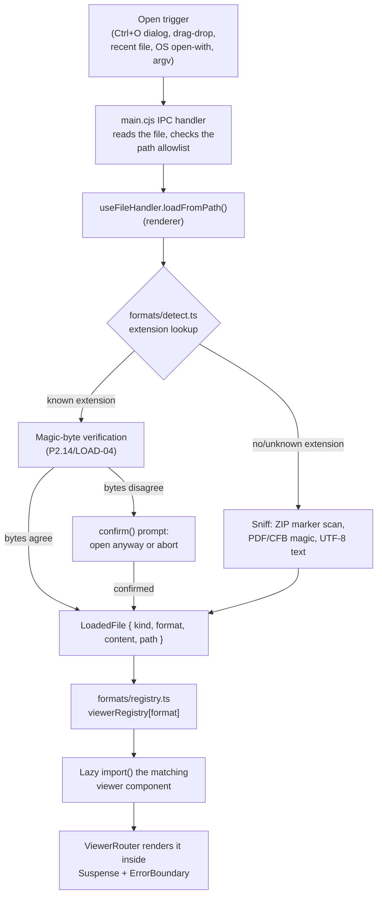
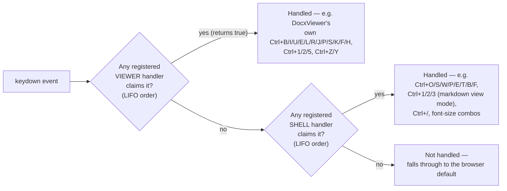
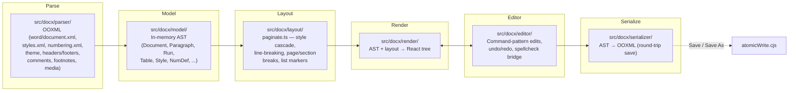

# Atlas Architecture

This document records the shell-level design decisions that are otherwise
only discoverable by reading (and cross-referencing) source across
`electron/`, `src/hooks/`, and `src/viewers/shared/` — written down while the
reasoning is still fresh, per Task P4.9/QA-18's process-hygiene fix. It is
about the *shared shell*, not any one format's fidelity details; per-format
gaps live in [`KNOWN_LIMITATIONS.md`](./KNOWN_LIMITATIONS.md), and the task
history that produced this architecture lives in
`.sisyphus/plans/atlas-phase3-improvement.md`.

Originally written against `main` after wave 2 (commit `03b2e2a`); updated
again against waves 3–8 (DOCX page virtualization, the shared PPTX/ODP
slide-editor core, the i18n layer, and the OPC/OOXML/ODF package validator
below are all wave 6–8 additions). Code is the ground truth if this drifts —
update this file whenever a change described below stops being accurate,
the same discipline QA-18 exists to enforce for the older plan documents.

---

## 1. File-open → detect → route → viewer

Every file Atlas opens — via `Ctrl+O`, drag-drop, "Open with Atlas", a recent
file, or an OS double-click at startup — converges on the same pipeline
before a single pixel of that format's viewer renders:

Key points this diagram compresses:

- **The extension manifest is the single source of truth.**
  `src/formats/extensionManifest.ts` (generated by
  `scripts/generate-extension-manifest.mjs`, run in `prebuild`) is the one
  table `formats/detect.ts`, `electron/main.cjs`'s dialog filters, and
  `electron-builder.yml`'s file associations all derive from — they used to
  be three hand-maintained copies that could (and did) drift (ELEC-05/
  ELEC-15/LOAD-03/LOAD-12).
- **Magic-byte verification runs even on the "fast path."** A recognized
  extension isn't trusted blindly: `formats/detect.ts` still checks the
  file's actual leading bytes (ZIP local-file-header markers for the Office/
  ODF formats, `%PDF`, CFB `D0 CF 11 E0` for legacy `.doc`/`.xls`/`.ppt`) and
  only prompts the user when they genuinely disagree with the extension —
  see `useFileHandler.test.ts`'s "P2.14/LOAD-04" describe block for the
  exact agree/mismatch/CFB-legacy matrix.
- **Detection never reads the whole file to do this.** `scanZipMarkers`
  bounds itself to a head+tail window (64 KiB / 16 KiB) instead of decoding
  an entire multi-hundred-megabyte buffer to a string (P4.10/LOAD-15).
- **The prefetched buffer is reused, not re-read.** A dialog-based open
  already has the file's bytes in memory (from the native dialog's own
  read); `loadFromPath` accepts that buffer directly instead of asking main
  to read the same path a second time over IPC (P4.10/LOAD-13) — only
  drag-drop/recent-file/OS-open paths (which only carry a path, not bytes)
  trigger a fresh IPC read.
- **Every viewer is a lazy `import()`.** `formats/registry.ts` keeps a
  static (not template-string) dynamic import per format so Vite/Rollup can
  code-split each one into its own chunk — a user who never opens a
  spreadsheet never downloads/parses SheetJS or glide-data-grid. This is
  also why `scripts/check-bundle.mjs` (Section 5 below) tracks *every*
  chunk rather than just the main entry bundle.

## 2. The ViewerContext document-session contract

`src/viewers/shared/viewerContextValue.ts` defines the capability contract
every non-markdown viewer can opt into so the shared shell (`Toolbar`,
`StatusBar`, `App.tsx`'s save/close/dirty logic) can treat "whichever viewer
is currently active" uniformly, without knowing anything about that format:

| Field | Contract |
|---|---|
| `isDirty` / `setDirty(dirty)` | The active viewer reports whether it has unsaved changes. `App.tsx` OR-combines this with markdown's own (separate, pre-existing) dirty flag for the single Toolbar/StatusBar dirty dot and the close/open-another-file confirmation guard. |
| `registerSave(fn \| null)` / `save()` | The active viewer registers its own `() => Promise<boolean>` save implementation on mount and unregisters (`null`) on unmount. `save()` calls whatever is currently registered and resolves `false` when nothing is registered, so a global `Ctrl+S` always has *something* safe to call regardless of which viewer is active. |
| `getExportableContent()` | A per-format export hook. Wired today for CSV/TSV export (`utils/export/csv.ts`, `ExportMenu.tsx`) — a registering viewer supplies its own `{ format, suggestedName, data }`; an unregistered viewer resolves `null` and the caller falls back to whatever export path already existed for it. |
| `registerFind(fn \| null)` / `openFind()` / `canFind` | The same register-from-the-active-viewer pattern for in-viewer find. `SpreadsheetViewer`/`CsvViewer` register a find-overlay opener here so the shared `Ctrl+F` dispatch can reach a grid's own find UI without the shell knowing what a "grid" is. Markdown's own `Ctrl+F` (`useSearch`) is untouched and never goes through this contract. |
| `navItems` / `stats` | Chrome data (sidebar nav entries, status-bar stats) the active viewer publishes; unrelated to the save/dirty/export contract but living in the same context for the same "one active viewer, one place to look" reason. |

**Why this shape**: before P1.1, only markdown had a dirty/save contract at
all — every other viewer was read-only-by-construction, so there was nothing
to unify. As DOCX (and later spreadsheet) editing landed, this context is
what let `App.tsx`'s save/close logic gain a second dirty source *additively*
— markdown's own `isDirty`/`saveFile` implementation was never touched or
replaced, only OR-combined with — rather than forking into a
markdown-flavored and a general-viewer-flavored code path. See
`App.dirtyState.characterization.test.tsx` for the frozen, byte-exact
sequence this guarantees for markdown specifically.

## 3. Shortcut dispatcher precedence

Before P2.1, six independent `window.addEventListener('keydown', ...)` call
sites (`useUniversalShortcuts`, `useFontSize`, `useSearch`, `ThemeMenu`,
`ExportMenu`, `ShortcutsModal`) plus a couple of element-level handlers all
raced for the same keys with no shared precedence — the direct cause of
SHELL-08/09 (editing a DOCX's Ctrl+B/Ctrl+E also toggling the sidebar /
opening the Export menu) and UX-03 (Ctrl+P double-firing print *and*
export).

`ShortcutManagerProvider` (`src/hooks/ShortcutManagerProvider.tsx`) replaces
all of them with **one** `window` keydown listener and an explicit two-tier
precedence:

- **Tier 1 — `useViewerShortcuts` ("active viewer")**: wins unconditionally
  over every shell-global handler, regardless of exactly *where* focus sits
  within that viewer (not just "is the `contentEditable` literally
  focused" — the active viewer as a whole gets first refusal). DocxViewer's
  editing shortcuts are the only current consumer.
- **Tier 2 — `useShellShortcut` ("shell-global")**: app-chrome shortcuts —
  open/save/save-as/close/print/export/theme/sidebar/search/shortcuts-modal
  — reached only once no viewer handler has claimed the event.
- **Within a tier, most-recently-registered wins (LIFO)** — e.g. a modal
  opened on top of another gets first refusal on its own `Escape` handler
  over the one underneath it.
- **Registration order across renders never matters.** Each hook keeps its
  latest handler closure in a ref and only registers/unregisters the
  *wrapper* when its `enabled` flag changes, so a caller can pass a fresh
  inline closure every render with no memoization burden and without
  reordering the precedence stack.
- **Handlers receive `{ inPlainField }`** — whether the keydown target is a
  plain `<input>`/`<textarea>` or inside a `contentEditable` region — so a
  shell handler can reproduce the old "don't fire while the user is typing"
  guard itself. This is *not* a separate precedence tier (there is no
  "focused-input" step the dispatcher enforces on handlers' behalf); it's
  context a handler can choose to check.
- **What this is not**: a global "capture everything" system. A handler
  returns `true` to claim an event and stop the walk, or `false`/`undefined`
  to let it fall through — an unclaimed key reaches the browser's own
  default behavior exactly as if no listener existed.

Markdown's shortcuts (`Ctrl+1/2/3` view mode, `Ctrl+B/I` in `RawEditor`) flow
through the shell tier like any other shell-global shortcut; `RawEditor`
itself is on the markdown no-touch list (Section 7.2 of the improvement
plan) and was never modified by this migration — only the *dispatch*
mechanism around it changed. `App.markdownShortcutRegression.test.tsx` gates
exactly this guarantee.

## 4. Electron IPC trust boundary

Atlas runs with `contextIsolation: true`, `nodeIntegration: false`,
`sandbox: true` (`electron/main.cjs`) — the renderer has **no** direct
filesystem, `child_process`, or Node module access. Everything it can do
crosses one of two explicit boundaries:

**a) The preload bridge (`electron/preload.cjs`)** exposes a fixed,
typed surface via `contextBridge` — `window.electronAPI` (typed in
`src/electron.d.ts`) — file open/save/dialog calls, the recent-files
IPC round-trip, drag-drop path registration, spellcheck, and image
picking. The renderer can only call exactly these named functions; there is
no generic "run this IPC channel" escape hatch.

**b) The main-process path allowlist (`electron/lib/pathAllowlist.cjs`)**
gates every read/write IPC handler to paths the *main process itself*
already vouches for — never a bare path string the renderer supplies
unchecked:

- an open-dialog result,
- `argv`/second-instance/OS "open with" paths,
- a drag-dropped path resolved via `webUtils.getPathForFile` and explicitly
  registered through `path:register-dropped`,
- a save-as dialog result,
- a recent-files entry re-validated through `recent:request-open` — this
  one matters because the renderer's recent-files list lives in
  `localStorage`, which any script running in the page can read *and write*;
  checking only `fs.existsSync` there would let a compromised page claim any
  existing path on disk is "recent" and get it allowlisted, so
  `recent:request-open` re-derives trust independently rather than trusting
  the renderer's claim.

Paths are normalized before comparison (case-insensitive drive letters,
`\\?\`-long-path and UNC prefixes stripped, forward/back slashes unified) so
a differently-spelled reference to the same file doesn't falsely bypass the
allowlist (ELEC-25).

**c) Content-Security-Policy (`electron/lib/csp.cjs`)** is the last layer:
production disallows `unsafe-eval`/`unsafe-inline` scripts (dev needs both,
for Vite/React Fast Refresh and its HMR websocket), restricts `connect-src`
to `'self'` in production, and allows exactly the resource types viewers
genuinely need — `blob:`/`data:` images and fonts (canvas-rendered PDF
pages, DOCX inline images and substitute fonts), `'wasm-unsafe-eval'`
(shiki's WASM tokenizer), `worker-src 'self'/blob:` (pdf.js's module
worker). `img-src`/`font-src` additionally allow `https:` (not `http:`) —
a deliberate, narrow exception: markdown's `rehypeRaw` pass-through and
plain `` syntax both routinely reference remote-hosted images, and the
owner's hard constraint that markdown's behavior not change means this
can't be tightened without breaking real documents; `https:`-only avoids
reopening a plaintext SSRF-probe surface while still not touching markdown
rendering.

**d) Saves are atomic (`electron/lib/atomicWrite.cjs`)**: write to a temp
file in the same directory → fsync → keep one rolling `.bak` of whatever was
previously at the target → rename the temp file over the target, so a crash
mid-save leaves the original file untouched. A cross-volume rename (some
network shares) falls back to a direct, non-atomic write rather than failing
the save outright (still preceded by the same backup). A locked target
(commonly: the same `.docx` also open in Microsoft Word) surfaces a specific
`FileLockedError` with a friendly message instead of a generic IPC failure.

## 5. DOCX engine pipeline

Unlike every other format (which uses an existing library — pdf.js, SheetJS,
Shiki, rtf.js, odf-kit), DOCX is a **hand-written, three-stage pipeline**
under `src/docx/` with no `docx-preview`/`mammoth`/SDK dependency, per the
Phase 2 plan's locked constraint (see `atlas-phase2-docx.md` and its
Section-19 "Actual State" addendum for what shipped vs. what that plan
originally scoped):

- **Parser** (`src/docx/parser/`) turns the ZIP's OOXML parts into the
  in-memory AST — one file per OOXML part (`document.ts`, `styles.ts`,
  `numbering.ts`, `theme.ts`, `headerFooter.ts`, `comments.ts`,
  `footnotes.ts`, `media.ts`) plus shared XML/relationship/content-types
  plumbing.
- **Model** (`src/docx/model/`) is intentionally behavior-free — plain TS
  types (`Document`, `Section`, `Paragraph`, `Run`, `Table`, style/numbering
  defs, an rId/bookmark-id allocator) that both the parser and serializer
  read/write, so parsing and serializing can never silently disagree about
  shape.
- **Layout** (`src/docx/layout/paginate.ts` and neighbors) resolves the
  style cascade (direct formatting → paragraph style → linked/table style →
  document defaults), does line-breaking and pagination, and computes list
  markers, tab stops, and section/page breaks — i.e. everything needed to
  know where a run of text actually falls on a page before it's rendered.
- **Render** (`src/docx/render/`) turns the laid-out AST into the actual
  React tree `DocxViewer` mounts. `PageStack` virtualizes this: only pages
  near the scroll container's viewport (plus a small buffer, plus whichever
  page holds the caret/selection) mount a real `PageView`; the rest render
  as a placeholder that reserves the same box, so scroll height and the
  page-count status bar are unaffected. Printing and PDF export force every
  page to mount first, since both read the live DOM. This exists because
  `paginate()` hands back a brand-new `Page` object per page on every call —
  without virtualization, every on-screen page remounts its full DOM
  subtree on every keystroke regardless of whether it's actually visible
  (measured on a 35-page document: React commit dropped from ~40-50ms to
  ~4-10ms and browser paint from ~50-60ms to ~10-20ms per keystroke once
  this landed).
- **Editor** (`src/docx/editor/`) implements editing as a command pattern
  with bounded undo/redo history, plus the spellcheck bridge
  (`useSpellCheck.ts` — see Section 6's `atlas-phase2-docx.md` note on why
  this talks to Electron's native/Chromium spellchecker via
  `window.electronAPI.spellcheck`, not the originally-planned `nspell` +
  bundled Hunspell dictionaries).
- **Serializer** (`src/docx/serializer/`) writes the AST back to OOXML for
  Save/Save As, sharing the same atomic-write + lock-detection path every
  other format's save goes through (Section 4d).

This separation is what lets fidelity work (parser/layout) and editing work
(editor) proceed on largely independent surfaces, and is why the round-trip
corpus (`P0.5`, a fixed set of real-shaped `.docx` fixtures parsed →
serialized → re-parsed and diffed) gates every serializer-touching change —
model/layout bugs usually show up as a rendering difference, but a
serializer bug can silently corrupt a file that still opens.

## 6. Testing strategy

| Layer | What it covers | Where |
|---|---|---|
| **Unit** | Individual functions/hooks/components in isolation (parsers, layout math, format detection, hooks). The large majority of the suite. | `src/**/__tests__/*.test.{ts,tsx}` |
| **Characterization** | Frozen snapshots of *live* behavior that must not silently regress: markdown's rendered DOM (`MarkdownRenderer`, `useToc`) across headings/GFM tables/task lists/code fences/KaTeX/Mermaid/nested lists/links; the exact dirty-state/save/active-file transition sequence through App.tsx's shared shell logic. This is the enforcement mechanism behind the "markdown is perfect, don't change its behavior" constraint (improvement plan Section 7) — a snapshot diff here is treated as a regression by default, not an improvement, unless explicitly reviewed and approved. | `src/__tests__/App.dirtyState.characterization.test.tsx`, `src/components/__tests__/MarkdownRenderer*.test.tsx`, `src/hooks/__tests__/useToc*.test.ts` |
| **Corpus (round-trip)** | A fixed set of real-shaped `.docx` fixtures parsed → serialized → re-parsed, diffed for structural/content drift. Gates every change touching the DOCX parser/model/serializer. | `src/docx/__fixtures__/`, corpus harness under `src/docx/__tests__/` |
| **Spec-level package validation** | An independent structural validator — its own from-scratch PKZIP reader (not JSZip), checked against the actual OPC/OOXML/ODF specs rather than Atlas's own parsers — runs against every save path's output (DOCX, the spreadsheet passthrough, PPTX/ODP editing). Catches what a round-trip diff can't: a byte-valid-but-spec-invalid package that Atlas's own lenient reader would still parse but real Office/LibreOffice would flag for repair. See `docs/KNOWN_LIMITATIONS.md`'s "Verification against real Office/LibreOffice" for what this does and doesn't substitute for. | `scripts/lib/officeValidator.mjs`, `scripts/lib/zipReader.mjs`, `scripts/validate-office-file.mjs` (standalone CLI), `src/office/__tests__/officeValidator.unit.test.ts` |
| **E2E (Electron/Playwright)** | Launches the *real* packaged-shape app (`_electron.launch()`) and opens one fixture per supported format, asserting the right viewer mounted, the status bar shows the right filename, and zero console errors were logged. `workers: 1` — Electron holds a single-instance lock, so parallel workers would race each other. | `tests/e2e/smoke.spec.ts`, `tests/e2e/perf.spec.ts` (200ms-budget task-perf spec) |
| **Coverage ratchet** | `npm run coverage` (v8 provider, text+html reporters, `reportOnFailure: true` so a failing run still shows what it covered) enforces a measured-floor threshold per global metric — see `vitest.config.ts`'s `coverage.thresholds` comment for the current numbers and how to raise them. | `vitest.config.ts` |
| **Shared test doubles** | `createMockElectronAPI()` (`src/__tests__/mocks/electronAPI.ts`) is the one typed `window.electronAPI` fixture; import and override rather than hand-rolling a new literal per test file (P4.8/QA-25). | `src/__tests__/mocks/electronAPI.ts` |

**Manual backstop.** Automated coverage catches regressions a snapshot can
articulate; it does not catch "this looks subtly wrong" the way a human
glancing at rendered output does. Every phase gate that touches shared shell
code also includes a manual smoke pass on markdown specifically (open the
sample document, edit, save, export all formats, toggle all three view
modes, exercise every documented shortcut) — see the improvement plan's
Section 7.5 for the full rationale.

## 7. The shared slide-editor core (PPTX/ODP)

PPTX and ODP editing (`src/viewers/slides/pptx/editing/`,
`src/viewers/slides/odp/editing/`) share one session hook,
`useSlideEditorCore` (`src/viewers/slides/shared/useSlideEditorCore.ts`),
covering everything that has nothing to do with either format specifically:
the in-memory package (`OfficePackage` — a path → part-bytes map, from
`src/office/officePackage.ts`), undo/redo, a queue that serializes edits so
each one sees the previous one's re-parsed result even while that re-parse
is still running, the `ViewerContext` dirty/save/save-as contract, and the
editor's own undo/redo shortcuts. Each format supplies only two things: how
to parse its package into `SlideData` (`parseDeck`) and its own edit
functions operating directly on OPC/ODF XML (`pptxEdits.ts`/`odpEdits.ts` —
no PptxGenJS or similar SDK, the same "hand-write the package format"
approach DOCX uses). This is why a PPTX-only feature (e.g. `opcXml.ts`'s
relationship/content-types helpers) never needs an ODP equivalent to reach
`main` — the shared core doesn't know or care which format it's holding.

## 8. Internationalization (`src/i18n/`)

A small, dependency-free module — no `i18next`/`react-intl` — built around
a stable-id message catalogue per locale (`messages.en.ts`, `messages.fr.ts`).
English is the source of truth: `messages.fr.ts` is typed
`satisfies Record<MessageKey, MessageValue>` against English's own derived
key union, so a key added to one file without the other is a compile error;
`catalogueParity.test.ts` re-checks the same thing at runtime by comparing
the two actual key sets, so a mismatch fails with the exact offending
key(s) rather than a generic type error. `LocaleProvider` +
`useTranslate()`/`useLocale()`
(`context.ts`, `useLocale.ts`) expose the current locale and a `t(key,
params)` function with `Intl.PluralRules`-backed plural handling. The
preference (`en`/`fr`/`system`) persists the same way the theme does;
`system` is the only path that ever consults the OS locale (via a
`preload.cjs` IPC round trip to `app.getLocale()`) — the default is always
the literal `en`, deliberately never derived from the OS, so a fresh
profile and the `PLAYWRIGHT=1` e2e environment both stay English
regardless of the host machine's locale. `src/i18n/__tests__/
noHardcodedStrings.test.ts` greps converted components for literal
user-facing English strings that should have gone through `t()` instead,
so a new string added to an already-converted surface can't silently skip
translation. See `docs/KNOWN_LIMITATIONS.md`'s "Internationalization"
section for which surfaces are and aren't converted yet.
