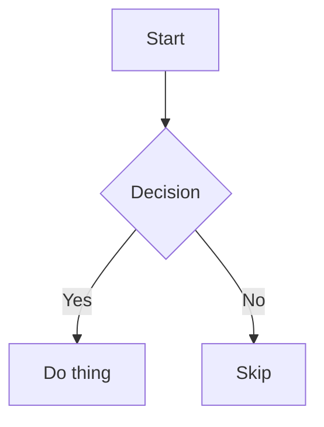

# Atlas Characterization Fixture

A single document exercising every markdown feature the P0.4 guardrail freezes.

## Heading **Two** with Bold

### Heading `Three` with Code

#### Heading *Four* with Italic

##### Heading [Five](https://example.com) with Link

###### Heading ~~Six~~ with Strikethrough

## Team Roster

| Name  | Role      | Active |
| ----- | --------- | :----: |
| Ada   | Engineer  |   ✅   |
| Grace | Scientist |   ❌   |

## Release Checklist

- [x] Write the characterization suite
- [ ] Get sign-off from the owner
  - [x] Nested done item
  - [ ] Nested todo item

## Notes

This is ~~struck through~~ text.

Visit https://example.com for details, or email test@example.com with questions.

## Example

```ts
function greet(name: string): string {
  return `Hello, ${name}!`;
}
```

Inline code like `const x = 1;` should stay inline.

## Math

Inline math: $E = mc^2$ is Einstein's mass-energy equivalence.

Block math:

$$
\int_0^\infty e^{-x^2} \, dx = \frac{\sqrt{\pi}}{2}
$$

## Flow



## Nested Lists

1. First
2. Second
   1. Second.a
   2. Second.b
      - bullet in ordered
3. Third

- Alpha
- Beta
  - Beta.1
  - Beta.2
    1. Beta.2.i
    2. Beta.2.ii
- Gamma

## Quoting

> A simple blockquote.
>
> > A nested blockquote inside the first.
>
> Back to the first level.

## Embedded HTML

<div class="callout">
  <strong>Note:</strong> this is raw HTML embedded in markdown.
</div>

Some text with an inline <span style="color:red">red span</span>.

## Links and Images

[Atlas repository](https://github.com/example/atlas "Atlas repo")


A reference-style [link][ref] and image ![alt text][img-ref].

[ref]: https://example.com/reference "Reference target"
[img-ref]: https://example.com/image.png "Reference image"

---

Final paragraph after a thematic break.
